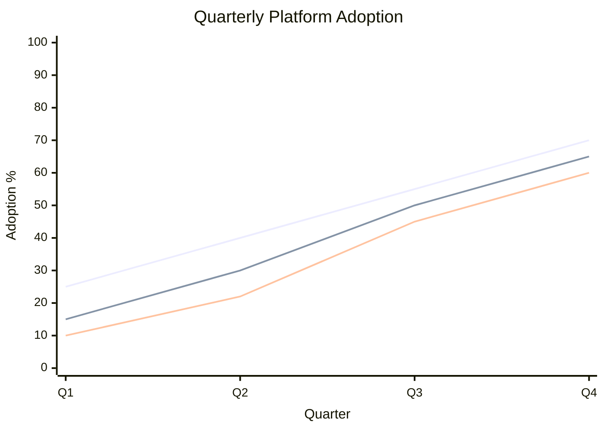

# Human-in-the-Loop AI Module Workflow

## Overview

Use this skill for EN.605.734 Human-in-the-Loop AI: read the active module, write a grounded learning summary, and prepare the requested learning artifact in clear first-person course language.

Write only the artifact the user requests or the assignment requires. Use the module's established file naming when it exists; otherwise agree on a filename before creating a new deliverable.

## Source Order

Start with local course files. Use web or Canvas only when the user provides content or explicitly asks for it.

1. The user-requested module folder and target files.
2. The module overview, assignment instructions or rubric, readings, notebooks, and provided data.
3. Caption files, transcripts, and lecture notes in the module folder.
4. Existing examples or drafts that the user identifies as a style reference.
5. Course-wide instructions, including `course-info/generative-ai-policy.md`.
6. Prior draft files in the same module folder.

Prefer `rg --files module_01` adjusted to the active module for inventory. For PDFs, use the best local extractor available, for example Ghostscript `txtwrite`, `pdftotext`, Python PDF libraries, or `strings` as a last fallback.

## Module Summary and Assignment Workflow

1. Inventory the module folder and identify the core artifacts.
2. Read enough overview, caption, and assignment material to identify the main concepts, methods, vocabulary, and self-check themes.
3. Write the requested artifact to the module folder when the user asks for a file.
4. Ground the summary in the local files. Mention source filenames where useful.
5. Use straightforward first-person course language. Explain the relationship between people, models, data, evaluation, and governance when it is relevant. Avoid hype, em dashes, and ornamental phrasing.
6. For every module learning summary, end the document with `## Glossary of Module Terms`. Include every term explicitly defined in the assigned module materials that is relevant to the summary. Give each term a plain-language definition and a direct local Markdown link to the source file, with page, section, or timestamp when available.
7. Treat specific facts, figures, dates, counts, results, and study conditions as source-traceable claims. Capture the material facts needed to understand the reading’s evidence in a `## Specific Evidence to Remember` section or adjacent sourced prose. Link each claim directly to its local source and identify the relevant page, section, table, figure, or timestamp. Do not present an interpretation as a source fact.

Recommended summary shape:

```markdown
# Module X Learning Summary

## Sources Reviewed

## Core Summary

## Key Learnings

## Assignment Readiness

## My Takeaway

## Glossary of Module Terms
```

Keep the summary practical. Capture what I need to remember for the module's reflection, analysis, evaluation, or other assignment.

## Reflection, Self-Check, and Analysis Workflow

1. Extract the full prompt and its required format from the supplied source.
2. Use an existing course artifact as a formatting guide only when the user identifies it as relevant.
3. Answer each numbered prompt or required section explicitly.
4. Complete the target file in place. Do not leave a template unless the user asks for one.
5. Show enough reasoning to support the answer. Use short tables when they make a comparison, measurement, or decision clearer.
6. Tie explanations back to local module concepts and distinguish the user's conclusion from generated material.
7. Follow the course GenAI disclosure requirements when the work will be submitted.

For short-answer questions, give a direct answer and brief rationale. For a human-AI system analysis, identify the task, human contribution, AI contribution, evidence, tradeoffs, and limitations that apply to the prompt.

## Math and Diagrams

Use KaTeX/LaTeX for all math:

1. Inline math uses `$...$`.
2. Display math uses `$$...$$`.
3. Do not put math in backticks unless discussing literal source text.
4. Avoid malformed shortcuts such as `hat{y}i`; use `\hat{y}_i`.
5. Use display math for multi-line derivations.

Use Mermaid only when it helps the requested learning artifact. For chart-like visuals:

1. Use the beta syntax: `xychart-beta`.
2. For actual-versus-estimate or multi-series trend charts, use multiple `line` series. Do not mix line and bar charts for that comparison.
3. Keep chart labels short so PDF export does not break or overflow.
4. If the target exporter cannot render Mermaid reliably, replace the chart with a Markdown table or a simple SVG fallback.

Example:



Use `quadrantChart` only when the point of the question is classification into quadrants. For regular scatter-style numeric plots, prefer a table, SVG, notebook code, or another renderer because Mermaid quadrant charts are categorical and less precise.

## Optional Notebook Companion

Create a notebook only when the user asks for it.

1. Convert the self-check into Markdown explanation cells plus small code or SVG cells where interactivity or exact plotting helps.
2. Use the course pattern: Markdown documentation cell, implementation or visualization cell, then assertion or verification cell.
3. Prefer standard Python and `IPython.display.SVG` for portable visuals when plotting dependencies are broken or unnecessary.
4. Preserve the existing notebook kernel metadata. Do not assume a course-specific kernel name.
5. Validate the notebook JSON and run extracted code cells when practical.

## Validation Checklist

Before finalizing edited files:

1. Confirm the expected files exist in the module folder.
2. Search the target file for unfinished markers before calling it complete.
3. Check style-sensitive prose for em dashes and banned hype words.
4. Check math formatting for raw text math, backticked formulas, and malformed subscripts.
5. Check Mermaid blocks use `xychart-beta` where intended.
6. For notebooks, run `jq empty file.ipynb` and validate with `nbformat` if available.
7. If code cells exist, execute the extracted cells or run the notebook when the environment supports it.
8. Confirm any required GenAI disclosure is included or explicitly noted as still needed.

Remember that this course folder may not be a git repository. Verify with direct file inspection rather than relying on `git diff`.
