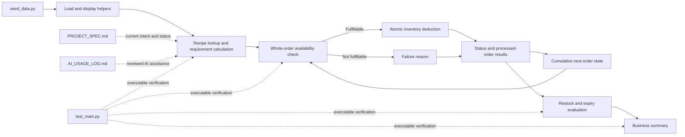

# High-Level Design: Cloud Kitchen Inventory Simulation

## Problem

A cloud kitchen shares ingredients across brands and menu items. The supplied simulation must determine whether complete orders can be fulfilled, update shared inventory cumulatively, identify expiry and stock risks, and present the outcome to a business user.

The project starts from a mostly working implementation that may contain incomplete behavior, unsupported assumptions, and gaps in its tests. The assignment requires an evidence-based audit and focused corrections rather than a replacement implementation. The final submission must also show how AI assistance was reviewed and verified.

## Approach

### Audit-first development

Preserve the supplied procedural structure and data schema. Establish the executable baseline, compare each requirement with the current implementation and tests, and change only behavior that is missing or incorrect.

### Functional simulation pipeline

Keep business rules in focused functions within `main.py`. The pipeline loads the five supplied data structures, resolves recipes, calculates order-level ingredient demand, checks the complete order, updates inventory and status atomically, calculates restock and expiry concerns, and produces a final business summary.

### Traceable verification

Use EARS requirements and focused unit tests to connect assignment rules to executable evidence. Maintain `PROJECT_SPEC.md` as the current project record and `AI_USAGE_LOG.md` as the record of AI-supported decisions, accepted suggestions, corrections, and rejected suggestions.

## Target Users

- The student developer needs a small codebase that can be understood, tested, explained, and submitted.
- The instructor or reviewer needs evidence that the starter implementation was audited against the requirements and corrected through focused changes.
- A kitchen manager represented by the simulation output needs a clear summary of delivered orders, failures, remaining inventory, restock needs, and expiry concerns.

## Goals

- Make the supplied program and complete test suite runnable with the required project filenames.
- Verify all five supplied data structures without redesigning their schema.
- Apply all-or-nothing order fulfillment based on combined recipe requirements, available quantity, and ingredient usability.
- Preserve cumulative inventory across sequential orders and prevent deductions for failed orders.
- Identify out-of-stock, low-stock, expired, expiring-soon, and overlapping restock reasons.
- Produce a business-readable final summary covering fulfillment, failure reasons, final inventory, restocking, and expiry.
- Provide meaningful tests for normal, boundary, and failure behavior required by the assignment.
- Maintain the required specification, AI usage record, written response, and 400 to 600 word reflection.

## Non-Goals

- Replace the supplied Python implementation with a new architecture or data model.
- Add a database, user interface, service API, or production deployment.
- Implement partial fulfillment, predictive stockout alerts, dynamic menu disabling, or another optional enhancement unless it is selected after the base requirements pass.
- Infer live kitchen operations or business performance from the small supplied dataset.

## Tenets

- **Preserve verified starter behavior over structural elegance.** Prefer a focused correction to a broader rewrite when both satisfy the requirement.
- **Use explicit simulation inputs over environment-dependent behavior.** Business-rule tests use a supplied reference date and controlled data.
- **Verify written business rules beyond the starter tests.** Passing starter tests does not establish requirements that those tests do not exercise.

## System Design

The implementation remains an in-memory simulation. Order fulfillment is atomic at the order level: the program deducts inventory only after every order line has a valid recipe and every combined ingredient requirement is available and usable. Each delivered order changes the inventory used to evaluate later orders.

## Key Design Decisions

| Decision | Selection and rationale | Alternatives considered |
| --- | --- | --- |
| Implementation shape | Retain an audit-first functional pipeline in `main.py`. This keeps changes visible against the supplied starter and limits the review surface. | Splitting inventory, fulfillment, and reporting into modules would improve separation but introduce broader changes. An object model would depart further from the supplied implementation and schema. |
| Fulfillment unit | Use all-or-nothing fulfillment for each complete order. The assignment overview defines partial fulfillment as optional and states that it takes precedence over the reference PDF when they conflict. | Partial line-item fulfillment is an optional enhancement, not base behavior. |
| Data contract | Keep the dictionaries and lists supplied by `seed_data.py` as the source schema. | New classes or normalized records would make the code easier to redesign but would weaken compliance with the audit task. |
| Time handling | Accept an explicit reference date for expiry-sensitive behavior and use the runtime date only as a convenience for interactive execution. | Always using the system date would make tests and reported results change over time. |
| Restock explanations | Preserve every applicable reason for an ingredient rather than allowing one rule to hide another. | A single prioritized reason is simpler but fails the requirement for simultaneous reasons. |

## Success Metrics

- `python main.py` completes without an import or runtime error from the assignment directory.
- The full `unittest` suite passes and directly covers every required normal, boundary, and failure case.
- A failed order leaves inventory unchanged, while delivered orders deduct the correct combined quantities in sequence.
- Expired ingredients cannot fulfill orders, and restock output can retain multiple applicable reasons for one ingredient.
- The final summary reports delivered and undelivered orders, failure reasons, final inventory, restock recommendations, and expiry concerns.
- `PROJECT_SPEC.md`, `AI_USAGE_LOG.md`, the written response, and the reflection satisfy the assignment structure and disclosure rules without unsupported claims.

## References

- `module_03/mod_03_assignment/module_03_assignment.md`
- `module_03/mod_03_assignment/AI-Assisted Cloud Kitchen Inventory Simulation.pdf`
- `module_03/module_03_learning_summary.md`
- `module_03/overview_03.md`
- `course-info/generative-ai-policy.md`
