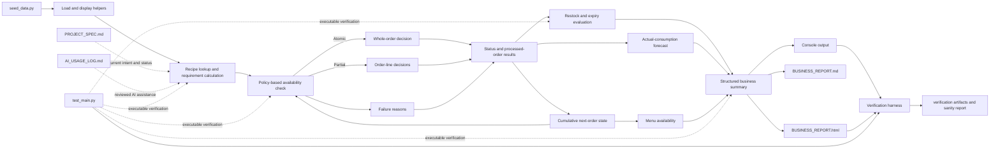

# High-Level Design: Cloud Kitchen Inventory Simulation

## Problem

A cloud kitchen shares ingredients across brands and menu items. The supplied simulation must determine whether complete orders or individual order lines can be fulfilled, update shared inventory cumulatively, identify current and forecast stock risks, disable menu items that cannot be prepared, and present the outcome to a business user.

The project starts from a mostly working implementation that may contain incomplete behavior, unsupported assumptions, and gaps in its tests. The assignment requires an evidence-based audit and focused corrections rather than a replacement implementation. The final submission must also show how AI assistance was reviewed and verified.

## Approach

### Audit-first development

Preserve the supplied procedural structure and data schema. Establish the executable baseline, compare each requirement with the current implementation and tests, and change only behavior that is missing or incorrect.

### Functional simulation pipeline

Keep business rules in focused functions within `main.py`. The pipeline loads the five supplied data structures, resolves recipes, calculates ingredient demand, applies an explicit atomic or partial fulfillment policy, records actual consumption, calculates restock and expiry concerns, forecasts stockouts, identifies unavailable menu items, and produces console, Markdown, and HTML reports. A verification harness captures program and test output and compares the evidence with the linked requirements.

### Traceable verification

Use EARS requirements and focused unit tests to connect assignment rules to executable evidence. Maintain `PROJECT_SPEC.md` as the current project record and `AI_USAGE_LOG.md` as the record of AI-supported decisions, accepted suggestions, corrections, and rejected suggestions.

## Target Users

- The student developer needs a small codebase that can be understood, tested, explained, and submitted.
- The instructor or reviewer needs evidence that the starter implementation was audited against the requirements and corrected through focused changes.
- A kitchen manager represented by the simulation output needs a clear summary of delivered orders, failures, remaining inventory, restock needs, and expiry concerns.

## Goals

- Make the supplied program and complete test suite runnable with the required project filenames.
- Verify all five supplied data structures without redesigning their schema.
- Preserve the required all-or-nothing fulfillment policy and add an explicit partial policy that can deliver valid order lines while rejecting unavailable lines.
- Preserve cumulative inventory across sequential orders and deduct inventory only for delivered orders or delivered order lines.
- Identify out-of-stock, low-stock, expired, expiring-soon, and overlapping restock reasons.
- Forecast ingredients likely to run out within a configurable future-order horizon using actual fulfilled consumption.
- Identify menu items that cannot produce one serving from the final usable inventory.
- Produce business-readable console and Markdown reports covering fulfillment, failure reasons, final inventory, restocking, expiry, forecasts, and menu availability.
- Produce a browser-readable HTML report and a repeatable verification bundle containing terminal output, test output, and a requirement comparison.
- Provide meaningful tests for normal, boundary, and failure behavior required by the assignment.
- Maintain the required specification, AI usage record, written response, and 400 to 600 word reflection.

## Non-Goals

- Replace the supplied Python implementation with a new architecture or data model.
- Add a database, user interface, service API, or production deployment.
- Infer live kitchen operations or business performance from the small supplied dataset.
- Split quantities within one order line, optimize procurement, persist reports to a database, or automatically change a live ordering platform.

## Tenets

- **Preserve verified starter behavior over structural elegance.** Prefer a focused correction to a broader rewrite when both satisfy the requirement.
- **Use explicit simulation inputs over environment-dependent behavior.** Business-rule tests use a supplied reference date and controlled data.
- **Verify written business rules beyond the starter tests.** Passing starter tests does not establish requirements that those tests do not exercise.
- **Keep optional behavior explicit.** Atomic and partial fulfillment remain named policies so optional behavior does not silently replace the required baseline.
- **Base operational projections on observed outcomes.** Forecasts use actual inventory consumption, not rejected demand.
- **Keep verification evidence reproducible.** A single command regenerates the complete evidence bundle from the current source and tests.

## System Design

The implementation remains an in-memory simulation. Atomic mode deducts inventory only after every order line has a valid recipe and every combined ingredient requirement is available and usable. Partial mode evaluates order lines sequentially and deducts only complete lines that are available and usable. It does not split the quantity within one order line. Every deduction changes the inventory used to evaluate later lines and orders.

## Key Design Decisions

| Decision | Selection and rationale | Alternatives considered |
| --- | --- | --- |
| Implementation shape | Retain an audit-first functional pipeline in `main.py`. This keeps changes visible against the supplied starter and limits the review surface. | Splitting inventory, fulfillment, and reporting into modules would improve separation but introduce broader changes. An object model would depart further from the supplied implementation and schema. |
| Fulfillment policy | Retain atomic fulfillment as the default function policy and add partial fulfillment as an explicit policy used by the command-line demonstration. Partial mode delivers complete order lines and never splits a line quantity. | Replacing atomic behavior would erase the required baseline. Unit-level quantity splitting would add allocation behavior not requested by the assignment. |
| Data contract | Keep the dictionaries and lists supplied by `seed_data.py` as the source schema. | New classes or normalized records would make the code easier to redesign but would weaken compliance with the audit task. |
| Time handling | Accept an explicit reference date for expiry-sensitive behavior and use the runtime date only as a convenience for interactive execution. | Always using the system date would make tests and reported results change over time. |
| Restock explanations | Preserve every applicable reason for an ingredient rather than allowing one rule to hide another. | A single prioritized reason is simpler but fails the requirement for simultaneous reasons. |
| Forecast basis | Divide actual fulfilled consumption by all observed order opportunities and project that rate over an explicit future-order horizon. | Using requested demand would count rejected work as consumption. Dividing only by delivered orders would overstate consumption frequency. |
| Dynamic menu rule | Disable an item when one serving has a missing, insufficient, depleted, expired, or invalid-expiry ingredient. | Checking only zero stock would keep items enabled when they cannot produce one serving. |
| Report formats | Generate Markdown and self-contained HTML from the same structured summary. | CSV is weaker for narrative status. A single format provides less direct evidence that both text and browser outputs are usable. |
| Verification evidence | Run the real program and test commands, capture their output, and produce a checked requirement matrix. | Handwritten evidence can drift from current runtime behavior. Test results alone do not show the rendered business output. |

## Success Metrics

- `python main.py` completes without an import or runtime error from the assignment directory.
- The full `unittest` suite passes and directly covers every required normal, boundary, and failure case.
- A failed atomic order leaves inventory unchanged, while delivered orders and partial-delivery lines deduct the correct quantities in sequence.
- Partial mode preserves deductions for delivered lines, rejects unavailable lines, and reports the order as partially delivered.
- Expired ingredients cannot fulfill orders, and restock output can retain multiple applicable reasons for one ingredient.
- Stockout alerts use only actual fulfilled consumption and honor the configured horizon.
- Menu availability reflects whether final usable inventory can produce one serving.
- The final summary, `BUSINESS_REPORT.md`, and `BUSINESS_REPORT.html` report full, partial, and failed orders; final inventory; restock and expiry concerns; stockout alerts; and disabled menu items.
- One verification command regenerates terminal output, unit-test output, HTML output, and a passing requirements sanity report.
- `PROJECT_SPEC.md`, `AI_USAGE_LOG.md`, the written response, and the reflection satisfy the assignment structure and disclosure rules without unsupported claims.

## References

- `module_03/mod_03_assignment/module_03_assignment.md`
- `module_03/mod_03_assignment/AI-Assisted Cloud Kitchen Inventory Simulation.pdf`
- `module_03/module_03_learning_summary.md`
- `module_03/overview_03.md`
- `course-info/generative-ai-policy.md`
