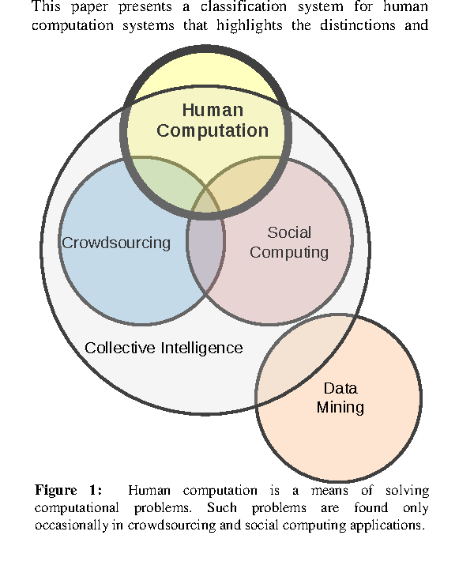
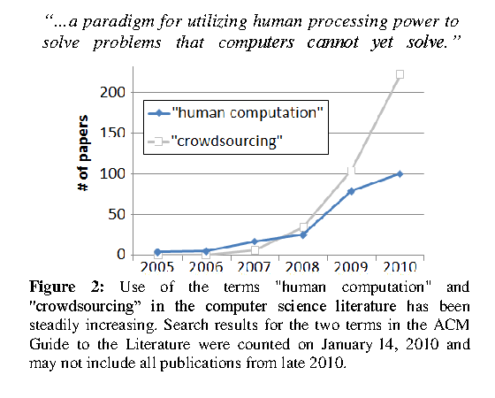
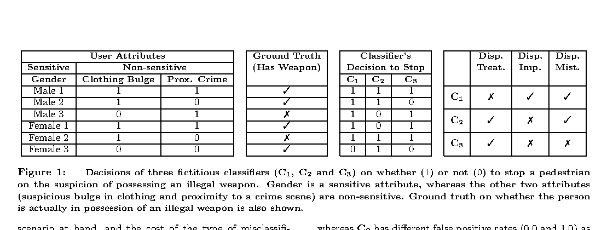
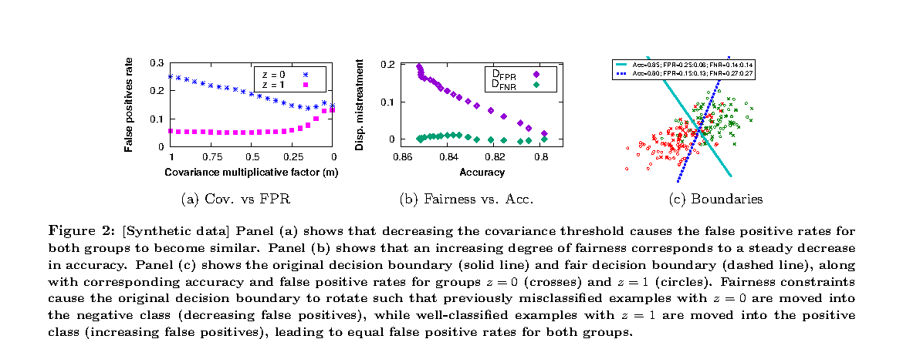
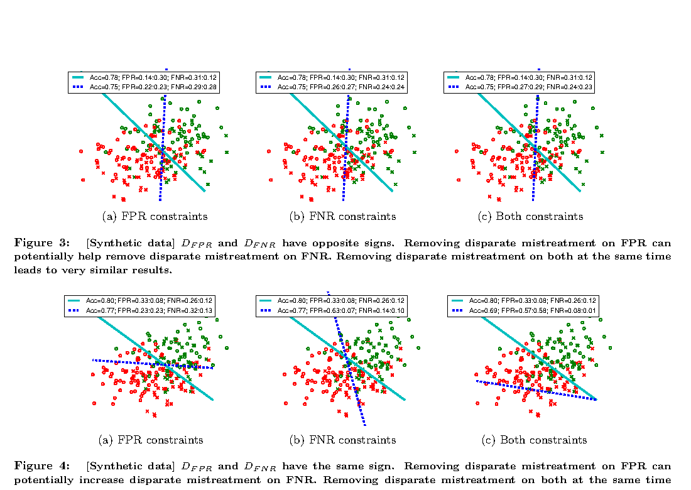
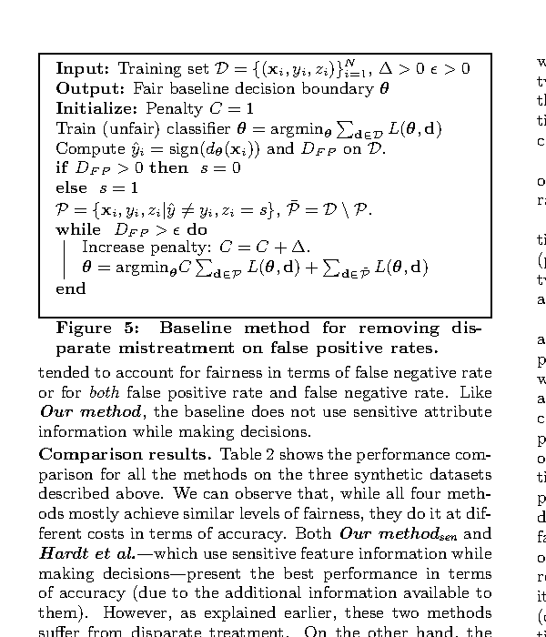
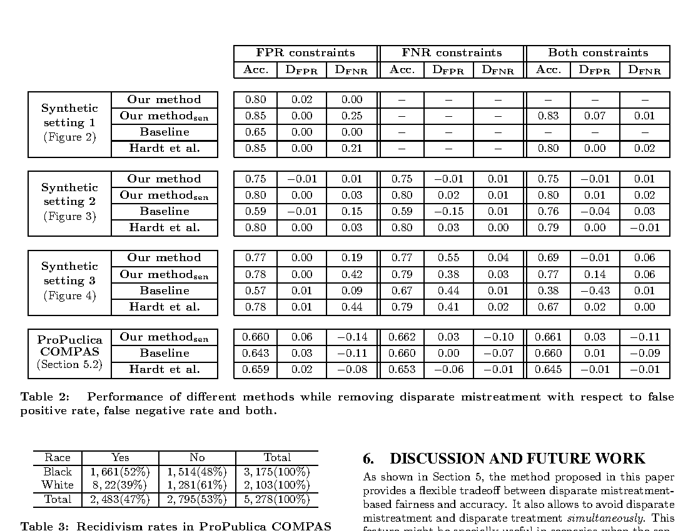

---
{
  "id": "file_ohzijysa",
  "filetype": "document",
  "filename": "module_01_combined_required_readings",
  "created_at": "2026-09-06T11:05:33.607Z",
  "updated_at": "2026-09-06T11:05:33.607Z",
  "meta": {
    "location": "/",
    "tags": [],
    "categories": [],
    "description": "",
    "source": "markdown"
  }
}
---
# Module 01 Combined Required Readings

> Study reader for EN.605.734 Human-in-the-Loop AI. This file combines the required material from the local Module 01 readings folder so it can be read in one place. Summaries and questions are study aids, not substitutes for the assigned text. Verify quotations and page citations against the original PDFs before using them in submitted work.

## Included scope

| Reading | Assigned scope included here |
| --- | --- |
| Quinn and Bederson (2011) | Source pages 1-4, through the start of “Classification Dimensions” |
| Ackerman (2000) | Source pages 1-5, through the start of “The Social-Technical Gap in Action” |
| Zafar et al. (2017) | Full paper, source pages 1-10 |

Diagrams and data tables from the assigned portions are preserved below as local PNGs extracted from the original PDFs.

---

## 1. Human Computation: A Survey and Taxonomy of a Growing Field

**Source:** Quinn, A. J., & Bederson, B. B. (2011). *Human Computation: A Survey and Taxonomy of a Growing Field.* CHI 2011.

**Local PDF:** [`Human Computation, A Survey and Taxonomy of a Growing Field (CHI 2011) (1).pdf`](mod_01_readings/Human%20Computation,%20A%20Survey%20and%20Taxonomy%20of%20a%20Growing%20Field%20%28CHI%202011%29%20%281%29.pdf)

### Takeaway

Human computation is a deliberately designed computational process that directs people to solve problem components that machines cannot yet handle reliably. It overlaps with crowdsourcing, social computing, collective intelligence, and data mining, but it is not interchangeable with them. The paper frames motivation, quality control, and aggregation as core design concerns because useful human input does not emerge automatically from simply placing a task online.

### Interesting questions

- What makes a task directed enough to qualify as human computation rather than social computing?
- Which motivation and quality-control mechanisms are appropriate when an incorrect answer can cause real harm?
- When can aggregation conceal systematic error instead of improving an answer?

### Included diagrams



*Figure 1 from Quinn and Bederson (2011): the relationship between human computation, crowdsourcing, social computing, collective intelligence, and data mining.*



*Figure 2 from Quinn and Bederson (2011): ACM publication frequency for “human computation” and “crowdsourcing.”*

### Assigned source text

#### Source page 1

Human Computation:  
A Survey and Taxonomy of a Growing Field  
Alexander J. Quinn1,2, Benjamin B. Bederson1,2,3  
University of Maryland, College Park  
Human-Computer Interaction Lab1 :: Computer Science2 :: Institute for Advanced Computer Studies3  
College Park, Maryland 20740  
{aq, bederson}@cs.umd.edu

##### ABSTRACT

The rapid growth of human computation within research and industry has produced many novel ideas aimed at organizing web users to do great things. However, the growth is not adequately supported by a f ramework with which to understand each new system in the context of the old. We classify human computation systems to help identify parallels between different systems and reveal ―holes‖ in the existing work as opportunities for new research. Since human c omputation is often confused with ―crowdsourcing‖ and other terms, we explore the position of human computation with respect to these related topics.

##### Author Keywords

Human computation, crowdsourcing, taxonomy, survey, literature review, social computing, data mining

##### ACM Classification Keywords

H5.m. Information interfaces and presentation (e.g., HCI).

##### General Keywords

Theory

##### INTRODUCTION

Since the birth of artificial intelligence research in the 1950s, c omputer scientists have been trying to emulate human-like capabilities, such as language, visual processing, and reasoning. Alan Turing wrote in 1950: “The idea behind digital computers may be explained by saying that these machines are intended to carry out any operations which could be done by a human computer.” [62]

Turing’s article stands as enduring evidence that the roles of human computation and machine computation have been intertwined since the earliest days. Even the idea of humans and computers workin g together in complementary roles was envisioned in 1960 in Licklider’s sketch of ―man-computer symbiosis‖ [ 37]. Only r ecently have researchers begun to explore this idea in earnest [21,50,53].

In 2005, a doctoral thesis about human computation  was completed [64]. Four years later, the first annual Workshop on Human Computation was held in Paris with participants representing a wide range of disciplines [ 28]. This diversity is important because finding appropriate and effective ways of enabling online human participation in the computational process will require new algorithms and soluti ons to tough policy and ethical issues, as well as the same understanding of users that we apply in other areas of HCI. Today, the field of human computation is being advanced by researchers from areas as diverse as artificial intelligence [35,38,58], business  [41,56,29,72], cryptography [ 64], art [16,31], genetic algorithms [32], and HCI [2,3,5,etc.].

As this area has blossomed with an ever-expanding array of novel applications, the need for a consistent vocabulary of terms and distinctions has become increasingly pronounced. This paper presents a classification system for human computation systems that highli ghts the distinctions and

Figure 1:  Human computation is a means of solving computational problems. Such problems are found only occasionally in crowdsourcing and social computing applications.

Permission to make digital or hard copies of all or part of this work for personal or classroom use is granted without fee provided that copies are not made or distributed for profit or commercial advantage and that copies bear this notice and the ful l citation on the first page. To copy otherwise, or republish, to post on servers or to redistribute to lists, requires prior specific permission and/or a fee.

CHI 2011, May 7–12, 2011, Vancouver, BC, Canada. Copyright 2011 ACM  978-1-4503-0267-8/11/05....$10.00.

```text
Data
Mining

Crowdsourcing

Social
Computing

Human
Computation

Collective Intelligence
```

#### Source page 2

similarities among various projects. The goal is to reveal the structure of the design space, thus helping new researchers understand the landscape and discover unexplored or underexplored areas of opportunity. The key contributions can be summarized as follows:

- Human computation is defined concretely and positioned in the context of related techniques and ideas.

- We give a set of dimensions that can be used to classify and compare existing human computation systems.

- We explain how to apply the system to identify open opportunities for future research in human computation.

##### DEFINITION OF HUMAN COMPUTATION

There have long been many interesting ways that people work with computers, as well as ways they work with each other through comp uters. This paper focuses on  one of them. Human  computation is related to, but not synonymous with terms such as collective intelligence , crowdsourcing, and  social computing , though all are important to understanding the landscape in which human computation is situated. Therefore, before introducing our human computation taxonomy itself, we will define a few of these terms, each on its own and in the context of human computation. This is important because without establishing the boundaries of human computa tion, it would be difficult to design a consistently applicable classification system.

Since we have no particular authority over these definitions, we will defer to the primary sources wherever possible.

##### Human Computation

The term human computation  was u sed as early as 1838 [69] in philosophy and psychology literature, as well as more recently in the context of computer science theory [62]. However, we are most concerned with its modern usage. Base d on historical trends of its use in computer science literature ( Figure 2) as well as our examination of citations between papers, it appears that the modern usage was inspired by von Ahn’s 2005 dissertation titled "Human Computa tion" [ 64] and the work leading to it.  That thesis defines the term as: “...a paradigm for utilizing human processing power to solve problems that com puters cannot yet solve.”

This seems compatible with definitions given elsewh ere by von Ahn (co-author on the first one) and others (the rest): “...the idea of using human effort to perform tasks that computers cannot yet perform, usually in an enjoyable manner.” [33] “...a new research area  that studies the process of channeling the vast internet population to perform tasks or provide data towards solving difficult problems that no known efficient computer algorithms can yet solve.” [9]

“...a techni que that makes use of human abilities for computation to solve problems.” [8,74] “...a technique to let humans solve tasks, which cannot be solved by computers.” [54] “A computational process that involves humans in certain steps...” [73] “...systems of computers and large numbers of humans that work together in order to solve problems that could not be solved by either computers or humans alone” [50] “...a new area of research that studies how to build systems, such as simple casual games, to collect annotations from human users.” [34]

Most other papers using the term do not define it explicitly. From these definitions, taken together with the body of work that self-identifies as human computation, a consensus emerges as to what constitutes human computation:

- The problem s fit the general paradigm of computation, and as such might someday be solvable by computers.

- The human participation is directed by the computational system or process.  (This is discussed more below.)

##### COMPARISON WITH RELATED IDEAS

The definition and criteria above do not include all technologies by which humans collaborate with the aid of computers, even though there may be intersections with related topics. For example, human computation does not encompass online discussions or creative projects where the initiative and flow of activity are directed primarily by the participants’ inspiration, as opposed to a predetermined plan designed to solve a computational problem.

We further argue that editing Wikipedia articles is excluded, though the distinction is subtle.  An encyclopedia purist might argue that an online encyclopedia should contain no creative content and could be interpreted as a very advanced search engine or information retrieval system that gathers existing knowledge and formulates it as prose. Such is  the goal of Wikipedia’s ―neutral point of view‖ policy [ 71]. If realized fully and perfectly, perhaps Wikipedia might reasonably be considered an example of human computation. However, Wikipedia was designed not to fill the pl ace of a machine, but as a collaborative writing project in place of the professional encyclopedia authors of

Figure 2: Use of the terms "human computation" and "crowdsourcing‖ in the computer science literature  has been steadily increasing. S earch results for the two terms in the ACM Guide to the Literature  were counted on January  14, 2010 and may not include all publications from late 2010.

#### Source page 3

yore. The current form of Wikipedia is created through a dynamic social process of discussion about the facts and presentation of each topic among   a network of the authors and editors [ 30]. When classifying an artifact, we consider not what it aspires to be, but what it is in its present state. Perhaps most notably, the very choice of which articles to create is made b y the authors, the people who would be counted as part of the computational machinery if Wikipedia editing were considered computation. A computer with free will to choose its tasks would cease to be a computer [62]. Therefore, Wikipedia authors cannot be regarded as merely performing  a computation.

##### Crowdsourcing

The term crowdsourcing, first coined in a Wired magazine article by Jeff Howe [ 22] and the subject of his book [ 23], was derived from outsourcing. Howe’s web site offers the following definition , which frames it as a replacement for roles that would otherwise be filled by regular workers: “Crowdsourcing is the act of taking a job traditionally performed by a des ignated agent (usually an employee) and outsourcing it to an undefined, generally large group of people in the form of an open call.” [24]

There is some overlap  between human computation and crowdsourcing where computers and humans already had established roles performing the same type of task. However, the center of gravity of the  two terms is different. The intersection of crowdsourcing with human computation in Figure 1 represents applications that could reasonably be considered as replacements for either traditional human roles or computer roles. For example, translation is a task that can be done either by machines when speed and cost are the priority, or by professional translators  when quality is the priority. Thus, approaches such as our MonoTrans project [2,25], which provides a compromise solution with moderate speed, cost, and quality, could be considered members of both sets.

##### Social Computing

Technologies such as blogs, wikis, and online communities are examples of social computing.  The scope is broad, but always includes humans in a social role where communication is mediated by technology.  The purpose is not usually to perform a computation.  Various definitions of social computing are given in the literature: “... applications and services that facilitate collective action and social interaction online with rich exchange of multimedia information and evolution of aggre gate knowledge...” [48]

“... the interplay between persons' social behaviors and their interactions with computing technologies” [15] The key distinction between human co mputation and social computing is that social computing facilitates relatively natural human behavior that happens to be mediated by technology, whereas participation in a human computation is directed primarily by the human computation system.

##### Data Mining

Data mining can be defined broadly as: “the application of specific algorithms for extracting patterns from data.” [17] Since these algorithms are often used to extract patterns from human -created data, some mi ght think  of them as a form of human computation.  We argue that data mining software in itself does not constitute human computation. As an example, consider Google’s PageRank web indexing algorithm, which mines the structure of hyperlinks between web pages to estimate the relevance of web pages to search queries [47].  Many of the pages were indeed created and linked together by humans.  However, the work that the humans did in linking the pages was not caused or directed by the system and, in fact, may have taken place before the PageRank algorithm was even invented.  Thus, the system cannot be said to have harnessed their processing abilities.

Furthermore, the humans created the pages out of free will, so they cannot be said to be part of a computation. In general, the use of data mining software does not encompass the collection of the data, whereas the use of human computation necessarily does. Thus, no data mining software system can be human computation, and vice versa. This distinction matters because if data mining were considered as human computation, our taxonomy would need to be as applicable to data mining applications as it is to the rest of the ideas included in human computation.  For example, challenges common to  all human computation systems (i.e., resistance to cheating, motivation, etc.) do not make sense when discussed in the context of data mining.

##### Collective Intelligence

Encompassing most of the territory discussed so far is the overarching notion that large  groups of loosely organized people can accomplish great things working together. Traditional study of collective intelligence focused on the inherent decision making abilities of large groups  [36,42]. However, the view most relevant to human computation is that expressed in Malone’s taxonomical ―genome of collective intelligence.‖  It defines the term very broadly as: "... groups of individuals doing things collectively that seem intelligent.” [41]

Malone’s work scope explicitly includes the PageRank algorithm, as well as virtually any group collaboration, even including "families, companies, countries, and armies." Therefore, as Figure 1 illustrates, collective intelligence is a superset of social computing and crowdsourcing, because both are defined in terms of social behavior. Data mining crosses the circle because some applications benefit from groups while others do not (i.e. mining climate data).

Whereas human computation replaces computers with humans, crowdsourcing replaces traditional human workers with members of the public.

#### Source page 4

The key distinctions between collective intelligence and human computation are the same as with crowdsourcing, but with the additional distinction that collective intelligence applies only when the process depends on a group of participants.  It is conceivable that there could be a human computation system with computations performed by a single worker in isolation. This is why part of human computation protrudes outside collective intelligence.

We are unaware of any well -developed examples of human computation that are not collective intelligence, but it is conceivable and might be a basis for some future work. Suppose a solitary human translator operates an on-demand, mechanized translation service.  It is human computation because it utilizes the hu man translator’s abilities to do a computation, translating text from one language to another.

It would not be considered collective intelligence because there is no group, and thus no group behavior at work.

##### CLASSIFICATION DIMENSIONS

The common denominator among most human computation systems is that they rely on humans to provide units of work which are aggregated to form an answer to the request. Still, that leaves a wide range of possible structures and algorithms that can (or could) be utilized. The classification system we are presenting is based on six of the most salient distinguishing factors.  These are summarized in Figure 3.  For each of these dimensions, we provide a few possible values corresponding to existing systems or notable ideas from the literature. Part of the job of researchers and technologists working to advance human computation will be to explore new possible values to address unmet needs, such as better control over speed and quality,  efficient use of work ers’ time, and positive working relationships with the humans involved.

To develop the dimensions, we started by performing a review of the human computation literature and notable examples found in industry.  Within those examples, we searched for groupin gs that tend to cite each other, use a common vocabulary, or share some obvious commonality. For example, there is a large cluster in the literature relating to games with a purpose (GWAPs).

For the taxonomy to be valid and useful, every dimension must have at least one (and ideally only one) value for each human computation system.  To that end, we identified the underlying properties that these groupings have in common, expressed in a way that would be relevant for any of the examples seen in the initial  review.  For example, all GWAPs use enjoyment as their primary means of motivating participants.  These properties formed three of our dimensions:  motivation, human skill, and aggregation.

To ensure that the dimensions could be used to gain new insight into the field of human computation, we also looked for properties that cut across the more obvious groupings. For example, a certain cross section of human computation systems has in common that all involve dividing up a single source request into small s lices (i.e. pages of a book, sections of an image, frames of a video, etc.), and issuing each slice as an individual task, even though the rest of the system design and problem domain may be completely different.  In this way, three more properties were fo rmed: quality control, process order, and task-request cardinality.

##### Motivation

One of the challenges in any human computation system is finding a way to motivate people to participate. This is eased somewhat  by the fact that most human computation systems rely on networks of unrelated people with connected computers in their homes or workplaces. They need not go anywhere or do anything too far out of their ordinary lives  to participate . Even so , since the computations frequently involve small unit tasks tha t do not directly benefit the contributors, they will only participate if they have a motivation —a reason why doing the tasks is more beneficial to them than not doing them. Unlike a traditional job, which almost always pays with money, human computation workers may be motivated by a number of factors. Still, some workers are paid, so we start there.

##### Pay

Financial rewards are probably the easiest way to recruit workers, but as soon as money is involved, people have more incentive to cheat the system to incr ease their overall rate of pay . Also, because participants are usually anonymous, they may be more likely to do something dishonest than they would if they were identified. Mechanical Turk [44] is an online market for small ta sks (computational or not) that uses monetary payment.

Developers can write programs that automatically submit tasks to be advertised on the site. The tasks are completed by a network of workers, usually directly through the Mechanical Turk web site. Price s are driven by an open market with about 90% of tasks paying $0.10 or less [27]. Another example that uses financial motivation  is ChaCha [7], a search service that uses humans to interpret search queries and select the most relevant results.

LiveOps [40] is a company that employs workers online to handle phone calls for businesses, as a sort of distributed call-center. The workers follow scripts, which makes the job ana logous to an automated telephone system, a role that might otherwise be filled by a computer. An older example was the Cyphermint PayCash anonymous payment kiosks [49,18], which used remote human workers to help verify the user's identity.

In some cases, the pay need not be money.  CrowdFlower is a company that acts as an intermediary for businesses wanting to take advantage of crowdsourcing or human computation [4]. Businesses send tasks to CrowdFlower, which works with a variety of services for connecting with and compensating workers (i.e., Mechanical Turk, Gambit, Prodege/SwagBucks, TrialPay, etc.) .  Workers may be paid in money, gift certificates, or even virtual currency redeemable for virtual goods in online games.

---

## 2. The Intellectual Challenge of CSCW: The Gap Between Social Requirements and Technical Feasibility

**Source:** Ackerman, M. S. (2000). *The Intellectual Challenge of CSCW: The Gap Between Social Requirements and Technical Feasibility.* Human-Computer Interaction, 15(2-3), 179-203.

**Local PDF:** [`The Intellectual Challenge of CSCW- The Gap Between Social Requirements and Technical Feasibility.pdf`](mod_01_readings/The%20Intellectual%20Challenge%20of%20CSCW-%20The%20Gap%20Between%20Social%20Requirements%20and%20Technical%20Feasibility.pdf)

### Takeaway

Ackerman describes a social-technical gap: collaboration depends on negotiated, contextual, and changing practices, while technical systems can represent only part of that complexity. A system can be technically capable and still fail if it forces users into fixed categories, roles, or workflows that do not match the way work is actually coordinated. Effective socio-technical design must account for the limits of formal representation and support ongoing adjustment by people and organizations.

### Interesting questions

- What risks follow when governance assumes that roles and workflows are stable rather than negotiated?
- How should a human-AI system make its representational limits visible to users and teams?
- Is flexible configuration sufficient, or must the organization also change its operating process?

### Included diagrams

No diagrams appear in the assigned excerpt of this reading.

### Assigned source text

#### Source page 1

Preprint - Ackerman - Challenge of CSCW 1  
The Intellectual Challenge of CSCW: The Gap Between  
Social Requirements and Technical Feasibility  
Mark S. Ackerman  
Computing, Organizations, Policy and Society  
Information and Computer Science  
University of California, Irvine  
and  
Project Oxygen  
Laboratory for Computer Science  
Massachusetts Institute of Technology

##### Abstract

Over the last 10 years, Computer-Supported Cooperative Work (CSCW) has identified a base set of findings.  These findings are taken almost as assumptions within the field.  In summary, they argue that human activity is highly flexible, nuanced, and contextualized and that computational entities such as information transfer, roles, and policies need to be similarly flexible, nuanced, and contextualized.  However, current systems cannot fully support the social world uncovered by these findings. This paper argues that there is an inherent gap between the social requirements of CSCW and its technical mechanisms.  The social-technical gap is the divide between what we know we must support socially and what we can support technically. Exploring, understanding, and hopefully ameliorating this social-technical gap is the central challenge for CSCW as a field and one of the central problems for HCI.  Indeed, merely attesting the continued centrality of this gap could be one of the important intellectual contributions of CSCW.

This paper also argues that the challenge of the social-technical gap creates an opportunity to refocus CSCW as a Simonian science of the artificial. To be published in Human-Computer Interaction

#### Source page 2

*Preprint - Ackerman - Challenge of CSCW 2*

##### 1. INTRODUCTION

Over the last 10 years, Computer-Supported Cooperative Work (CSCW) has identified a base set of findings.  These findings are taken almost as assumptions within the field.  Indeed, many of these findings have been known and have been debated within Computer Science, Information Science, and Information Technology for over twenty years. The findings will be discussed at length below, but in summary, they argue that human activity is highly flexible, nuanced, and contextualized and that computational entities such as information transfer, roles, and policies need to be similarly flexible, nuanced, and contextualized.

Simply put, we do not know how to build systems that fully support the social world uncovered by these findings.  I argue here that it is not from lack of trying.  Nor is it from lack of understanding by technical people.  Numerous attempts have been made, not only within CSCW, but within many other subfields of computer science to bridge what will be called here the social-technical gap, the great divide between what we know we must support socially and what we can support technically.  Technical systems are rigid and brittle - not only in any intelligent understanding, but also in their support of the social world.

Researchers and computer professionals have edged towards a better understanding of this social-technical gap in the last ten years, and CSCW systems have certainly become more sophisticated.  We have learned to construct systems with computermediated communication (CMC) elements to allow people enough communicative suppleness; yet, these systems still lack much computational support for sharing information, roles, and other social policies.  Important CSCW technical mechanisms (e.g., floor or session control) lack the flexibility required by social life.  The socialtechnical gap still exists and is wide. Exploring, understanding, and hopefully ameliorating this social-technical gap is the central challenge for CSCW as a field and one of the central problems for HCI.  Other areas of computer science dealing with users also face the social-technical gap, but CSCW, with its emphasis on augmenting social activity, cannot avoid it.  I will also argue below that the challenge of the social-technical gap creates an opportunity to refocus CSCW as a Simonian science of the artificial.

This article proceeds in three parts. First, the paper provides an overview of CSCW, briefly reviewing the major social and technical findings of the field, particularly with regard to the construction of computational systems.  Next, I argue that there is an inherent gap between the social requirements of CSCW and its technical mechanisms. This is demonstrated through a discussion of a particular CSCW research problem, privacy in information systems.  Finally, potential resolutions for the social-technical gap are discussed.  In this section, the requirements for a science of the artificial are evaluated, along with the need for such a viewpoint for CSCW.

##### 2. A BIASED SUMMARY OF CSCW FINDINGS

Most of this section will be obvious to CSCW researchers, but might be a useful overview for non-CSCW researchers.  This does not attempt to be a complete summary of CSCW assumptions and findings; rather, the emphasis is on those social aspects most germane to the social-technical gap.

#### Source page 3

*Preprint - Ackerman - Challenge of CSCW 3*

While Simon and March's limited rational actor model (March, & Simon, 1958; Simon, 1957) underlies CSCW, as it does for most of computer science, CSCW researchers also tend to assume the following:

- Social activity is fluid and nuanced, and this makes systems technically difficult to construct properly and often awkward to use. A considerable range of social inquiry has established that the details of interaction matter (Garfinkel, 1967; Strauss, 1993) and that people handle this detail with considerable agility (Garfinkel, 1967; Heritage, 1984; Suchman, 1987).  (In this paper, following Strauss 1991 and others, I will use "nuanced" technically to denote the depth of detail as well as its fine-grained quality.  Connotations to the term include agility and smoothness in the use of the detail.)  People's emphases on what details to consider or to act upon differ according to the situation (Suchman, 1987).  Yet, systems often have considerable difficulty handling this detail and flexibility.

For example, Goffman (1961, 1971) noted that people have very nuanced behavior concerning how and with whom they wish to share information.  People are concerned about whether to release this piece of information to that person at this time, and they have very complex understandings of people's views of themselves, the current situation, and the effects of disclosure.  Yet, access control systems often have very simple models.  As another example, since people often lack shared histories and meanings (especially when they are in differing groups or organizations), information must be recontextualized in order to reuse experience or knowledge.  Systems often assume a shared understanding of information.

One finding of CSCW is that it is sometimes easier and better to augment technical mechanisms with social mechanisms to control, regulate, or encourage behavior (Sproull, & Kiesler, 1991).  An example is the use of chat facilities to allow norm creation and negotiation in commercial CSCW systems.

- Members of organizations sometimes have differing (and multiple) goals, and conflict may be as important as cooperation in obtaining issue resolutions (Kling, 1991).  Groups and organizations may not have shared goals, knowledge, meanings, and histories (Heath, & Luff, 1996; Star, & Ruhleder, 1994). If there are hidden or conflicting goals, people will resist concretely articulating goals.  On the other hand, people are good at resolving communicative and activity breakdowns (Suchman, 1987).

Without shared meanings or histories, meanings will have to be negotiated (Boland, Tenkasi, & Te'eni, 1994).  As well, information will lose context as it crosses boundaries (Ackerman, & Halverson, 2000).  Sometimes this loss is beneficial, in that it hides the unnecessary details of others' work.  Boundary objects (Star, 1989) are information artifacts that span two or more groups; each group will attach different understandings and meanings to the information.

Boundary objects let groups coordinate, since the details of the information use in one group need not be understood completely by any other group.

#### Source page 4

*Preprint - Ackerman - Challenge of CSCW 4*

An active area of CSCW research is in finding ways to manage the problems and trade-offs resulting from conflict and coordination (Malone, & Crowston, 1994; Schmidt, & Simone, 1996).

- Exceptions are normal in work processes.  It has been found that much of office work is handling exceptional situations (Suchman, & Wynn, 1984). Additionally, roles are often informal and fluid (Strauss, 1993).  CSCW approaches to workflow and process engineering primarily try to deal with exceptions and fluidity (e.g., Katzenberg, Pickard, & McDermott, 1996).

- People prefer to know who else is present in a shared space, and they use this awareness to guide their work (Erickson, et al., 1999).  For example, air traffic controllers monitor others in their workspace to anticipate their future workflow (Bentley, et al., 1992; Hughes, King, Rodden, & Andersen, 1994).  This effect has also been found in other control room settings (Heath, & Luff, 1992) and trading floors (Heath, Jirotka, Luff, & Hindmarsh, 1994).  An active area of research is adding awareness (i.e., knowing who is present) and peripheral awareness (i.e., low-level monitoring of others' activity) to shared communication systems.  Recent research is addressing the trade-offs inherent in awareness versus privacy, and in awareness versus disturbing others (Hudson, & Smith, 1996b).

- Visibility of communication exchanges and of information enables learning and greater efficiencies (Hutchins, 1995b).  For example, co-pilots learn from observing pilots work (i.e., situated learning, learning in a community of practice).  However, it has been found that people are aware that making their work visible may also open them to criticism or management; thus, visibility may also make work more formal and reduce sharing.  A very active area of CSCW is trying to determine ways to manage the trade-offs in sharing.  This is tied to the issue of incentives, discussed below.

- The norms for using a CSCW system are often actively negotiated among users. These norms of use are also subject to re-negotiation (Strauss, 1991). CSCW systems should have some secondary mechanism or communication backchannel to allow users to negotiate the norms of use, exceptions, and breakdowns among themselves, making the system more flexible.

- There appears to be a critical mass problem for CSCW systems (Markus, 1990). With an insufficient number of users, people will not use a CSCW system.  This has been found in e-mail, synchronous communication, and calendar systems. There also appears to be a similar problem with communication systems if the number of active users falls beneath a threshold (called the "melt-down" problem in Ackerman, & Palen, 1996b). Adoption of CSCW systems is often more difficult than for single-user systems, since CSCW systems often require initial buy-in from groups of people, rather than individuals, as well as continued buyin.

- People not only adapt to their systems, they adapt their systems to their needs (co-evolution) (Orlikowski, 1992a; O’Day, Bobrow, Shirley, 1996). These adaptations can be quite sophisticated.  People may use systems in ways completely unanticipated by the designers.  One CSCW finding is that people

#### Source page 5

*Preprint - Ackerman - Challenge of CSCW 5*

will need to change their categories over time (Suchman, 1994).  System designers should assume that people will try to tailor their use of a system.

- Incentives are critical.  A classic finding in CSCW, for example, is that managers and workers may not share incentive or reward structures; systems will be less used than desired if this is true (Grudin, 1989). Another classic finding is that people will not share information in the absence of a suitable organizational reward structure (Orlikowski, 1992b).  Even small incremental costs in collaborating must be compensated (either by reducing the cost of collaboration or offering derived benefits). Thus, many CSCW researchers try to use available data to reduce the cost of sharing and collaborative work.

Not every CSCW researcher would agree with all of the above assumptions and findings, and commercial systems (e.g., workflow systems) sacrifice one or more of them.  The above list provides an ideal type of what needs be provided.  Since some of the idealization must be ignored to provide a working solution, this trade-off provides much of the tension in any given implementation between "technically working" and "organizationally workable" systems.  CSCW as a field is notable for its attention and concern to managing this tension.

##### 3. THE SOCIAL-TECHNICAL GAP IN ACTION

Attempts to deal with online privacy nicely demonstrate the gap between what we need to do socially and what we can do technically.  I will use the example of the Platform for Privacy Preferences Project (P3P) of the World Wide Web Consortium.  P3P is an attempt to create a privacy standard for the Web.  It is inherently a CSCW system, and an HCI problem, since it deals with how people manage their private information with regard to other people, companies, and institutions: The goal of P3P is to enable users to exercise preferences about Web sites' privacy practices. P3P applications will allow users to be informed about Web site practices, delegate decisions to their computer agent when they wish, and tailor relationships with specific sites (Cranor, & Reagle, 1998).

It is important to detail at some length how P3P works and what its initial design goals were.   Regardless of whether one believes in the efficacy of such protocols for ameliorating privacy issues per se, P3P aims at a common collaborative problem, sharing information.  As such, it must tackle the social-technical gap discussed above.  With regard to P3P, the gap is large.  In the following description, it is not important to grasp the details as much as understand the information space under consideration: P3P is designed to help users reach informed agreements with services (Web sites and applications that declare privacy practices and make data requests). As the first step towards reaching an agreement, a service sends a machine-readable P3P proposal ..., in which the organization responsible for the service declares its identity and privacy practices....

Proposals can be automatically parsed by user agents such as Web browsers and compared with privacy preferences set by the

---

## 3. Fairness Beyond Disparate Treatment & Disparate Impact: Learning Classification without Disparate Mistreatment

**Source:** Zafar, M. B., Valera, I., Gomez Rodriguez, M., & Gummadi, K. P. (2017). *Fairness Beyond Disparate Treatment & Disparate Impact: Learning Classification without Disparate Mistreatment.* Proceedings of the 26th International Conference on World Wide Web.

**Local PDF:** [`Fairness Beyond Disparate Treatment & Disparate Impact- Learning Classification without Disparate Mistreatment 1610.08452v2.pdf`](mod_01_readings/Fairness%20Beyond%20Disparate%20Treatment%20%26%20Disparate%20Impact-%20Learning%20Classification%20without%20Disparate%20Mistreatment%201610.08452v2.pdf)

### Takeaway

Fairness requires more than excluding a protected attribute or comparing aggregate accuracy. The paper distinguishes disparate treatment, disparate impact, and disparate mistreatment. It proposes constraints that control group-level error rates and shows that the selected fairness objective can trade off against predictive accuracy. The appropriate error measure depends on the harm and decision context, which makes fairness a socio-technical decision rather than a purely mathematical setting.

### Interesting questions

- Which error measure creates the most serious harm in a given decision context: false positives, false negatives, or both?
- Can using sensitive attributes during training and evaluation, while excluding them at decision time, reduce unfairness without creating new risks?
- Who should choose an acceptable fairness-accuracy tradeoff, and how should that choice be explained to affected people?

### Included diagrams and tables



*Figure 1 from Zafar et al. (2017): examples of three classifiers with different fairness properties.*



*Figure 2 from Zafar et al. (2017): an example of optimizing a classifier subject to disparate-mistreatment constraints.*



*Figures 3 and 4 from Zafar et al. (2017): decision-boundary comparisons on synthetic data.*



*Figure 5 from Zafar et al. (2017): baseline algorithm pseudocode.*



*Tables 2 through 4 from Zafar et al. (2017): performance results and COMPAS dataset details.*

### Assigned source text

#### Source page 1

Fairness Beyond Disparate Treatment & Disparate Impact:  
Learning Classification without Disparate Mistreatment  
Muhammad Bilal Zafar, Isabel Valera, Manuel Gomez Rodriguez, Krishna P . Gummadi  
Max Planck Institute for Software Systems (MPI-SWS)  
{mzafar, ivalera, manuelgr, gummadi}@mpi-sws.org

##### ABSTRACT

Automated data-driven decision making systems are increasingly being used to assist, or even replace humans in many settings. These systems function by learning from historical decisions, often taken by humans. In order to maximize the utility of these systems (or, classifiers), their training involves minimizing the errors (or, misclassifications) over the given historical data. However, it is quite possible that the optimally trained classifier makes decisions for people belonging to different social groups with different misclassification rates (e.g., misclassification rates for females are higher than for males), thereby placing these groups at an unfair disadvantage. To account for and avoid such unfairness, in this paper, we introduce a new notion of unfairness, disparate mistreatment, which is defined in terms of misclassification rates. We then propose intuitive measures of disparate mistreatment for decision boundary-based classifiers, which can be easily incorporated into their formulation as convex-concave constraints. Experiments on synthetic as well as real world datasets show that our methodology is effective at avoiding disparate mistreatment, often at a small cost in terms of accuracy.

##### 1. INTRODUCTION

The emergence and widespread usage of automated datadriven decision making systems in a wide variety of applications, ranging from content recommendations to pretrial risk assessment, has raised concerns about their potential unfairness towards people with certain traits [8, 22, 24, 27]. Anti-discrimination laws in various countries prohibit unfair treatment of individuals based on specific traits, also called sensitive attributes ( e.g., gender, race). These laws typically distinguish between two different notions of unfairness [5] namely, disparate treatment and disparate impact. More specifically, there is disparate treatment when the decisions an individual user receives change with changes An open-source code implementation of our scheme is available at: http://fate-computing.mpi-sws.org/ c⃝2017 International World Wide Web Conference Committee (IW3C2), published under Creative Commons CC BY 4.0 License.

WWW 2017, April 3–7, 2017, Perth, Australia. ACM 978-1-4503-4913-0/17/04. http://dx.doi.org/10.1145/3038912.3052660 . to her sensitive attribute information, and there is disparate impact when the decision outcomes disproportionately benefit or hurt members of certain sensitive attribute value groups. A number of recent studies [10, 21, 29], including our own prior work [28], have focused on designing decision making systems that avoid one or both of these types of unfairness.

These prior designs have attempted to tackle unfairness in decision making scenarios where the historical decisions in the training data are biased (i.e., groups of people with certain sensitive attributes may have historically received unfair treatment) and there is no ground truth about the correctness of the historical decisions ( i.e., one cannot tell whether a historical decision used during the training phase was right or wrong). However, when the ground truth for historical decisions is available, disproportionately beneficial outcomes for certain sensitive attribute value groups can be justified and explained by means of the ground truth.

Therefore, disparate impact would not be a suitable notion of unfairness in such scenarios. In this paper, we propose an alternative notion of unfairness, disparate mistreatment, especially well-suited for scenarios where ground truth is available for historical decisions used during the training phase. We call a decision making process to be suffering from disparate mistreatment with respect to a given sensitive attribute ( e.g., race) if the misclassification rates differ for groups of people having different values of that sensitive attribute ( e.g., blacks and whites). For example, in the case of the NYPD Stopquestion-and-frisk program (SQF) [1], where pedestrians are stopped on the suspicion of possessing an illegal weapon [12], having different weapon discovery rates for different races would constitute a case of disparate mistreatment.

In addition to all misclassifications in general, depending on the application scenario, one might want to measure disparate mistreatment with respect to different kinds of misclassifications. For example, in pretrial risk assessments, the decision making process might only be required to ensure that the false positive rates are equal for all groups, since it may be more acceptable to let a guilty person go, rather than incarcerate an innocent person. 1 On the other hand, in loan approval systems, one might instead favor a decision making process in which the false negative rates are equal, to ensure that deserving (positive class) people with a certain sensitive attribute value are not denied (negative class) loans disproportionately. Similarly, depending on the application 1 “It is better that ten guilty persons escape than that one innocent suffer”—William Blackstone arXiv:1610.08452v2  [stat.ML]  8 Mar 2017

#### Source page 2

```text
User Attributes Ground Truth Classifier’s Disp. Disp. Disp.
Sensitive Non-sensitive (Has Weapon) Decision to Stop Treat. Imp. Mist.
Gender Clothing Bulge Prox. Crime C1 C2 C3
Male 1 1 1  1 1 1 C1   Male 2 1 0  1 1 0
Male 3 0 1  1 0 1 C2   Female 1 1 1  1 0 1
Female 2 1 0  1 1 1 C3   Female 3 0 0  0 1 0
```

Figure 1: Decisions of three fictitious classifiers (C 1, C 2 and C 3) on whether ( 1) or not ( 0) to stop a pedestrian on the suspicion of possessing an illegal weapon. Gender is a sensitive attribute, whereas the other two attributes (suspicious bulge in clothing and proximity to a crime scene) are non-sensitive. Ground truth on whether the person is actually in possession of an illegal weapon is also shown.

scenario at hand, and the cost of the type of misclassification, one may choose to measure disparate mistreatment using false discovery and false omission rates, instead of false positive and false negative rates (see Table 1). In the remainder of the paper, we first formalize disparate treatment, disparate impact and disparate mistreatment in the context of (binary) classification. Then, we introduce intuitive measures of disparate mistreatment for decision boundary-based classifiers and show that, for a wide variety of linear and nonlinear classifiers, these measures can be incorporated into their formulation as convex-concave constraints. The resulting formulation can be solved efficiently using recent advances in convex-concave programming [26].

Finally, we experiment with synthetic as well as real world datasets and show that our methodology can be effectively used to avoid disparate mistreatment.

##### 2. BACKGROUND AND RELA TED WORK

In this section, we first elaborate on the three different notions of unfairness in automated decision making systems using an illustrative example and then provide an overview of the related literature. Disparate mistreatment. Intuitively, disparate mistreatment can arise in any automated decision making system whose outputs (or decisions) are not perfectly ( i.e., 100%) accurate. For example, consider a decision making system that uses a logistic regression classifier to provide binary outputs (say, positive and negative) on a set of people. If the items in the training data with positive and negative class labels are not linearly separable, as is often the case in many real-world application scenarios, the system will misclassify (i.e., produce false positives, false negatives, or both, on) some people. In this context, the misclassification rates may be different for groups of people having different values of sensitive attributes ( e.g., males and females; blacks and whites) and thus disparate mistreatment may arise.

Figure 1 provides an example of decision making systems (classifiers) with and without disparate mistreatment. In all cases, the classifiers need to decide whether to stop a pedestrian—on the suspicion of possessing an illegal weapon— using a set of features such as bulge in clothing and proximity to a crime scene. The“ground truth”on whether a pedestrian actually possesses an illegal weapon is also shown. We show decisions made by three different classifiers C1, C2 and C3. We deem C1 and C2 as unfair due to disparate mistreatment because their rate of erroneous decisions for males and females are different: C1 has different false negative rates for males and females (0 .0 and 0.5, respectively), whereas C2 has different false positive rates (0.0 and 1.0) as well as different false negative rates (0 .0 and 0.5) for males and females.

Disparate treatment. In contrast to disparate mistreatment, disparate treatment arises when a decision making system provides different outputs for groups of people with the same (or similar) values of non-sensitive attributes (or features) but different values of sensitive attributes. In Figure 1, we deem C2 and C3 to be unfair due to disparate treatment since C2’s (C3’s) decisions for Male 1 and Female 1 (Male 2 and Female 2) are different even though they have the same values of non-sensitive attributes.

Here, disparate treatment corresponds to the very intuitive notion of fairness: two otherwise similar persons should not be treated differently solely because of a difference in gender. Disparate impact. Finally, disparate impact arises when a decision making system provides outputs that benefit (hurt) a group of people sharing a value of sensitive attribute more frequently than other groups of people.

In Figure 1, assuming that a pedestrian benefits from a decision of not being stopped, we deem C1 as unfair due to disparate impact because the fraction of males and females that were stopped are different (1.0 and 0.66, respectively). Application scenarios for disparate impact vs. disparate mistreatment. Note that unlike in the case of disparate mistreatment, the notion of disparate impact is independent of the“ground truth”information about the decisions, i.e., whether or not the decisions are correct or valid.

Thus, the notion of disparate impact is particularly appealing in application scenarios where ground truth information for decisions does not exist and the historical decisions used during training are not reliable and thus cannot be trusted. Unreliability of historical decisions for automated decision making systems is particularly concerning in scenarios like recruiting or loan approvals, where biased judgments by humans in the past may be used when training classifiers for the future. In such application scenarios, it is hard to distinguish correct and incorrect decisions, making it hard to assess or use disparate mistreatment as a notion of fairness.

However, in scenarios where ground truth information for decisions can be obtained, disparate impact can be quite misleading as a notion of fairness. That is, in scenarios where the validity of decisions can be reliably ascertained, it would be possible to distinguish disproportionality in decision outcomes for sensitive groups that arises from justifiable reasons ( e.g., qualification of the candidates) and disproportionality that arises for non-justifiable reasons ( i.e.,

#### Source page 3

discrimination against certain groups). By requiring decision outcomes to be proportional, disparate impact risks introducing reverse-discrimination against qualified candidates. Such practices have previously been deemed unlawful by courts ( Ricci vs. DeStefano, 2009 ). In contrast, when the correctness of decisions can be determined, disparate mistreatment can not only be accurately assessed, but also avoids reverse-discrimination, making it a more appealing notion of fairness.

Related Work. There have been a number of studies, including our own prior work [28], proposing methods for detecting [10, 21, 23, 25] and removing [9, 10, 13, 16, 17, 23, 28, 29] unfairness when it is defined in terms of disparate treatment, disparate impact or both. However, as pointed out earlier, the disparate impact notion might be less meaningful in scenarios where ground truth decisions are available.

A number of previous studies have pointed out racial disparities in both automated [4] as well as human [12, 14] decision making systems related to criminal justice. For example, a recent work by Goel et al. [12] detects racial disparities in NYPD SQF program, inspired by a notion of unfairness similar to our notion of disparate mistreatment. More specifically, it uses ground truth (stops leading to successful discovery of an illegal weapon on the suspect) to show that blacks were treated unfairly since false positive rates in stops were higher for them than for whites. The study’s findings provide further justification for the need for data-driven decision making systems without disparate mistreatment.

A recent work by Hardt et al. [15] (concurrently conducted with our work) proposes a method to achieve a fairness notion equivalent to our notion of disparate mistreatment. This method works by post-processing the probability estimates of an unfair classifier to learn different decision thresholds for different sensitive attribute value groups, and applying these group-specific thresholds at decision making time. Since this method requires the sensitive attribute information at decision time, it cannot be used in cases where sensitive attribute information is unavailable ( e.g., due to privacy reasons) or prohibited from being used due to disparate treatment laws [5].

##### 3. FORMALIZING NOTIONS OF FAIRNESS

```text
In a binary classification task, the goal is to learn a mapping
f(x) between user feature vectorsx∈ Rd and class labelsy∈
{−1, 1}. Learning this mapping is often achieved by finding
a decision boundary θ∗ in the feature space that minimizes
a certain loss L(θ), i.e., θ∗ = argminθL(θ), computed on a
training datasetD ={(xi,y i)}N
i=1. Then, for a given unseen
feature vector x, the classifier predicts the class label ˆ y =
fθ∗(x) = 1 if dθ∗(x) ≥ 0 and ˆy = −1 otherwise, where
dθ∗(x) denotes the signed distance from x to the decision
boundary. Assume that each user has an associated sensitive
featurez. For ease of exposition, we assume z to be binary,
i.e.,z∈{ 0, 1}. However, our setup can be easily generalized
to categorical as well as multiple sensitive features.
```

Given the above terminology, we can formally express the absence of disparate treatment, disparate impact and disparate mistreatment as follows: Existing notion 1: Avoiding disparate treatment. A binary classifier does not suffer from disparate treatment if:

```text
P (ˆy|x,z ) =P (ˆy|x), (1)
Predicted Label
ˆy = 1 ˆy =−1
y = 1 True positive False negative
P(ˆy̸=y|y = 1)
False
Negative Rate
True Label
y =−1
False positive True negative
P(ˆy̸=y|y =−1)
False
Positive Rate
P(ˆy̸=y|ˆy = 1)
False
Discovery Rate
P(ˆy̸=y|ˆy =−1)
False
Omission Rate
P(ˆy̸=y)
Overall
Misclass. Rate
```

Table 1: In addition to the overall misclassification rate, error rates can be measured in two different ways: false negative rate and false positive rate are defined as fractions over the class distribution in the ground truth labels, or true labels. On the other hand, false discovery rate and false omission rate are defined as fractions over the class distribution in the predicted labels .

i.e., if the probability that the classifier outputs a specific value of ˆy given a feature vector x does not change after observing the sensitive featurez, there is no disparate treatment. Existing notion 2: Avoiding disparate impact. A binary classifier does not suffer from disparate impact if:

```text
P (ˆy = 1|z = 0) =P (ˆy = 1|z = 1), (2)
```

i.e., if the probability that a classifier assigns a user to the positive class, ˆy = 1, is the same for both values of the sensitive feature z, then there is no disparate impact. New notion 3: Avoiding disparate mistreatment. A binary classifier does not suffer from disparate mistreatment if the misclassification rates for different groups of people having different values of the sensitive featurez are the same.

Table 1 describes various ways of measuring misclassification rates. Specifically, misclassification rates can be measured as fractions over theclass distribution in the ground truth labels, i.e., as false positive and false negative rates, or over the class distribution in the predicted labels , i.e., as false omission and false discovery rates. 2 Consequently, the absence of disparate mistreatment in a binary classification task can be specified with respect to the different misclassification measures as follows: overall misclassification rate (OMR) :

```text
P (ˆy̸=y|z = 0) =P (ˆy̸=y|z = 1), (3)
```

false positive rate (FPR) :

```text
P (ˆy̸=y|z = 0,y =−1) =P (ˆy̸=y|z = 1,y =−1), (4)
```

false negative rate (FNR) :

```text
P (ˆy̸=y|z = 0,y = 1) =P (ˆy̸=y|z = 1,y = 1), (5)
```

false omission rate (FOR) :

```text
P (ˆy̸=y|z = 0, ˆy =−1) =P (ˆy̸=y|z = 1, ˆy =−1), (6)
```

false discovery rates (FDR) :

```text
P (ˆy̸=y|z = 0, ˆy = 1) =P (ˆy̸=y|z = 1, ˆy = 1). (7)
```

2 In prediction tasks where a positive prediction entails a large cost (e.g., cost involved in the treatment of a disease) one might be more interested in measuring error rates as fractions over the class distribution in the predicted labels, rather than over the class distribution in the ground truth labels, e.g., to ensure that the false discovery rates, instead of false positive rates, for all groups are the same.

#### Source page 4

In the following section, we introduce a method to eliminate disparate mistreatment from decision boundary-based classifiers when disparate mistreatment is defined in terms of overall misclassification rate, false positive rate and false negative rate. Eliminating disparate mistreatment when it is defined in terms of false discovery rate and false omission rate presents significant additional challenges due to computational complexities involved and we leave it as a direction to be thoroughly explored in a future work.

Satisfying multiple fairness notions simultaneously. In certain application scenarios, it might be desirable to satisfy more than one notion of fairness defined above in Eqs. (1-7). In this paper, we consider scenarios where we attempt to avoid disparate treatment as well as disparate mistreatment measured as overall misclassification rate, false positive rate and false negative rate simultaneously, i.e., satisfy Eqs. (1, 3-5).

Some recent works [7, 18] have investigated the impossibility of simultaneously satisfying multiple notions of fairness. Chouldechova [7] and Kleinberg et al. [18], show that, when the fraction of users with positive class labels differ between members of different sensitive attribute value groups, it is impossible to construct classifiers that are equally wellcalibrated (where well-calibration essentially measures the false discovery and false omission rates of a classifier) and also satisfy the equal false positive and false negative rate criterion (except for a “dumb” classifier that assign all examples to a single class). These results suggest that satisfying all five criterion of disparate mistreatment (Table 1) simultaneously is impossible when the underlying distribution of data is different for different groups. However, in practice, it may still be interesting to explore the best, even if imperfect, extent of fairness a classifier can achieve. In the next section, we allow for bounded imperfections in our new fairness notions by allowing the left- and right-sides of Eqs. (3-5) to differ by no more than a threshold ε.

##### 4. CLASSIFIERS WITHOUT DISPARA TE MISTREA TMENT

In this section, we describe how to train decision boundarybased classifiers (e.g., logistic regression, SVMs) that do not suffer from disparate mistreatment. These classifiers generally learn the optimal decision boundary by minimizing a convex loss L(θ). The convexity of L(θ) ensures that a global optimum can be found efficiently. In order to ensure that the learned boundary is fair—it does not suffer from disparate mistreatment—one could incorporate the appropriate condition from Eqs. (3-5) (based on which kind of misclassifications disparate mistreatment is being defined for) into the classifier formulation. For example:

```text
minimize L(θ)
subject to P (ˆy̸=y|z = 0)−P (ˆy̸=y|z = 1)≤ε,
P (ˆy̸=y|z = 0)−P (ˆy̸=y|z = 1)≥−ε,
(8)
```

whereε∈ R+ and the smallerε is, the more fair the decision boundary would be. The above formulation ensures that the classifier chooses the optimal decision boundary within the space of fair boundaries specified by the constraints. However, since the conditions in Eqs. (3-5) are, in general, non convex, solving the constrained optimization problem defined by (8) seems difficult.

To overcome the above difficulty, we propose a tractable proxy, inspired by the disparate impact proxy proposed by Zafar et al. [28]. In particular, we propose to measure disparate mistreatment using the covariance between the users’ sensitive attributes and the signed distance between the feature vectors of misclassified users and the classifier decision boundary, i.e.:

```text
Cov(z,g θ(y, x)) = E[(z−  ̄z)(gθ(y, x)−  ̄gθ(y, x))]
≈ 1
N
∑
(x,y,z)∈D
(z−  ̄z)gθ(y, x), (9)
```

where the term E[(z− ̄z)] ̄gθ(x) cancels out since E[(z− ̄z)] = 0 and the function gθ(y, x) is defined as:

```text
gθ(y, x) =min(0,yd θ(x)), (10)
gθ(y, x) =min
(
0, 1−y
2 ydθ(x)
)
, or (11)
gθ(y, x) =min
(
0, 1 +y
2 ydθ(x)
)
, (12)
```

which approximates, respectively, the conditions in Eqs. (35). Note that, if a decision boundary satisfies Eqs. (3-5), the covariance defined above for that boundary will be close to zero, i.e., Cov(z,g θ(y, x))≈ 0. Moreover, in linear models for classification, such as logistic regression or linear SVMs, the decision boundary is simply the hyperplane defined by θTx = 0, therefore, dθ(x) = θTx.

Given the above proxy, one can rewrite (8) as:

```text
minimize L(θ)
subject to 1
N
∑
(x,y,z)∈D (z−  ̄z)gθ(y, x)≤c,
1
N
∑
(x,y,z)∈D (z−  ̄z)gθ(y, x)≥−c,
(13)
```

where the covariance threshold c∈ R+ controls how adherent to disparate mistreatment the boundary should be. 3 Solving the problem efficiently. While the constraints proposed in (13) can be an effective proxy for fairness, they are still non-convex, making it challenging to efficiently solve the optimization problem in (13). Next, we will convert these constraints into a Disciplined Convex-Concave Program (DCCP), which can be solved efficiently by leveraging recent advances in convex-concave programming [26].

First, consider the constraint described in (13), i.e.,

```text
∑
(x,y,z)∈D
(z−  ̄z)gθ(y, x)∼c, (14)
```

where∼ may denote ‘≥’ or ‘≤’. Also, we drop the constant number 1 N for the sake of simplicity. Since the sensitive feature z is binary, i.e., z∈{ 0, 1}, we can split the sum in the above expression into two terms:

```text
∑
(x,y)∈D0
(0−  ̄z)gθ(y, x) +
∑
(x,y)∈D1
(1−  ̄z)gθ(y, x)∼c,
(15)
```

whereD0 andD1 are the subsets of the training dataset D taking values z = 0 and z = 1, respectively. Define N0 = |D0| andN1 =|D1|, then one can write  ̄z = (0×N0)+(1×N1) N = N1 N and rewrite (15) as:

```text
−N1
N
∑
(x,y)∈D0
gθ(y, x) +N0
N
∑
(x,y)∈D1
gθ(y, x)∼c, (16)
```

3 Note that if one wants to have both equal false positive and equal false negative rates, one can apply separate constraints with gθ(y, x) defined in both (11) and (12).

#### Source page 5

which, given that gθ(y, x) is convex in θ, results into a convex-concave (or, difference of convex) function. Finally, we can rewrite the problem defined by (13) as:

```text
minimize L(θ)
subject to −N1
N
∑
(x,y)∈D0gθ(y, x)
+ N0
N
∑
(x,y)∈D1gθ(y, x)≤c
−N1
N
∑
(x,y)∈D0gθ(y, x)
+ N0
N
∑
(x,y)∈D1gθ(y, x)≥−c,
(17)
```

which is a Disciplined Convex-Concave Program (DCCP) for any convex loss L(θ), and can be efficiently solved using well-known heuristics such as the one proposed by Shen et al. [26]. Next, we particularize the formulation given by (17) for a logistic regression classifier [6]. 4 Logistic regression without disparate mistreatment. In logistic regression, the optimal decision boundary θ∗ can be found by solving a maximum likelihood problem of the form θ∗ = argmin θ−∑N i=1 logp(yi|xi, θ) in the training phase. Hence, a fair logistic regressor can be trained by solving the following constrained optimization problem:

```text
minimize −∑
(x,y)∈D logp(yi|xi, θ)
subject to −N1
N
∑
(x,y)∈D0gθ(y, x)
+ N0
N
∑
(x,y)∈D1gθ(y, x)≤c
−N1
N
∑
(x,y)∈D0gθ(y, x)
+ N0
N
∑
(x,y)∈D1gθ(y, x)≥−c.
(18)
```

Simultaneously removing disparate treatment. Note that the above formulation for removing disparate mistreatment provides the flexibility to remove disparate treatment as well. That is, since our formulation does not require the sensitive attribute information at decision time, by keeping the features x disjoint from sensitive attribute z, one can remove disparate mistreatment and disparate treatment simultaneously.

##### 5. EV ALUA TION

In this section, we conduct experiments on synthetic as well as real world datasets to evaluate the effectiveness of our scheme in controlling disparate mistreatment. To this end, we first generate several synthetic datasets that illustrate different variations of disparate mistreatment and show that our method can effectively remove disparate mistreatment in each of the variations, often at a small cost on accuracy.

Then, we conduct experiments on the ProPublica COMPAS dataset [19] to show the effectiveness of our method on areal world dataset. In both the synthetic and real-world datasets, we compare the performance of our scheme with a baseline algorithm and a recently proposed method [15]. All of our experiments are conducted using logistic regression classifiers. To ensure the robustness of the experimental findings, for all of the datasets, we repeatedly (five times) split the data uniformly at random into train (50%) and test (50%) sets and report the average statistics for accuracy and fairness.

Evaluation metrics. In this evaluation, we consider that one wants to remove disparate mistreatment when it is measured in terms of false positive rate and false negative rate 4 Our fairness constraints can be easily incorporated to other boundary-based classifiers such as (non)linear SVMs. (Eqs. (4) and (5)). Specifically, We quantify the disparate mistreatment incurred by a classifier as:

```text
DF P R =P (ˆy̸=y|z = 0,y =−1)−P (ˆy̸=y|z = 1,y =−1),
DF N R =P (ˆy̸=y|z = 0,y = 1)−P (ˆy̸=y|z = 1,y = 1),
```

where the closer the values of DF P R and DF N R to 0, the lower the degree of disparate mistreatment.

##### 5.1 Experiments on synthetic data

In this section, we empirically study the trade-off between fairness and accuracy in a classifier that suffers from disparate mistreatment. To this end, we first start with a simple scenario in which the classifier is unfair in terms of only false positive rate or false negative rate. Then, we focus on a more complex scenario in which the classifier is unfair in terms of both.

##### 5.1.1 Disparate mistreatment on only false positive rate or false negative rate

The first scenario considers a case where a classifier trained on the ground truth data leads to disparate mistreatment in terms of only the false positive rate (false negative rate), while being fair with respect to false negative rate (false positive rate), i.e.,DF P R̸= 0 andDF N R = 0 (or, alternatively, DF P R = 0 and DF N R̸= 0).

Experimental setup. We first generate 10 ,000 binary class labels ( y ∈ {−1, 1}) and corresponding sensitive attribute values (z∈{ 0, 1}), both uniformly at random, and assign a two-dimensional user feature vector ( x) to each of the points. To ensure different distributions for negative classes of the two sensitive attribute value groups (so that the two groups have different false positive rates), the user feature vectors are sampled from the following distributions (we sample 2500 points from each distribution):

```text
p(x|z = 0,y = 1) =N ([2, 2], [3, 1; 1, 3])
p(x|z = 1,y = 1) =N ([2, 2], [3, 1; 1, 3])
p(x|z = 0,y =−1) =N ([1, 1], [3, 3; 1, 3])
p(x|z = 1,y =−1) =N ([−2,−2], [3, 1; 1, 3]).
```

Next, we train a (unconstrained) logistic regression classifier on this data. The classifier is able to achieve an accuracy of 0.85. However, due to difference in feature distributions for the two sensitive attribute value groups, it achievesDF N R = 0.14− 0.14 = 0 and DF P R = 0.25− 0.06 = 0 .19, which constitutes a clear case of disparate mistreatment in terms of false positive rate.

We then train several logistic regression classifiers on the same training data subject to fairness constraints on false positive rate, i.e., we train a logistic regressor by solving problem (18), where gθ(y, x) is given by Eq. (11). Each classifier constrains the false positive rate covariance (c) with a multiplicative factor (m∈ [0, 1]) of the covariance of the unconstrained classifier ( c∗), that is, c = mc∗. Ideally, a smaller m, and hence a smaller c, would result in more fair outcomes.

Results. Figure 2 summarizes the results for this scenario by showing (a) the relation between decision-boundary covariance and the false positive rates for both sensitive attribute values; (b) the trade-off between accuracy and fairness; and (c) the decision boundaries for both the unconstrained classifier (solid) and the fair constrained classifier

#### Source page 6

```text
0
 0.1
 0.2
 0.3
 0 0.25 0.5 0.75 1
False positives rate
Covariance multiplicative factor (m)
z = 0
z = 1
(a) Cov. vs FPR
 0
 0.1
 0.2
 0.8 0.82 0.84 0.86
Disp. mistreatment
Accuracy
DFPR
DFNR (b) Fairness vs. Acc.
Acc=0.85; FPR=0.25:0.06; FNR=0.14:0.14
Acc=0.80; FPR=0.15:0.13; FNR=0.27:0.27 (c) Boundaries
```

Figure 2: [Synthetic data] Panel (a) shows that decreasing the covariance threshold causes the false positive rates for both groups to become similar. Panel (b) shows that an increasing degree of fairness corresponds to a steady decrease in accuracy. Panel (c) shows the original decision boundary (solid line) and fair decision boundary (dashed line), along with corresponding accuracy and false positive rates for groups z = 0 (crosses) and z = 1 (circles). Fairness constraints cause the original decision boundary to rotate such that previously misclassified examples with z = 0 are moved into the negative class (decreasing false positives), while well-classified examples with z = 1 are moved into the positive class (increasing false positives), leading to equal false positive rates for both groups.

(dashed). In this figure, we observe that: i) as the fairness constraint valuec =mc∗ goes to zero, the false positive rates for both groups (z = 0 and z = 1) converge, and hence, the outcomes of the classifier become more fair, i.e.,DF P R→ 0, while DF N R remains close to zero (the invariance of DF N R may however change depending on the underlying distribution of the data); ii) ensuring lower values of disparate mistreatment leads to a larger drop in accuracy.

##### 5.1.2 Disparate mistreatment on both false positive rate and false negative rate

In this section, we consider a more complex scenario, where the outcomes of the classifier suffer from disparate mistreatment with respect to both false positive rate and false negative rate, i.e., both DF P R and DF N R are non-zero. This scenario can in turn be split into two cases: I. DF P R and DF N R have opposite signs, i.e., the decision boundary disproportionately favors subjects from a certain sensitive attribute value group to be in the positive class (even when such assignments are misclassifications) while disproportionately assigning the subjects from the other group to the negative class. As a result, false positive rate for one group is higher than the other, while the false negative rate for the same group is lower.

II. DF P R and DF N R have the same sign , i.e., both false positive as well as false negative rate are higher for a certain sensitive attribute value group. These cases might arise in scenarios when a certain group is harder to classify than the other. Next, we experiment with each of the above cases separately. — Case I: To simulate this scenario, we first generate 2,500 samples from each of the following distributions:

```text
p(x|z = 0,y = 1) =N ([2, 0], [5, 1; 1, 5])
p(x|z = 1,y = 1) =N ([2, 3], [5, 1; 1, 5])
p(x|z = 0,y =−1) =N ([−1,−3], [5, 1; 1, 5])
p(x|z = 1,y =−1) =N ([−1, 0], [5, 1; 1, 5])
```

An unconstrained logistic regression classifier on this dataset attains an overall accuracy of 0.78 but leads to a false positive rate of 0.14 and 0.30 (i.e.,DF P R = 0.14−0.30 =−0.16) for the sensitive attribute groups z = 0 and z = 1, respectively; and false negative rates of 0 .31 and 0 .12 ( i.e., DF N R = 0.31− 0.12 = 0.19). Finally, we train three different fair classifiers, with fairness constraints on (i) false positive rates—gθ(y, x) given by Eq. (11), (ii) false negative rates—gθ(y, x) given by Eq. (12) and (iii) on both false positive and false negative rates—separate constraints for gθ(y, x) given by Eq. (11) and Eq. (12).

Results. Figure 3 summarizes the results for this scenario by showing the decision boundaries for the unconstrained classifier (solid) and the constrained fair classifiers. Here, we can observe several interesting patterns. First, removing disparate mistreatment on only false positive rate causes a rotation in the decision boundary to move previously misclassified examples with z = 1 into the negative class, decreasing their false positive rate. However, in the process, it also moves previously well-classified examples with z = 1 into the negative class, increasing their false negative rate. As a consequence, controlling disparate mistreatment on false positive rate (Figure 3(a)), also removes disparate mistreatment on false negative rate. A similar effect occurs when we control disparate mistreatment only with respect to the false negative rate (Figure 3(b)), and therefore, provides similar results as the constrained classifier for both false positive and false negative rates (Figure 3(c)). This effect is explained by the distribution of the data, where the centroids of the clusters for the group with z = 0 are shifted with respect to the ones for the group z = 1.

— Case II: To simulate the scenario where bothDF P R and DF N R have the same sign, we generate 2 ,500 samples from each of the following distributions:

```text
p(x|z = 0,y = 1) =N ([1, 2], [5, 2; 2, 5])
p(x|z = 1,y = 1) =N ([2, 3], [10, 1; 1, 4])
p(x|z = 0,y =−1) =N ([0,−1], [7, 1; 1, 7])
p(x|z = 1,y =−1) =N ([−5, 0], [5, 1; 1, 5])
```

Then, we train an unconstrained logistic regression classifier on this dataset. It attains an accuracy of 0 .80 but leads to DF P R = 0.33−0.08 = 0.25 andDF N R = 0.26−0.12 = 0.14, resulting in disparate mistreatment in terms of both false positive and negative rates. Then, similarly to the previous scenario, we train three different kind of constrained classifiers to remove disparate mistreatment on (i) false positive rate, (ii) false negatives rate, and (iii) both.

Results. Figure 4 summarizes the results by showing the decision boundaries for both the unconstrained classifiers (solid) and the fair constrained classifier (dashed) when controlling for disparate mistreatment with respect to false positive rate, false negative rate and both, respectively. We

#### Source page 7

```text
Acc=0.78; FPR=0.14:0.30; FNR=0.31:0.12
Acc=0.75; FPR=0.22:0.23; FNR=0.29:0.28
(a) FPR constraints
Acc=0.78; FPR=0.14:0.30; FNR=0.31:0.12
Acc=0.75; FPR=0.26:0.27; FNR=0.24:0.24 (b) FNR constraints
Acc=0.78; FPR=0.14:0.30; FNR=0.31:0.12
Acc=0.75; FPR=0.27:0.29; FNR=0.24:0.23 (c) Both constraints
```

Figure 3: [Synthetic data] DF P R and DF N R have opposite signs. Removing disparate mistreatment on FPR can potentially help remove disparate mistreatment on FNR. Removing disparate mistreatment on both at the same time leads to very similar results.

```text
Acc=0.80; FPR=0.33:0.08; FNR=0.26:0.12
Acc=0.77; FPR=0.23:0.23; FNR=0.32:0.13
(a) FPR constraints
Acc=0.80; FPR=0.33:0.08; FNR=0.26:0.12
Acc=0.77; FPR=0.63:0.07; FNR=0.14:0.10 (b) FNR constraints
Acc=0.80; FPR=0.33:0.08; FNR=0.26:0.12
Acc=0.69; FPR=0.57:0.58; FNR=0.08:0.01 (c) Both constraints
```

Figure 4: [Synthetic data] DF P R and DF N R have the same sign. Removing disparate mistreatment on FPR can potentially increase disparate mistreatment on FNR. Removing disparate mistreatment on both at the same time causes a larger drop in accuracy. observe several interesting patterns. First, controlling disparate mistreatment for only false positive rate (false negative rate), leads to a minor drop in accuracy, but can exacerbate the disparate mistreatment on false negative rate (false positive rate). For example, while the decision boundary is moved to control for disparate mistreatment on false negative rate, that is, to ensure that more examples with z = 0 are well-classified in the positive class (reducing false negative rate), it also moves previously well-classified negative examples into the positive class, hence increasing the false positive rate. A similar phenomenon occur when controlling disparate mistreatment with respect to only false positive rate. As a consequence, controlling for both types of disparate mistreatment simultaneously brings DF P R and DF N R close to zero, but causes a large drop in accuracy.

##### 5.1.3 Performance Comparison

In this section, we compare the performance of our scheme with two different methods on the synthetic datasets described above. In particular, we compare the performance of the following approaches: Our method : implements our scheme to avoid disparate treatment and disparate mistreatment simultaneously. Disparate mistreatment is avoided by using fairness constraints (as described in Sections 5.1.1 and 5.1.2). Disparate treatment is avoided by ensuring that sensitive attribute information is not used while making decisions, i.e., by keeping user feature vectors (x) and the sensitive features (z) disjoint. All the explanatory simulations on synthetic data shown earlier (Sections 5.1.1 and 5.1.2) implement this scheme.

Our method sen: implements our scheme to avoid disparate mistreatment only. The user feature vectors ( x) and the sensitive features (z) are not disjoint, that is, z is used as a learnable feature. Therefore, the sensitive attribute information is used for decision making, resulting in disparate treatment. Hardt et al. [15]: operates by post-processing the outcomes of an unfair classifier (logistic regression in this case) and using different decision thresholds for different sensitive attribute value groups to achieve fairness. By construction, it needs the sensitive attribute information while making decisions, and hence cannot avoid disparate treatment.

Baseline: tries to remove disparate mistreatment by introducing different penalties for misclassified data points with different sensitive attribute values during training phase. Specifically, it proceeds in two steps. First, it trains an (unfair) classifier minimizing a loss function ( e.g., logistic loss) over the training data. Next, it selects the set of misclassified data points from the sensitive attribute value group that presents the higher error rate. For example, if one wants to remove disparate mistreatment with respect to false positive rate and DF P R > 0 (which means the false positive rate for points with z = 0 is higher than that of z = 1), it selects the set of misclassified data points in the training set having z = 0 and y =−1. Next, it iteratively re-trains the classifier with increasingly higher penalties on this set of data points until a certain fairness level is achieved in the training set (until DF P R≤ ε). The algorithm is summarized in Figure 5, particularized to ensure fairness in terms of false positive rate. This process can be intuitively ex-

#### Source page 8

```text
Input: Training setD ={(xi,y i,z i)}N
i=1, ∆ > 0 ε> 0
Output: Fair baseline decision boundary θ
Initialize: PenaltyC = 1
Train (unfair) classifier θ = argminθ
∑
d∈DL(θ, d)
Compute ˆyi = sign(dθ(xi)) and DF P onD.
if DF P > 0 then s = 0
else s = 1
P ={xi,y i,z i|ˆy̸=yi,z i =s},  ̄P =D\P .
while DF P >ε do
Increase penalty: C =C + ∆.
θ = argminθC∑
d∈PL(θ, d) +∑
d∈  ̄PL(θ, d)
end
```

Figure 5: Baseline method for removing disparate mistreatment on false positive rates. tended to account for fairness in terms of false negative rate or for both false positive rate and false negative rate. Like Our method , the baseline does not use sensitive attribute information while making decisions. Comparison results. Table 2 shows the performance comparison for all the methods on the three synthetic datasets described above. We can observe that, while all four methods mostly achieve similar levels of fairness, they do it at different costs in terms of accuracy. Both Our method sen and Hardt et al. —which use sensitive feature information while making decisions—present the best performance in terms of accuracy (due to the additional information available to them). However, as explained earlier, these two methods suffer from disparate treatment. On the other hand, the implementation of our scheme to simultaneously remove disparate mistreatment and disparate treatment (Our method ) does so with further accuracy drop of only∼5% with respect to the above two methods that cause disparate treatment.

Finally, the baseline is sometimes unable to achieve fairness. When it does achieves fairness, it does so at a (sometimes much) greater cost in accuracy in comparison with the competing methods. In summary, our method achieves the same performance as Hardt et al. when making use of the same information in the data, i.e., non-sensitive as well as sensitive features.

However, in contrast to Hardt et al. , it also allows us to simultaneously remove both disparate mistreatment and disparate treatment at a small additional cost in terms of accuracy.

##### 5.2 Real world dataset: ProPublica COMPAS

In this section, we experiment with the COMPAS risk assessment dataset compiled by ProPublica [19] and show that our method can significantly reduce disparate mistreatment at a modest cost in terms of accuracy. Dataset and experimental setup. ProPublica compiled a list of all criminal offenders screened through the COMPAS (Correctional Offender Management Profiling for Alternative Sanctions) tool 5 in Broward County, Florida during 2013-2014. The data includes information on the offenders’ demographic features (gender, race, age), criminal history (charge for which the person was arrested, number of prior offenses) and the risk score assigned to the offender by COMPAS. ProPublica also collected the ground truth on 5 COMPAS tries to predict the recidivism risk (on a scale of 1–10) of a criminal offender by analyzing answers to 137 questions pertaining to the offender’s criminal history and behavioral patterns [2].

whether or not these individuals actually recidivated within two years after the screening. For more information about the data collection, we point the reader to a detailed description [20]. Some of the follow-up discussion on this dataset can be found at [3, 11]. In this analysis, for simplicity, we only consider a subset of offenders whose race was either black or white. Recidivism rates for the two groups are shown in Table 3.

Using this ground truth, we build an unconstrained logistic regression classifier to predict whether an offender will (positive class) or will not (negative class) recidivate within two years. The set of features used in the classification task are described in Table 4. 6, 7 The (unconstrained) logistic regression classifier leads to an accuracy of 0 .668. However, the classifier yields false positive rates of 0.35 and 0.17, respectively, for blacks and whites (i.e., DF P R = 0.18), and false negative rates of 0 .31 and 0.61 (i.e., DF N R =−0.30). These results constitute a clear case of disparate mistreatment in terms of both false positive rate and false negative rate. The classifier puts one group (blacks) at relative disadvantage by disproportionately misclassifying negative (did not recidivate) examples from this group into positive (did recidivate) class. This disproportional assignment results in a significantly higher false positive rate for blacks as compared to whites. On the other hand, the classifier puts the other group (whites) on a relative advantage by disproportionately misclassifying positive (did recidivate) examples from this group into negative (did not recidivate) class (resulting in a higher false negative rate). Note that this scenario resembles our synthetic example Case I in Section 5.1.2.

Finally, we train logistic regression classifiers with three types of constraints: constraints on false positive rate, false negative rate, and on both. Results. Table 2 (last block) summarizes the results by showing the trade-off between fairness and accuracy achieved by our method, the method by Hardt et al., and the baseline. Similarly to the results in Section 5.1.2, we observe that for all three mehtods, controlling for disparate mistreatment on false positive rate (false negative rate) also helps decrease disparate mistreatment on false negative rate (false positive rate). Moreover, all three methods are able to achieve similar accuracy for a given level of fairness.

Additionally, we observe that our method (as well as the baseline) does not completely remove disparate mistreatment, i.e., it does not achieve zero DF P R or/and DF N R in any of the cases. This is probably due to the relatively small size of the dataset 8 (and hence a smaller ratio between number of training examples and number of learnable features), which hinders a robust estimate of misclassification covariance (Eqs. 11 and 12). This highlights the fact that our method can suffer from reduced performance on small datasets. In scenarios with sufficiently large training datasets, we expect more reliable estimates of covariance, 6 Notice that goal of this section is not to analyze the best set of features for recidivism prediction, rather, we focus on showing that our method can effectively remove disparate mistreatment in a given dataset. Hence, we chose to use the same set of features as used by ProPublica for their analysis.

7 Since race is one of the features in the learnable set, we additionally assume that all the methods have access to the sensitive attributes while making decisions. 8 2, 639 examples in the training set.

#### Source page 9

```text
FPR constraints FNR constraints Both constraints
Acc. DFPR DFNR Acc. DFPR DFNR Acc. DFPR DFNR
Synthetic
setting 1
(Figure 2)
Our method 0.80 0.02 0.00 − − − − − −
Our method sen 0.85 0.00 0.25 − − − 0.83 0.07 0.01
Baseline 0.65 0.00 0.00 − − − − − −
Hardt et al. 0.85 0.00 0.21 − − − 0.80 0.00 0.02
Synthetic
setting 2
(Figure 3)
Our method 0.75 −0.01 0.01 0.75 −0.01 0.01 0.75 −0.01 0.01
Our method sen 0.80 0.00 0.03 0.80 0.02 0.01 0.80 0.01 0.02
Baseline 0.59 −0.01 0.15 0.59 −0.15 0.01 0.76 −0.04 0.03
Hardt et al. 0.80 0.00 0.03 0.80 0.03 0.00 0.79 0.00 −0.01
Synthetic
setting 3
(Figure 4)
Our method 0.77 0.00 0.19 0.77 0.55 0.04 0.69 −0.01 0.06
Our method sen 0.78 0.00 0.42 0.79 0.38 0.03 0.77 0.14 0.06
Baseline 0.57 0.01 0.09 0.67 0.44 0.01 0.38 −0.43 0.01
Hardt et al. 0.78 0.01 0.44 0.79 0.41 0.02 0.67 0.02 0.00
ProPuclica
COMPAS
(Section 5.2)
Our method sen 0.660 0.06 −0.14 0.662 0.03 −0.10 0.661 0.03 −0.11
Baseline 0.643 0.03 −0.11 0.660 0.00 −0.07 0.660 0.01 −0.09
Hardt et al. 0.659 0.02 −0.08 0.653 −0.06 −0.01 0.645 −0.01 −0.01
```

Table 2: Performance of different methods while removing disparate mistreatment with respect to false positive rate, false negative rate and both.

```text
Race Yes No Total
Black 1, 661(52%) 1, 514(48%) 3, 175(100%)
White 8, 22(39%) 1, 281(61%) 2, 103(100%)
Total 2, 483(47%) 2, 795(53%) 5, 278(100%)
```

Table 3: Recidivism rates in ProPublica COMPAS data for both races.

```text
Feature Description
Age Category < 25, between 25 and 45, > 45
Gender Male or Female
Race White or Black
Priors Count 0–37
Charge Degree Misconduct or Felony
2-year-rec. Whether (+ve) or not (-ve) the
(target feature) defendant recidivated within two years
```

Table 4: Description of features used from ProPublica COMPAS data. and hence, a better performance from our method. On the other hand, the method by Hardt et al. is able to achieve both zero DF P R and DF N R while controlling for disparate mistreatment on both false positive and false negative rates (Table 2)—albeit at a considerable drop in terms of accuracy. Since this method operates on a data of much smaller dimensionality (the final classifier probability estimates), it is not expected to suffer as much from the small size of the dataset as compared to our method or the baseline (which depend on the misclassification covariance computed on the feature set).

##### 6. DISCUSSION AND FUTURE WORK

As shown in Section 5, the method proposed in this paper provides a flexible tradeoff between disparate mistreatmentbased fairness and accuracy. It also allows to avoid disparate mistreatment and disparate treatment simultaneously. This feature might be specially useful in scenarios when the sensitive attribute information is not available (e.g., due to privacy reasons) or is prohibited from being used due to disparate treatment laws [5].

Although we proposed fair classifier formulations to remove disparate mistreatment only on false positive and false negative rates, as described in Section 3, disparate mistreatment can also be measured with respect to false discovery and false omission rates. Extending our current formulation to include false discovery and false omission rates is a non-trivial task due to computational complexities involved.

A natural extension of this work would be to include these other measures of disparate mistreatment into our fair classifier formulation. Finally, we would like to point out that the current formulation of fairness constraints may suffer from the following limitations. Firstly, the proposed formulation to train fair classifiers is not a convex program, but a disciplined convexconcave program (DCCP), which can be efficiently solved using heuristic-based methods [26]. While these methods are shown to work well in practice, unlike convex optimization, they do not provide any guarantees on the global optimality of the solution. Secondly, since computing the analytical covariance in fairness constraints is not a trivial task, we approximate it through Monte Carlo covariance on the training set (Eq. 9). While this approximation is expected to work well when a reasonable amount of training data is provided, it might be inaccurate for smaller datasets.

#### Source page 10

##### 7. REFERENCES

[1] Stop-and-frisk in New York City. https://en.wikipedia.org/wiki/Stop-and-frisk_ in_New_York_City.

[2] https://www.documentcloud.org/documents/ 2702103-Sample-Risk-Assessment-COMPAS-CORE. html, 2016.

[3] J. Angwin and J. Larson. Bias in Criminal Risk Scores Is Mathematically Inevitable, Researchers Say. http://bit.ly/2iTc4B9.

[4] J. Angwin, J. Larson, S. Mattu, and L. Kirchner. Machine Bias: There’s Software Used Across the Country to Predict Future Criminals. And it’s Biased Against Blacks. https://www.propublica.org/article/ machine-bias-risk-assessments-in-criminal-sentencing , 2016.

[5] S. Barocas and A. D. Selbst. Big Data’s Disparate Impact. California Law Review, 2016.

[6] C. M. Bishop. Pattern Recognition and Machine Learning. Springer, 2006.

[7] A. Chouldechova. Fair Prediction with Disparate Impact:A Study of Bias in Recidivism Prediction Instruments. arXiv preprint, arXiv:1610.07524 , 2016.

[8] K. Crawford. Artificial Intelligence’s White Guy Problem. https: //www.nytimes.com/2016/06/26/\opinion/sunday/ artificial-intelligences-white-guy-problem. html.

[9] C. Dwork, M. Hardt, T. Pitassi, and O. Reingold. Fairness Through Awareness. In ITCSC, 2012.

[10] M. Feldman, S. A. Friedler, J. Moeller, C. Scheidegger, and S. Venkatasubramanian. Certifying and Removing Disparate Impact. In KDD, 2015.

[11] A. W. Flores, C. T. Lowenkamp, and K. Bechtel. False Positives, False Negatives, and False Analyses: A Rejoinder to “Machine Bias: There’s Software Used Across the Country to Predict Future Criminals. And it’s Biased Against Blacks.”. 2016.

[12] S. Goel, J. M. Rao, and R. Shroff. Precinct or Prejudice? Understanding Racial Disparities in New York City’s Stop-and-Frisk Policy. Annals of Applied Statistics, 2015.

[13] G. Goh, A. Cotter, M. Gupta, and M. Friedlander. Satisfying Real-world Goals with Dataset Constraints. In NIPS, 2016.

[14] J. M. Greg Ridgeway. Doubly Robust Internal Benchmarking and False Discovery Rates for Detecting Racial Bias in Police Stops. Journal of the American Statistical Association, 2009.

[15] M. Hardt, E. Price, and N. Srebro. Equality of Opportunity in Supervised Learning. In NIPS, 2016.

[16] F. Kamiran and T. Calders. Classification with No Discrimination by Preferential Sampling. In BENELEARN, 2010.

[17] T. Kamishima, S. Akaho, H. Asoh, and J. Sakuma. Fairness-aware Classifier with Prejudice Remover Regularizer. In PADM, 2011.

[18] J. Kleinberg, S. Mullainathan, and M. Raghavan. Inherent Trade-Offs in the Fair Determination of Risk Scores. In ITCS, 2017.

[19] J. Larson, S. Mattu, L. Kirchner, and J. Angwin. https://github.com/propublica/compas-analysis, 2016.

[20] J. Larson, S. Mattu, L. Kirchner, and J. Angwin. How We Analyzed the COMPAS Recidivism Algorithm. https://www.propublica.org/article/ how-we-analyzed-the-compas-recidivism-algorithm , 2016.

[21] B. T. Luong, S. Ruggieri, and F. Turini. kNN as an Implementation of Situation Testing for Discrimination Discovery and Prevention. In KDD, 2011.

[22] C. Mu ̃ noz, M. Smith, and D. Patil. Big Data: A Report on Algorithmic Systems, Opportunity, and Civil Rights. Executive Office of the President. The White House., 2016.

[23] D. Pedreschi, S. Ruggieri, and F. Turini. Discrimination-aware Data Mining. In KDD, 2008.

[24] J. Podesta, P. Pritzker, E. Moniz, J. Holdren, and J. Zients. Big Data: Seizing Opportunities, Preserving Values. Executive Office of the President. The White House., 2014.

[25] A. Romei and S. Ruggieri. A Multidisciplinary Survey on Discrimination Analysis. KER, 2014.

[26] X. Shen, S. Diamond, Y. Gu, and S. Boyd. Disciplined Convex-Concave Programming. arXiv:1604.02639, 2016.

[27] L. Sweeney. Discrimination in Online Ad Delivery. ACM Queue, 2013.

[28] M. B. Zafar, I. V. Martinez, M. G. Rodriguez, and K. P. Gummadi. Fairness Constraints: Mechanisms for Fair Classification. In AISTATS, 2017.

[29] R. Zemel, Y. Wu, K. Swersky, T. Pitassi, and C. Dwork. Learning Fair Representations. In ICML, 2013.

---

## Original local sources

1. [`Human Computation, A Survey and Taxonomy of a Growing Field (CHI 2011) (1).pdf`](mod_01_readings/Human%20Computation,%20A%20Survey%20and%20Taxonomy%20of%20a%20Growing%20Field%20%28CHI%202011%29%20%281%29.pdf)
2. [`The Intellectual Challenge of CSCW- The Gap Between Social Requirements and Technical Feasibility.pdf`](mod_01_readings/The%20Intellectual%20Challenge%20of%20CSCW-%20The%20Gap%20Between%20Social%20Requirements%20and%20Technical%20Feasibility.pdf)
3. [`Fairness Beyond Disparate Treatment & Disparate Impact- Learning Classification without Disparate Mistreatment 1610.08452v2.pdf`](mod_01_readings/Fairness%20Beyond%20Disparate%20Treatment%20%26%20Disparate%20Impact-%20Learning%20Classification%20without%20Disparate%20Mistreatment%201610.08452v2.pdf)
