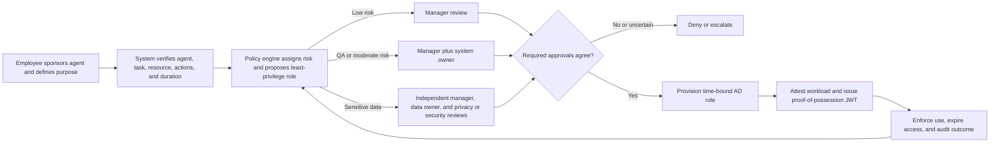

---
{
  "id": "file_ymjm1gzx",
  "filetype": "document",
  "filename": "agentic_access_review_system",
  "created_at": "2026-09-13T18:24:42.242Z",
  "updated_at": "2026-09-13T18:27:26.842Z",
  "meta": {
    "location": "/",
    "tags": [],
    "categories": [],
    "description": "",
    "source": "markdown"
  }
}
---
# Governed Agentic Access

## Problem

I propose a human computation system for governing how autonomous software agents access enterprise systems and data. The core problem is not whether an agent can authenticate. It is whether a specific use is permitted for a stated purpose. Reading a non-sensitive knowledge base, testing an application in quality assurance (QA), and analyzing customer records require different levels of evidence and accountability.

AI cannot make these decisions reliably on its own. The risk of an entitlement depends on the data, environment, and action. Historical approvals may reflect outdated policy, missing context, or bias. The requesting agent is also part of the threat model. It could omit facts, divide a high-risk request into several low-risk requests, or repeatedly rewrite its justification.

Human judgment is needed where context and accountability matter. Managers confirm the employee's assignment, data owners assess the use, and privacy or cybersecurity reviewers determine whether the risk is acceptable. Their decisions become structured inputs to automated provisioning and enforcement.

## Workflow and Architecture

I would divide the system into three layers: request definition, human decision, and runtime enforcement. Independent review increases with risk. In Malone, Laubacher, and Dellarocas's (2009) framework, a hierarchy performs a **Decide** task. Tang, Li, and Xie (2026) use a similar hybrid structure: automation organizes evidence while qualified people retain decision authority.

The request would begin with structured facts: sponsor, immutable agent identity and version, task, resource, actions, data classification, environment, duration, and permissible purpose. A narrative could add context but could not override those facts. The policy engine would recommend the narrowest Active Directory role using current policy and prior decisions. History would support the decision, not make it. Reviewers would see differences from precedent and later revocations.

Read-only access to non-sensitive information would require manager approval. QA access would add the system owner because test environments may contain production-like data or deployment capabilities. Sensitive data would require independent approval from the manager, data owner, and a privacy or security reviewer. Initial decisions would remain hidden to limit information cascades. Disagreement would trigger escalation, not majority vote, because each reviewer represents a different control function.

Approval is not the final control. The service would place the agent identity in the selected role for a defined period. At runtime, the workload would complete a signed challenge and platform attestation. It would receive a short-lived proof-of-possession JSON Web Token (JWT) bound to its identity, private key, task, resource, actions, and approval record. A copied token would be unusable without the key. The system would record the sponsor and agent separately and revoke access when the task ends or violates policy.

## Quality Control

Quality control starts with constraining the problem. The system would validate required fields, reject incompatible roles, show effective permissions, and link related requests across time. Semantic duplicate detection, resubmission limits, and cumulative privilege checks would identify reworded or fragmented requests. An agent could explain its request, but it could not change resource classification, conceal denials, or choose reviewers.

Independent high-risk reviews provide redundancy without treating expertise as interchangeable. Synthetic known-answer cases would test reviewer consistency, similar to the module's gold tasks. An audit team would compare authorized use with actual behavior and examine incidents and revocations. Poor outcomes would update policy instead of becoming favorable precedent. I would track false approvals, unnecessary privileges, overturned denials, reviewer disagreement, latency, repeated requests, unused access, expiration failures, and incidents. The ESP Game demonstrates that agreement is evidence, not proof of correctness (von Ahn & Dabbish, 2004).

## Participation and Incentives

Reviewers would participate as part of their paid responsibilities and receive protected time for the work. Performance measures would emphasize decision quality, documented reasoning, and timely escalation. Approval volume and speed would not be primary measures because they reward superficial review. Reviewers could receive recognition for identifying policy gaps. Requesters would receive faster decisions when they submit complete, narrowly scoped requests.

## Ethical Issues

The first ethical issue is privacy. An access request may expose customer information, employee activity, security findings, or the agent's actions. The interface should disclose only what each reviewer needs, redact customer data from narratives, encrypt logs, limit retention, and restrict audit access. Authorization for one purpose would not permit secondary use. Monitoring should capture security evidence without collecting unrelated employee content.

The second issue is bias and accountability. Historical approvals may favor teams with experienced managers or established relationships. An agent could amplify that advantage by optimizing its language against prior decisions. Routing should depend on verified attributes, and audits should compare approval and appeal rates across similar teams and request types. Each decision needs a named human owner, an explanation, and an appeal path. Precedent should be treated as evidence that can be challenged, not policy that must be repeated.

## Most Difficult Design Problem

The hardest design problem is separating legitimate clarification from manipulation by a persistent agent. Blocking every resubmission would prevent valid work. Allowing unlimited revisions would let an agent search the decision boundary until it finds a path to approval. I would maintain a canonical record of the underlying task, link semantically similar requests, calculate cumulative risk, limit resubmissions, and escalate repeated denials. These controls would still require adversarial testing with agents and human reviewers because no wording filter can prove intent.

The system must preserve a legitimate path for correction and appeal without allowing persistence to defeat least privilege. That balance is the central human computation problem in the design.

## References

Malone, T. W., Laubacher, R., & Dellarocas, C. (2009). *Harnessing crowds: Mapping the genome of collective intelligence* (SSRN Scholarly Paper No. 1381502). Social Science Research Network.

Tang, M., Li, M., & Xie, L. (2026). Harnessing the hybrid intelligence of crowd and artificial intelligence in group decision making for uncertain disaster response. *Risk Analysis, 46*(5), e70254. https://doi.org/10.1111/risa.70254

von Ahn, L., & Dabbish, L. (2004). Labeling images with a computer game. In *Proceedings of the SIGCHI Conference on Human Factors in Computing Systems* (pp. 319–326). Association for Computing Machinery. https://doi.org/10.1145/985692.985733

## Generative AI Disclosure

I used ChatGPT/Codex to help organize the system architecture, identify failure modes involving adversarial access requests, and draft this design document. I reviewed the output against the Module 2 assignment, required readings, and remain responsible for the final analysis.

OpenAI Codex. (2026, September 13). Agentic access human computation system design (Yaw Etse, interviewer).