---
{
  "id": "file_oticbqp8",
  "filetype": "document",
  "filename": "module_02_combined_required_readings",
  "created_at": "2026-09-10T02:11:10.332Z",
  "updated_at": "2026-09-10T02:11:10.332Z",
  "meta": {
    "location": "/",
    "tags": [],
    "categories": [],
    "description": "",
    "source": "markdown"
  }
}
---
# Module 02 Combined Required Readings

> Study reader for EN.605.734 Human-in-the-Loop AI. I have combined the assigned local papers into one reading file. The takeaways and questions are AI-assisted study aids. The source-text sections reproduce the papers and retain the authors' claims; I should verify quotations and citations against the original PDFs before using them in submitted work.

## Included scope

| Reading | Assigned scope included here |
| --- | --- |
| Malone, Laubacher, and Dellarocas | Full local PDF, 21 pages, including covers, appendix, and endnotes. |
| Tang, Li, and Xie (2026) | Full paper, 31 pages, including references and rescue-plan appendix. |
| von Ahn and Dabbish (2004) | Full paper, eight PDF pages, published pp. 319-326. |

The [Module 2 reading list](readings_02.md) specifies all three papers without page restrictions. I use PDF viewer page numbers throughout. The [learning summary](module_02_learning_summary.md) synthesizes these readings with the five lectures.

## Reading and source notes

Each reading includes a takeaway, study questions, selected complete visuals, and extracted source text arranged by PDF page. Every source page also has a local PNG in an expandable panel. Those page images preserve all diagrams, tables, equations, references, and appendices. I should read equations and dense tables from the source images because text extraction can flatten mathematical notation or table structure. Paragraph wrapping and dash punctuation have been normalized; source claims and wording have not been rewritten.

Malone's assigned year is 2009, while the downloaded copy has a March 2010 cover and a February 2009 title page. Tang's prose on PDF p. 12 says three crowd and two AI clusters, but Table 8 and the appendix show two crowd and three AI alternatives. These are source details to retain when citing the readings.

## Contents

- [1. Malone: Mapping the Genome of Collective Intelligence](#reading-malone)
- [2. Tang: Hybrid Intelligence for Disaster Response](#reading-tang)
- [3. von Ahn and Dabbish: Labeling Images with a Computer Game](#reading-esp)

---

## 1. Harnessing Crowds: Mapping the Genome of Collective Intelligence

**Source:** Malone, T. W., Laubacher, R., & Dellarocas, C. (2009, as assigned). *Harnessing Crowds: Mapping the Genome of Collective Intelligence.* MIT Center for Collective Intelligence working paper. The local PDF includes a March 2010 cover and a February 2009 internal title page.

**Local PDF:** [Mapping the Genome of Collective Intelligence - ssrn-1381502.pdf](mod_02_readings/Mapping%20the%20Genome%20of%20Collective%20Intelligence%20-%20ssrn-1381502.pdf)

### Takeaway

I can design collective intelligence by answering Who, Why, What, and How for each task. The paper distinguishes crowd participation from hierarchical assignment, separates creation from decision making, and explains when independent contributions or collaboration fit the work. Its framework helps me choose mechanisms based on dependencies, incentives, and decision authority. It does not establish that a crowd is always the best choice.

### Interesting questions

- How would I divide one system into separate creation, evaluation, and final-decision activities?
- When would I choose a collection, a contest, or collaboration?
- Which decisions need a shared outcome, and which can remain individual?
- What might fail if I assume that enjoyment or recognition will replace payment?

### Included diagrams and tables

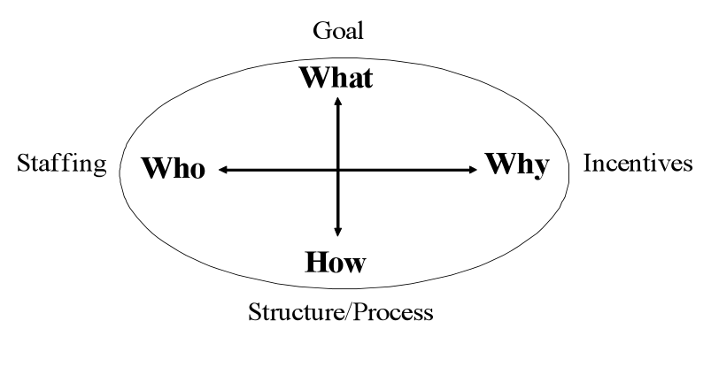

*Figure 1. Who, Why, What, and How. [Source PDF p. 4](mod_02_readings/Mapping%20the%20Genome%20of%20Collective%20Intelligence%20-%20ssrn-1381502.pdf#page=4).*

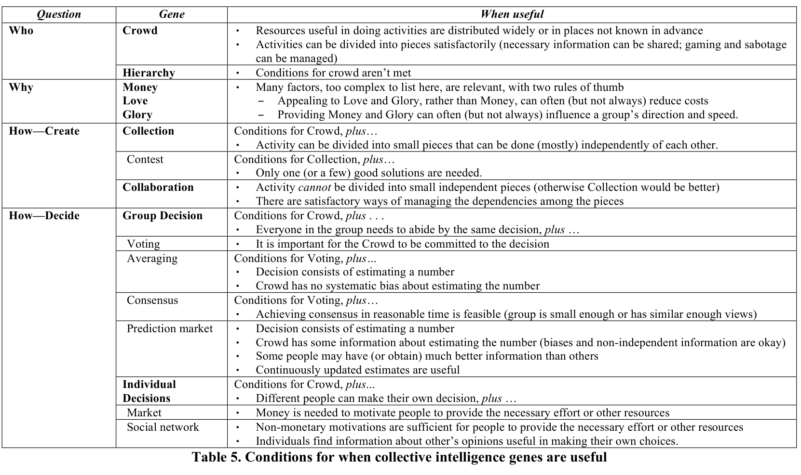

*Table 5. Conditions for selecting collective intelligence genes. [Source PDF p. 15](mod_02_readings/Mapping%20the%20Genome%20of%20Collective%20Intelligence%20-%20ssrn-1381502.pdf#page=15).*

### Assigned source text

#### Source page 1

[Open original PDF page 1](mod_02_readings/Mapping%20the%20Genome%20of%20Collective%20Intelligence%20-%20ssrn-1381502.pdf#page=1)

View original page 1, including its figures, tables, and equations

##### MIT Sloan School of Management

MIT Sloan School Working Paper 4732-09 3/19/2010

Harnessing Crowds: Mapping the Genome of Collective Intelligence

Thomas W. Malone, Robert Laubacher, and Chrysanthos Dellarocas

- © 2010 Thomas W. Malone, Robert Laubacher, and Chrysanthos Dellarocas

All rights reserved. Short sections of text, not to exceed two paragraphs, may be quoted without explicit permission, provided that full credit including © notice is given to the source.

This paper also can be downloaded without charge from the Social Science Research Network Electronic Paper Collection: http://ssrn.com/abstract=1381502

#### Source page 2

[Open original PDF page 2](mod_02_readings/Mapping%20the%20Genome%20of%20Collective%20Intelligence%20-%20ssrn-1381502.pdf#page=2)

View original page 2, including its figures, tables, and equations

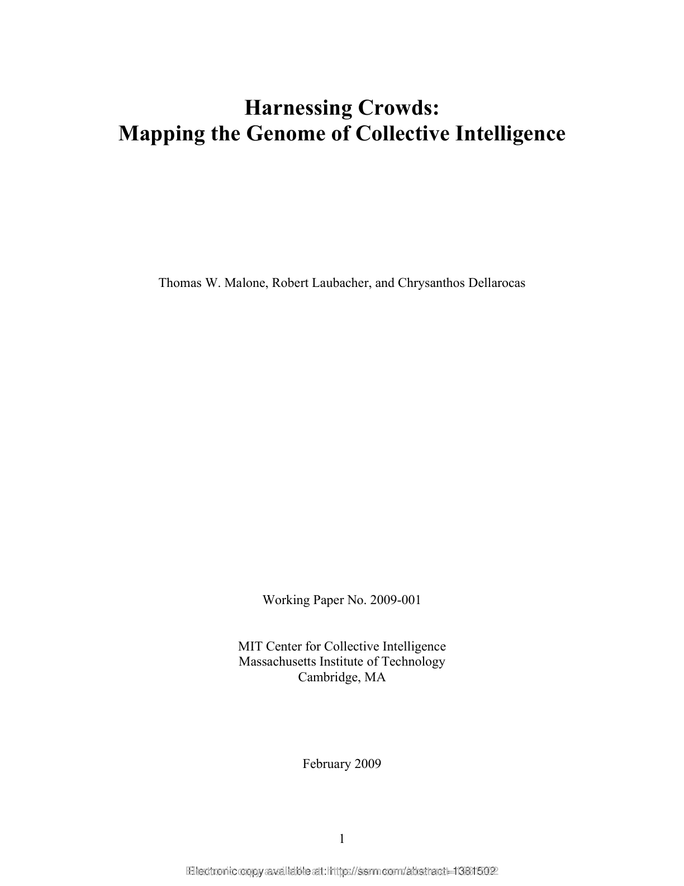

##### **Harnessing Crowds: Mapping the Genome of Collective Intelligence**

Thomas W. Malone, Robert Laubacher, and Chrysanthos Dellarocas

Working Paper No. 2009-001

MIT Center for Collective Intelligence Massachusetts Institute of Technology Cambridge, MA

February 2009

#### Source page 3

[Open original PDF page 3](mod_02_readings/Mapping%20the%20Genome%20of%20Collective%20Intelligence%20-%20ssrn-1381502.pdf#page=3)

View original page 3, including its figures, tables, and equations

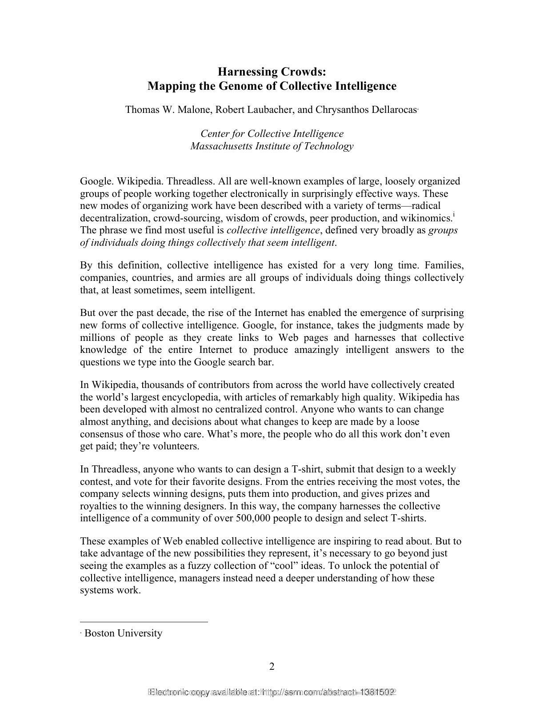

##### **Harnessing Crowds: Mapping the Genome of Collective Intelligence**

Thomas W. Malone, Robert Laubacher, and Chrysanthos Dellarocas

_Center for Collective Intelligence Massachusetts Institute of Technology_

Google. Wikipedia. Threadless. All are well-known examples of large, loosely organized groups of people working together electronically in surprisingly effective ways. These new modes of organizing work have been described with a variety of terms - radical decentralization, crowd-sourcing, wisdom of crowds, peer production, and wikinomics.i The phrase we find most useful is _collective intelligence_ , defined very broadly as _groups of individuals doing things collectively that seem intelligent_ .

By this definition, collective intelligence has existed for a very long time. Families, companies, countries, and armies are all groups of individuals doing things collectively that, at least sometimes, seem intelligent.

But over the past decade, the rise of the Internet has enabled the emergence of surprising new forms of collective intelligence. Google, for instance, takes the judgments made by millions of people as they create links to Web pages and harnesses that collective knowledge of the entire Internet to produce amazingly intelligent answers to the questions we type into the Google search bar.

In Wikipedia, thousands of contributors from across the world have collectively created the world’s largest encyclopedia, with articles of remarkably high quality. Wikipedia has been developed with almost no centralized control. Anyone who wants to can change almost anything, and decisions about what changes to keep are made by a loose consensus of those who care. What’s more, the people who do all this work don’t even get paid; they’re volunteers.

In Threadless, anyone who wants to can design a T-shirt, submit that design to a weekly contest, and vote for their favorite designs. From the entries receiving the most votes, the company selects winning designs, puts them into production, and gives prizes and royalties to the winning designers. In this way, the company harnesses the collective intelligence of a community of over 500,000 people to design and select T-shirts.

These examples of Web enabled collective intelligence are inspiring to read about. But to take advantage of the new possibilities they represent, it’s necessary to go beyond just seeing the examples as a fuzzy collection of “cool” ideas. To unlock the potential of collective intelligence, managers instead need a deeper understanding of how these systems work.

∗ Boston University

#### Source page 4

[Open original PDF page 4](mod_02_readings/Mapping%20the%20Genome%20of%20Collective%20Intelligence%20-%20ssrn-1381502.pdf#page=4)

View original page 4, including its figures, tables, and equations

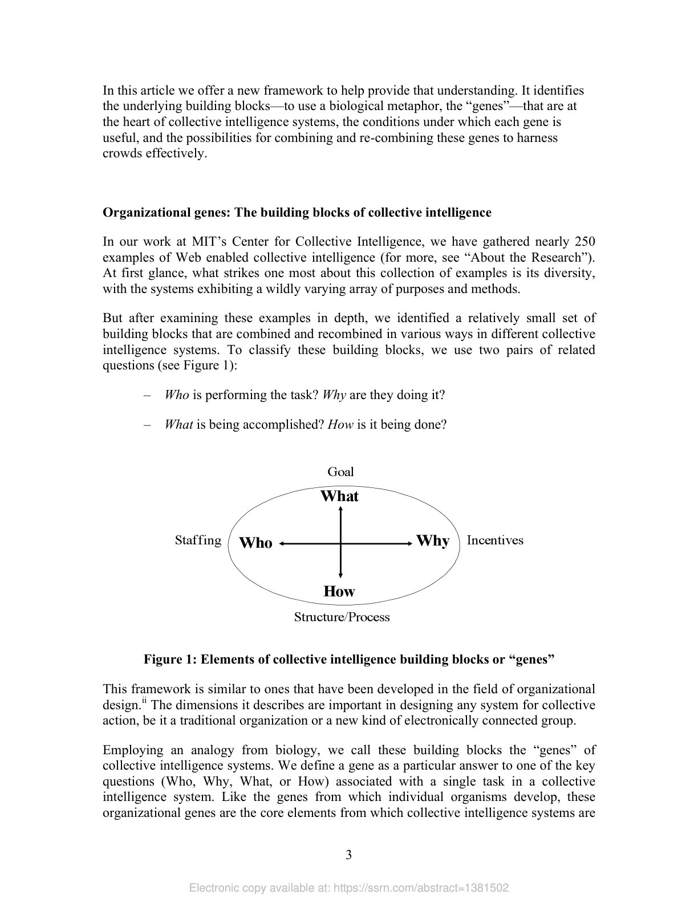

In this article we offer a new framework to help provide that understanding. It identifies the underlying building blocks - to use a biological metaphor, the “genes” - that are at the heart of collective intelligence systems, the conditions under which each gene is useful, and the possibilities for combining and re-combining these genes to harness crowds effectively.

##### **Organizational genes: The building blocks of collective intelligence**

In our work at MIT’s Center for Collective Intelligence, we have gathered nearly 250 examples of Web enabled collective intelligence (for more, see “About the Research”). At first glance, what strikes one most about this collection of examples is its diversity, with the systems exhibiting a wildly varying array of purposes and methods.

But after examining these examples in depth, we identified a relatively small set of building blocks that are combined and recombined in various ways in different collective intelligence systems. To classify these building blocks, we use two pairs of related questions (see Figure 1):

- _Who_ is performing the task? _Why_ are they doing it?

- _What_ is being accomplished? _How_ is it being done?

##### **Figure 1: Elements of collective intelligence building blocks or “genes”**

This framework is similar to ones that have been developed in the field of organizational design.ii The dimensions it describes are important in designing any system for collective action, be it a traditional organization or a new kind of electronically connected group.

Employing an analogy from biology, we call these building blocks the “genes” of collective intelligence systems. We define a gene as a particular answer to one of the key questions (Who, Why, What, or How) associated with a single task in a collective intelligence system. Like the genes from which individual organisms develop, these organizational genes are the core elements from which collective intelligence systems are

#### Source page 5

[Open original PDF page 5](mod_02_readings/Mapping%20the%20Genome%20of%20Collective%20Intelligence%20-%20ssrn-1381502.pdf#page=5)

View original page 5, including its figures, tables, and equations

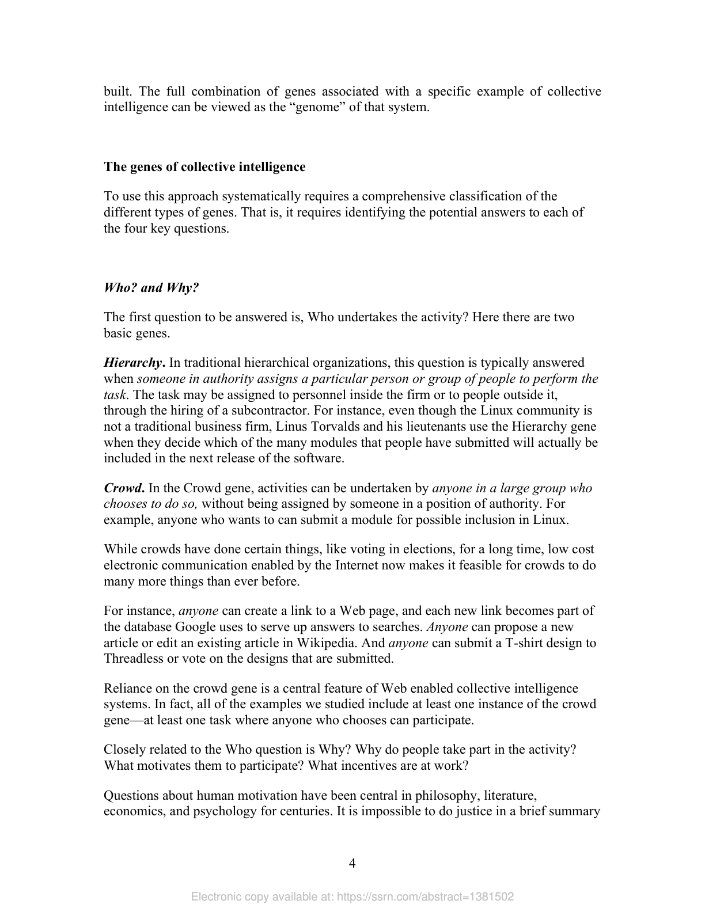

built. The full combination of genes associated with a specific example of collective intelligence can be viewed as the “genome” of that system.

##### **The genes of collective intelligence**

To use this approach systematically requires a comprehensive classification of the different types of genes. That is, it requires identifying the potential answers to each of the four key questions.

##### **_Who? and Why?_**

The first question to be answered is, Who undertakes the activity? Here there are two basic genes.

**_Hierarchy_ .** In traditional hierarchical organizations, this question is typically answered when _someone in authority assigns a particular person or group of people to perform the task_ . The task may be assigned to personnel inside the firm or to people outside it, through the hiring of a subcontractor. For instance, even though the Linux community is not a traditional business firm, Linus Torvalds and his lieutenants use the Hierarchy gene when they decide which of the many modules that people have submitted will actually be included in the next release of the software.

**_Crowd_ .** In the Crowd gene, activities can be undertaken by _anyone in a large group who chooses to do so,_ without being assigned by someone in a position of authority. For example, anyone who wants to can submit a module for possible inclusion in Linux.

While crowds have done certain things, like voting in elections, for a long time, low cost electronic communication enabled by the Internet now makes it feasible for crowds to do many more things than ever before.

For instance, _anyone_ can create a link to a Web page, and each new link becomes part of the database Google uses to serve up answers to searches. _Anyone_ can propose a new article or edit an existing article in Wikipedia. And _anyone_ can submit a T-shirt design to Threadless or vote on the designs that are submitted.

Reliance on the crowd gene is a central feature of Web enabled collective intelligence systems. In fact, all of the examples we studied include at least one instance of the crowd gene - at least one task where anyone who chooses can participate.

Closely related to the Who question is Why? Why do people take part in the activity? What motivates them to participate? What incentives are at work?

Questions about human motivation have been central in philosophy, literature, economics, and psychology for centuries. It is impossible to do justice in a brief summary

#### Source page 6

[Open original PDF page 6](mod_02_readings/Mapping%20the%20Genome%20of%20Collective%20Intelligence%20-%20ssrn-1381502.pdf#page=6)

View original page 6, including its figures, tables, and equations

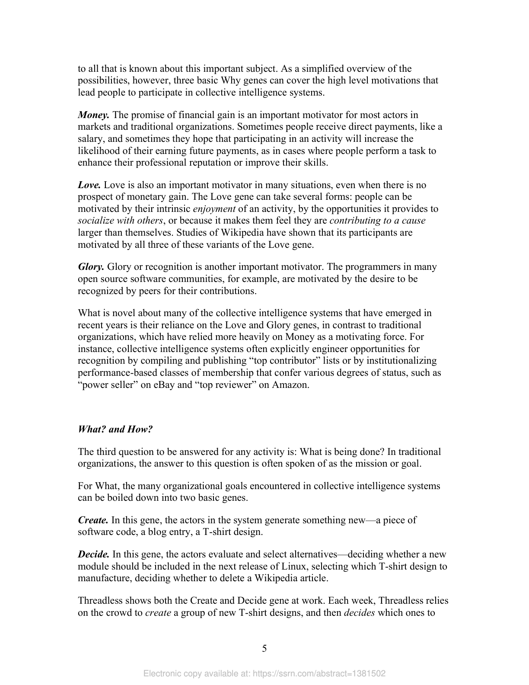

to all that is known about this important subject. As a simplified overview of the possibilities, however, three basic Why genes can cover the high level motivations that lead people to participate in collective intelligence systems.

**_Money._** The promise of financial gain is an important motivator for most actors in markets and traditional organizations. Sometimes people receive direct payments, like a salary, and sometimes they hope that participating in an activity will increase the likelihood of their earning future payments, as in cases where people perform a task to enhance their professional reputation or improve their skills.

**_Love._** Love is also an important motivator in many situations, even when there is no prospect of monetary gain. The Love gene can take several forms: people can be motivated by their intrinsic _enjoyment_ of an activity, by the opportunities it provides to _socialize with others_ , or because it makes them feel they are _contributing to a cause_ larger than themselves. Studies of Wikipedia have shown that its participants are motivated by all three of these variants of the Love gene.

**_Glory._** Glory or recognition is another important motivator. The programmers in many open source software communities, for example, are motivated by the desire to be recognized by peers for their contributions.

What is novel about many of the collective intelligence systems that have emerged in recent years is their reliance on the Love and Glory genes, in contrast to traditional organizations, which have relied more heavily on Money as a motivating force. For instance, collective intelligence systems often explicitly engineer opportunities for recognition by compiling and publishing “top contributor” lists or by institutionalizing performance-based classes of membership that confer various degrees of status, such as “power seller” on eBay and “top reviewer” on Amazon.

##### **_What? and How?_**

The third question to be answered for any activity is: What is being done? In traditional organizations, the answer to this question is often spoken of as the mission or goal.

For What, the many organizational goals encountered in collective intelligence systems can be boiled down into two basic genes.

**_Create._** In this gene, the actors in the system generate something new - a piece of software code, a blog entry, a T-shirt design.

**_Decide._** In this gene, the actors evaluate and select alternatives - deciding whether a new module should be included in the next release of Linux, selecting which T-shirt design to manufacture, deciding whether to delete a Wikipedia article.

Threadless shows both the Create and Decide gene at work. Each week, Threadless relies on the crowd to _create_ a group of new T-shirt designs, and then _decides_ which ones to

#### Source page 7

[Open original PDF page 7](mod_02_readings/Mapping%20the%20Genome%20of%20Collective%20Intelligence%20-%20ssrn-1381502.pdf#page=7)

View original page 7, including its figures, tables, and equations

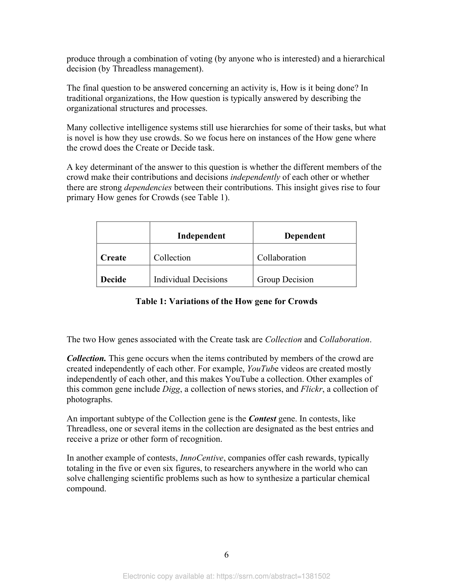

produce through a combination of voting (by anyone who is interested) and a hierarchical decision (by Threadless management).

The final question to be answered concerning an activity is, How is it being done? In traditional organizations, the How question is typically answered by describing the organizational structures and processes.

Many collective intelligence systems still use hierarchies for some of their tasks, but what is novel is how they use crowds. So we focus here on instances of the How gene where the crowd does the Create or Decide task.

A key determinant of the answer to this question is whether the different members of the crowd make their contributions and decisions _independently_ of each other or whether there are strong _dependencies_ between their contributions. This insight gives rise to four primary How genes for Crowds (see Table 1).

||**Independent**|**Dependent**|
|---|---|---|
|**Create**|Collection|Collaboration|
|**Decide**|Individual Decisions|Group Decision|

**Table 1: Variations of the How gene for Crowds**

The two How genes associated with the Create task are _Collection_ and _Collaboration_ .

**_Collection._** This gene occurs when the items contributed by members of the crowd are created independently of each other. For example, _YouTub_ e videos are created mostly independently of each other, and this makes YouTube a collection. Other examples of this common gene include _Digg_ , a collection of news stories, and _Flickr_ , a collection of photographs.

An important subtype of the Collection gene is the **_Contest_** gene. In contests, like Threadless, one or several items in the collection are designated as the best entries and receive a prize or other form of recognition.

In another example of contests, _InnoCentive_ , companies offer cash rewards, typically totaling in the five or even six figures, to researchers anywhere in the world who can solve challenging scientific problems such as how to synthesize a particular chemical compound.

#### Source page 8

[Open original PDF page 8](mod_02_readings/Mapping%20the%20Genome%20of%20Collective%20Intelligence%20-%20ssrn-1381502.pdf#page=8)

View original page 8, including its figures, tables, and equations

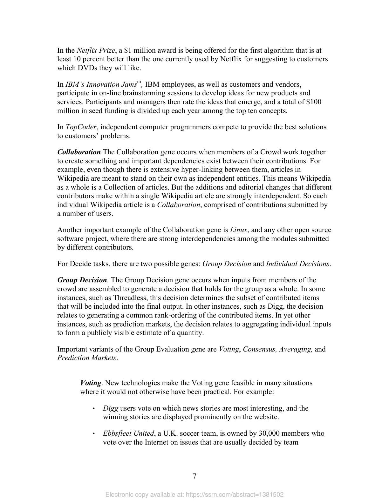

In the _Netflix Prize_ , a $1 million award is being offered for the first algorithm that is at least 10 percent better than the one currently used by Netflix for suggesting to customers which DVDs they will like.

In _IBM’s Innovation Jams_iii _,_ IBM employees, as well as customers and vendors, participate in on-line brainstorming sessions to develop ideas for new products and services. Participants and managers then rate the ideas that emerge, and a total of $100 million in seed funding is divided up each year among the top ten concepts.

In _TopCoder_ , independent computer programmers compete to provide the best solutions to customers’ problems.

**_Collaboration_** The Collaboration gene occurs when members of a Crowd work together to create something and important dependencies exist between their contributions. For example, even though there is extensive hyper-linking between them, articles in Wikipedia are meant to stand on their own as independent entities. This means Wikipedia as a whole is a Collection of articles. But the additions and editorial changes that different contributors make within a single Wikipedia article are strongly interdependent. So each individual Wikipedia article is a _Collaboration_ , comprised of contributions submitted by a number of users.

Another important example of the Collaboration gene is _Linux_ , and any other open source software project, where there are strong interdependencies among the modules submitted by different contributors.

For Decide tasks, there are two possible genes: _Group Decision_ and _Individual Decisions_ .

**_Group Decision_** . The Group Decision gene occurs when inputs from members of the crowd are assembled to generate a decision that holds for the group as a whole. In some instances, such as Threadless, this decision determines the subset of contributed items that will be included into the final output. In other instances, such as Digg, the decision relates to generating a common rank-ordering of the contributed items. In yet other instances, such as prediction markets, the decision relates to aggregating individual inputs to form a publicly visible estimate of a quantity.

Important variants of the Group Evaluation gene are _Voting_ , _Consensus, Averaging,_ and _Prediction Markets_ .

**_Voting_** . New technologies make the Voting gene feasible in many situations where it would not otherwise have been practical. For example:

- _Digg_ users vote on which news stories are most interesting, and the winning stories are displayed prominently on the website.

- _Ebbsfleet United_ , a U.K. soccer team, is owned by 30,000 members who vote over the Internet on issues that are usually decided by team

#### Source page 9

[Open original PDF page 9](mod_02_readings/Mapping%20the%20Genome%20of%20Collective%20Intelligence%20-%20ssrn-1381502.pdf#page=9)

View original page 9, including its figures, tables, and equations

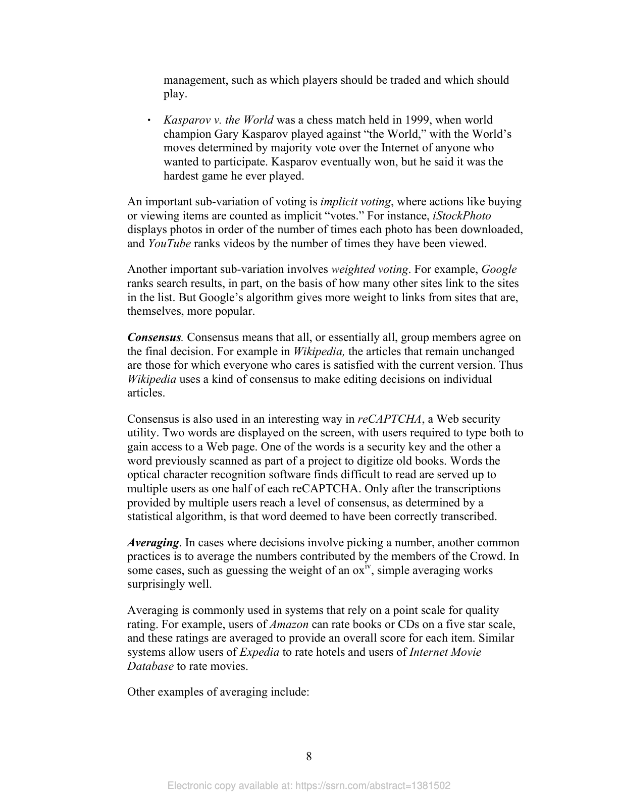

management, such as which players should be traded and which should play.

- _Kasparov v. the World_ was a chess match held in 1999, when world champion Gary Kasparov played against “the World,” with the World’s moves determined by majority vote over the Internet of anyone who wanted to participate. Kasparov eventually won, but he said it was the hardest game he ever played.

An important sub-variation of voting is _implicit voting_ , where actions like buying or viewing items are counted as implicit “votes.” For instance, _iStockPhoto_ displays photos in order of the number of times each photo has been downloaded, and _YouTube_ ranks videos by the number of times they have been viewed.

Another important sub-variation involves _weighted voting_ . For example, _Google_ ranks search results, in part, on the basis of how many other sites link to the sites in the list. But Google’s algorithm gives more weight to links from sites that are, themselves, more popular.

**_Consensus_** _._ Consensus means that all, or essentially all, group members agree on the final decision. For example in _Wikipedia,_ the articles that remain unchanged are those for which everyone who cares is satisfied with the current version. Thus _Wikipedia_ uses a kind of consensus to make editing decisions on individual articles.

Consensus is also used in an interesting way in _reCAPTCHA_ , a Web security utility. Two words are displayed on the screen, with users required to type both to gain access to a Web page. One of the words is a security key and the other a word previously scanned as part of a project to digitize old books. Words the optical character recognition software finds difficult to read are served up to multiple users as one half of each reCAPTCHA. Only after the transcriptions provided by multiple users reach a level of consensus, as determined by a statistical algorithm, is that word deemed to have been correctly transcribed.

**_Averaging_** . In cases where decisions involve picking a number, another common practices is to average the numbers contributed by the members of the Crowd. In some cases, such as guessing the weight of an oxiv , simple averaging works surprisingly well.

Averaging is commonly used in systems that rely on a point scale for quality rating. For example, users of _Amazon_ can rate books or CDs on a five star scale, and these ratings are averaged to provide an overall score for each item. Similar systems allow users of _Expedia_ to rate hotels and users of _Internet Movie Database_ to rate movies.

Other examples of averaging include:

#### Source page 10

[Open original PDF page 10](mod_02_readings/Mapping%20the%20Genome%20of%20Collective%20Intelligence%20-%20ssrn-1381502.pdf#page=10)

View original page 10, including its figures, tables, and equations

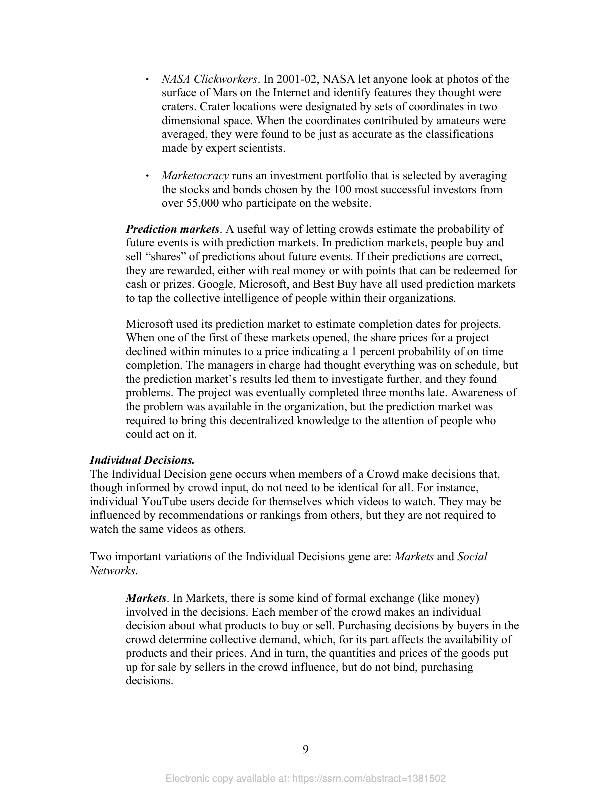

- _NASA Clickworkers_ . In 2001-02, NASA let anyone look at photos of the surface of Mars on the Internet and identify features they thought were craters. Crater locations were designated by sets of coordinates in two dimensional space. When the coordinates contributed by amateurs were averaged, they were found to be just as accurate as the classifications made by expert scientists.

- _Marketocracy_ runs an investment portfolio that is selected by averaging the stocks and bonds chosen by the 100 most successful investors from over 55,000 who participate on the website.

**_Prediction markets_** . A useful way of letting crowds estimate the probability of future events is with prediction markets. In prediction markets, people buy and sell “shares” of predictions about future events. If their predictions are correct, they are rewarded, either with real money or with points that can be redeemed for cash or prizes. Google, Microsoft, and Best Buy have all used prediction markets to tap the collective intelligence of people within their organizations.

Microsoft used its prediction market to estimate completion dates for projects. When one of the first of these markets opened, the share prices for a project declined within minutes to a price indicating a 1 percent probability of on time completion. The managers in charge had thought everything was on schedule, but the prediction market’s results led them to investigate further, and they found problems. The project was eventually completed three months late. Awareness of the problem was available in the organization, but the prediction market was required to bring this decentralized knowledge to the attention of people who could act on it.

##### **_Individual Decisions._**

The Individual Decision gene occurs when members of a Crowd make decisions that, though informed by crowd input, do not need to be identical for all. For instance, individual YouTube users decide for themselves which videos to watch. They may be influenced by recommendations or rankings from others, but they are not required to watch the same videos as others.

Two important variations of the Individual Decisions gene are: _Markets_ and _Social Networks_ .

**_Markets_** . In Markets, there is some kind of formal exchange (like money) involved in the decisions. Each member of the crowd makes an individual decision about what products to buy or sell. Purchasing decisions by buyers in the crowd determine collective demand, which, for its part affects the availability of products and their prices. And in turn, the quantities and prices of the goods put up for sale by sellers in the crowd influence, but do not bind, purchasing decisions.

#### Source page 11

[Open original PDF page 11](mod_02_readings/Mapping%20the%20Genome%20of%20Collective%20Intelligence%20-%20ssrn-1381502.pdf#page=11)

View original page 11, including its figures, tables, and equations

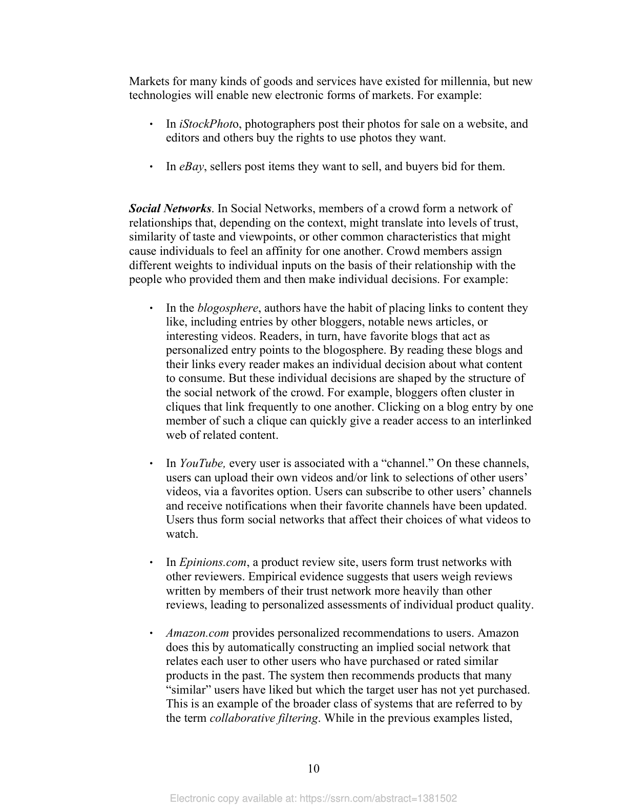

Markets for many kinds of goods and services have existed for millennia, but new technologies will enable new electronic forms of markets. For example:

- In _iStockPhot_ o, photographers post their photos for sale on a website, and editors and others buy the rights to use photos they want.

- In _eBay_ , sellers post items they want to sell, and buyers bid for them.

**_Social Networks_** . In Social Networks, members of a crowd form a network of relationships that, depending on the context, might translate into levels of trust, similarity of taste and viewpoints, or other common characteristics that might cause individuals to feel an affinity for one another. Crowd members assign different weights to individual inputs on the basis of their relationship with the people who provided them and then make individual decisions. For example:

- In the _blogosphere_ , authors have the habit of placing links to content they like, including entries by other bloggers, notable news articles, or interesting videos. Readers, in turn, have favorite blogs that act as personalized entry points to the blogosphere. By reading these blogs and their links every reader makes an individual decision about what content to consume. But these individual decisions are shaped by the structure of the social network of the crowd. For example, bloggers often cluster in cliques that link frequently to one another. Clicking on a blog entry by one member of such a clique can quickly give a reader access to an interlinked web of related content.

- In _YouTube,_ every user is associated with a “channel.” On these channels, users can upload their own videos and/or link to selections of other users’ videos, via a favorites option. Users can subscribe to other users’ channels and receive notifications when their favorite channels have been updated. Users thus form social networks that affect their choices of what videos to watch.

- In _Epinions.com_ , a product review site, users form trust networks with other reviewers. Empirical evidence suggests that users weigh reviews written by members of their trust network more heavily than other reviews, leading to personalized assessments of individual product quality.

- _Amazon.com_ provides personalized recommendations to users. Amazon does this by automatically constructing an implied social network that relates each user to other users who have purchased or rated similar products in the past. The system then recommends products that many “similar” users have liked but which the target user has not yet purchased. This is an example of the broader class of systems that are referred to by the term _collaborative filtering_ . While in the previous examples listed,

#### Source page 12

[Open original PDF page 12](mod_02_readings/Mapping%20the%20Genome%20of%20Collective%20Intelligence%20-%20ssrn-1381502.pdf#page=12)

View original page 12, including its figures, tables, and equations

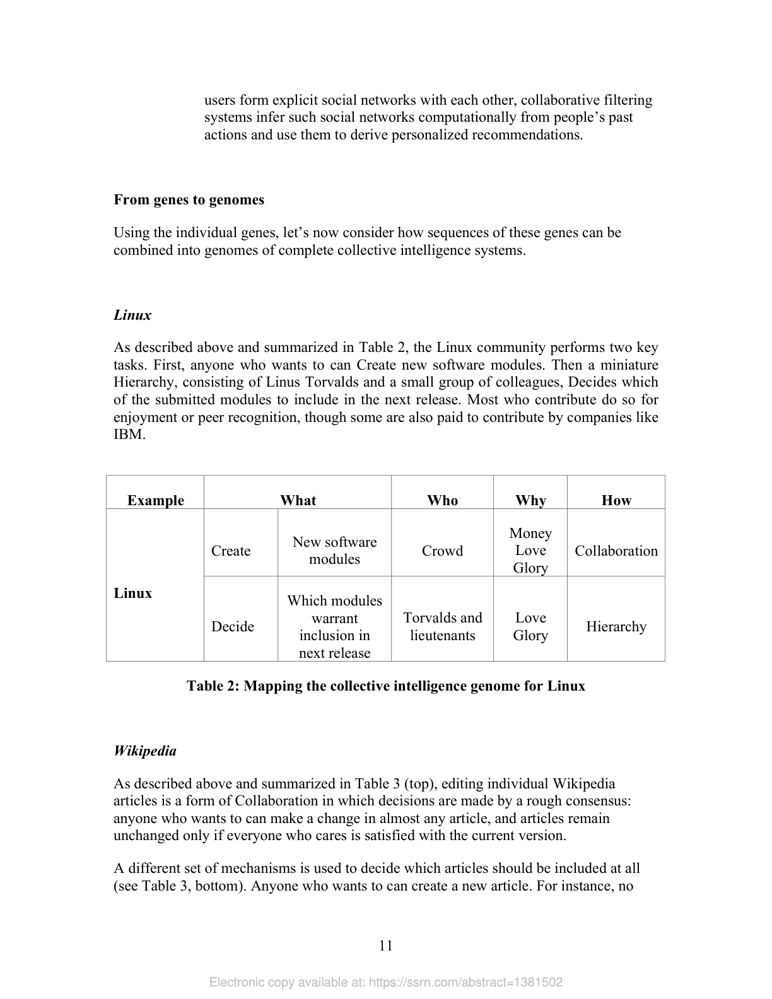

users form explicit social networks with each other, collaborative filtering systems infer such social networks computationally from people’s past actions and use them to derive personalized recommendations.

##### **From genes to genomes**

Using the individual genes, let’s now consider how sequences of these genes can be combined into genomes of complete collective intelligence systems.

##### **_Linux_**

As described above and summarized in Table 2, the Linux community performs two key tasks. First, anyone who wants to can Create new software modules. Then a miniature Hierarchy, consisting of Linus Torvalds and a small group of colleagues, Decides which of the submitted modules to include in the next release. Most who contribute do so for enjoyment or peer recognition, though some are also paid to contribute by companies like IBM.

|**Example**||**What**|**Who**|**Why**|**How**|
|---|---|---|---|---|---|
||Create|New software modules|Crowd|Money Love Glory|Collaboration|
|**Linux**|Decide|Which modules warrant inclusion in next release|Torvalds and lieutenants|Love Glory|Hierarchy|

**Table 2: Mapping the collective intelligence genome for Linux**

##### **_Wikipedia_**

As described above and summarized in Table 3 (top), editing individual Wikipedia articles is a form of Collaboration in which decisions are made by a rough consensus: anyone who wants to can make a change in almost any article, and articles remain unchanged only if everyone who cares is satisfied with the current version.

A different set of mechanisms is used to decide which articles should be included at all (see Table 3, bottom). Anyone who wants to can create a new article. For instance, no

#### Source page 13

[Open original PDF page 13](mod_02_readings/Mapping%20the%20Genome%20of%20Collective%20Intelligence%20-%20ssrn-1381502.pdf#page=13)

View original page 13, including its figures, tables, and equations

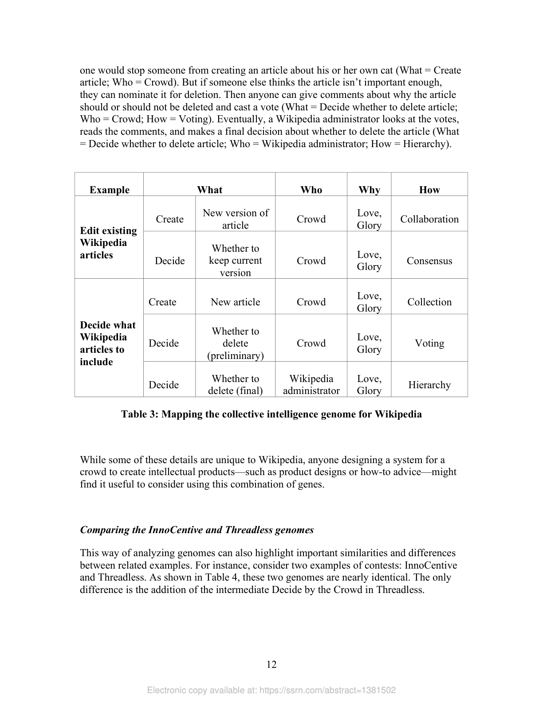

one would stop someone from creating an article about his or her own cat (What = Create article; Who = Crowd). But if someone else thinks the article isn’t important enough, they can nominate it for deletion. Then anyone can give comments about why the article should or should not be deleted and cast a vote (What = Decide whether to delete article; Who = Crowd; How = Voting). Eventually, a Wikipedia administrator looks at the votes, reads the comments, and makes a final decision about whether to delete the article (What = Decide whether to delete article; Who = Wikipedia administrator; How = Hierarchy).

|**Example**||**What**|**Who**|**Why**|**How**|
|---|---|---|---|---|---|
|**Edit existing**|Create|New version of article|Crowd|Love, Glory|Collaboration|
| **Wikipedia** **articles**|Decide|Whether to keep current version|Crowd|Love, Glory|Consensus|
||Create|New article|Crowd|Love, Glory|Collection|
|**Decide what** **Wikipedia** **articles to** **include**|Decide|Whether to delete (preliminary)|Crowd|Love, Glory|Voting|
||Decide|Whether to delete (final)|Wikipedia administrator|Love, Glory|Hierarchy|

**Table 3: Mapping the collective intelligence genome for Wikipedia**

While some of these details are unique to Wikipedia, anyone designing a system for a crowd to create intellectual products - such as product designs or how-to advice - might find it useful to consider using this combination of genes.

##### **_Comparing the InnoCentive and Threadless genomes_**

This way of analyzing genomes can also highlight important similarities and differences between related examples. For instance, consider two examples of contests: InnoCentive and Threadless. As shown in Table 4, these two genomes are nearly identical. The only difference is the addition of the intermediate Decide by the Crowd in Threadless.

#### Source page 14

[Open original PDF page 14](mod_02_readings/Mapping%20the%20Genome%20of%20Collective%20Intelligence%20-%20ssrn-1381502.pdf#page=14)

View original page 14, including its figures, tables, and equations

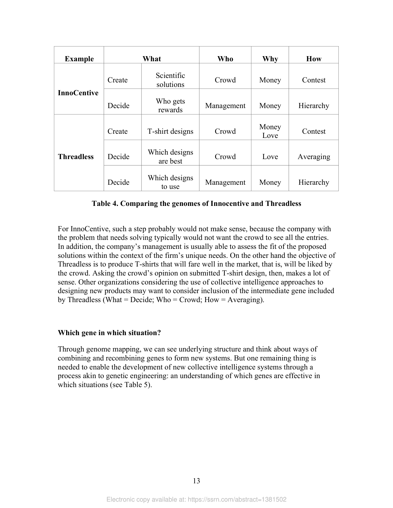

|**Example**||**What**|**Who**|**Why**|**How**|
|---|---|---|---|---|---|
||Create|Scientific solutions|Crowd|Money|Contest|
|**InnoCentive**|Decide|Who gets rewards|Management|Money|Hierarchy|
||Create|T-shirt designs|Crowd|Money Love|Contest|
|**Threadless**|Decide|Which designs are best|Crowd|Love|Averaging|
||Decide|Which designs to use|Management|Money|Hierarchy|

**Table 4. Comparing the genomes of Innocentive and Threadless**

For InnoCentive, such a step probably would not make sense, because the company with the problem that needs solving typically would not want the crowd to see all the entries. In addition, the company’s management is usually able to assess the fit of the proposed solutions within the context of the firm’s unique needs. On the other hand the objective of Threadless is to produce T-shirts that will fare well in the market, that is, will be liked by the crowd. Asking the crowd’s opinion on submitted T-shirt design, then, makes a lot of sense. Other organizations considering the use of collective intelligence approaches to designing new products may want to consider inclusion of the intermediate gene included by Threadless (What = Decide; Who = Crowd; How = Averaging).

##### **Which gene in which situation?**

Through genome mapping, we can see underlying structure and think about ways of combining and recombining genes to form new systems. But one remaining thing is needed to enable the development of new collective intelligence systems through a process akin to genetic engineering: an understanding of which genes are effective in which situations (see Table 5).

#### Source page 15

[Open original PDF page 15](mod_02_readings/Mapping%20the%20Genome%20of%20Collective%20Intelligence%20-%20ssrn-1381502.pdf#page=15)

View original page 15, including its figures, tables, and equations

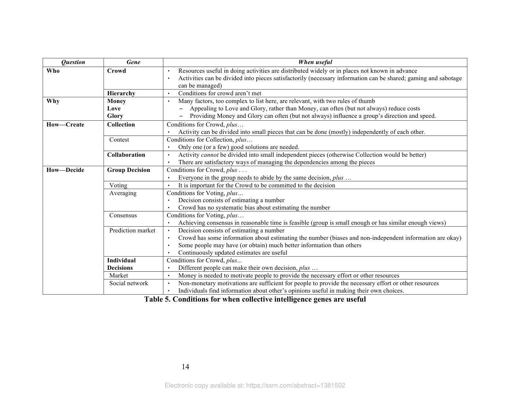

|**_Question_**|**_Gene_**|**_When useful_**|
|---|---|---|
|**Who**|**Crowd**|· Resources useful in doing activities are distributed widely or in places not known in advance · Activities can be divided into pieces satisfactorily (necessary information can be shared; gaming and sabotage can be managed)|
||**Hierarchy**|· Conditions for crowd aren’t met|
|**Why**|**Money** **Love** **Glory**|· Many factors, too complex to list here, are relevant, with two rules of thumb – Appealing to Love and Glory, rather than Money, can often (but not always) reduce costs – ProvidingMoneyand Glorycan often(but not always)influence agroup’s direction and speed.|
|**How - Create**|**Collection**|Conditions for Crowd,_plus_… · Activitycan be divided into smallpieces that can be done(mostly)independentlyof each other.|
||Contest|Conditions for Collection,_plus_… · Onlyone(or a few) good solutions are needed.|
||**Collaboration**|· Activity_cannot_be divided into small independent pieces (otherwise Collection would be better) · There are satisfactoryways of managingthe dependencies amongthepieces|
|**How - Decide**|**Group Decision**|Conditions for Crowd,_plus_. . . · Everyone in thegroupneeds to abide bythe same decision, _plus_…|
||Voting|· It is important for the Crowd to be committed to the decision|
||Averaging|Conditions for Voting,_plus…_ · Decision consists of estimating a number · Crowd has no systematic bias about estimatingthe number|
||Consensus|Conditions for Voting,_plus_… · Achievingconsensus in reasonable time is feasible(groupis small enough or has similar enough views)|
||Prediction market|· Decision consists of estimating a number · Crowd has some information about estimating the number (biases and non-independent information are okay) · Some people may have (or obtain) much better information than others · Continuouslyupdated estimates are useful|
||**Individual** **Decisions**|Conditions for Crowd,_plus_... · Differentpeople can make their own decision, _plus_…|
||Market|· Moneyis needed to motivatepeople toprovide the necessaryeffort or other resources|
||Social network|· Non-monetary motivations are sufficient for people to provide the necessary effort or other resources · Individuals find information about other’s opinions useful in makingtheir own choices.|

**Table 5. Conditions for when collective intelligence genes are useful**

#### Source page 16

[Open original PDF page 16](mod_02_readings/Mapping%20the%20Genome%20of%20Collective%20Intelligence%20-%20ssrn-1381502.pdf#page=16)

View original page 16, including its figures, tables, and equations

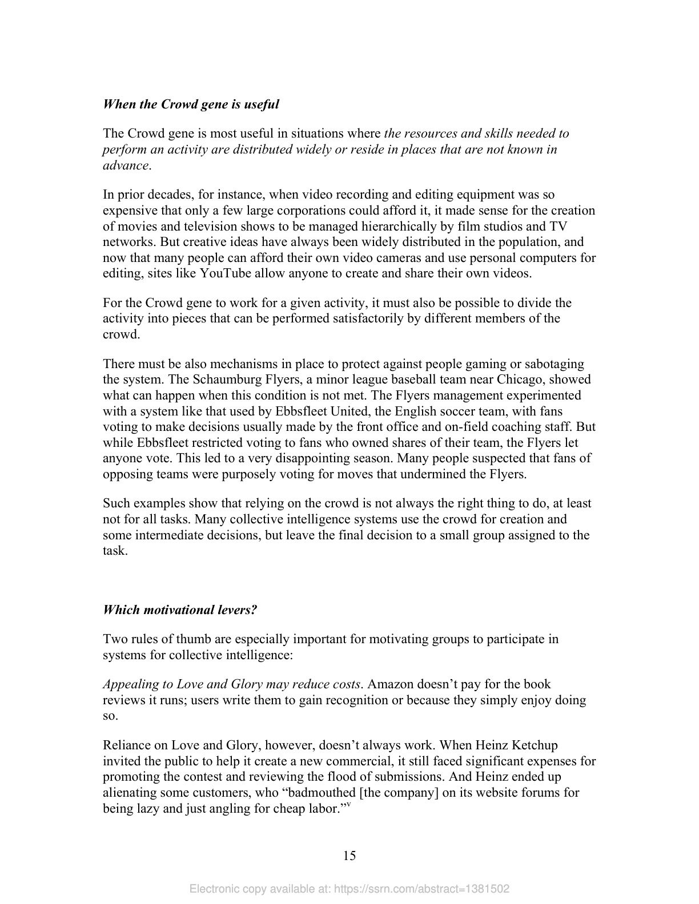

##### **_When the Crowd gene is useful_**

The Crowd gene is most useful in situations where _the resources and skills needed to perform an activity are distributed widely or reside in places that are not known in advance_ .

In prior decades, for instance, when video recording and editing equipment was so expensive that only a few large corporations could afford it, it made sense for the creation of movies and television shows to be managed hierarchically by film studios and TV networks. But creative ideas have always been widely distributed in the population, and now that many people can afford their own video cameras and use personal computers for editing, sites like YouTube allow anyone to create and share their own videos.

For the Crowd gene to work for a given activity, it must also be possible to divide the activity into pieces that can be performed satisfactorily by different members of the crowd.

There must be also mechanisms in place to protect against people gaming or sabotaging the system. The Schaumburg Flyers, a minor league baseball team near Chicago, showed what can happen when this condition is not met. The Flyers management experimented with a system like that used by Ebbsfleet United, the English soccer team, with fans voting to make decisions usually made by the front office and on-field coaching staff. But while Ebbsfleet restricted voting to fans who owned shares of their team, the Flyers let anyone vote. This led to a very disappointing season. Many people suspected that fans of opposing teams were purposely voting for moves that undermined the Flyers.

Such examples show that relying on the crowd is not always the right thing to do, at least not for all tasks. Many collective intelligence systems use the crowd for creation and some intermediate decisions, but leave the final decision to a small group assigned to the task.

##### **_Which motivational levers?_**

Two rules of thumb are especially important for motivating groups to participate in systems for collective intelligence:

_Appealing to Love and Glory may reduce costs_ . Amazon doesn’t pay for the book reviews it runs; users write them to gain recognition or because they simply enjoy doing so.

Reliance on Love and Glory, however, doesn’t always work. When Heinz Ketchup invited the public to help it create a new commercial, it still faced significant expenses for promoting the contest and reviewing the flood of submissions. And Heinz ended up alienating some customers, who “badmouthed [the company] on its website forums for being lazy and just angling for cheap labor.”v

#### Source page 17

[Open original PDF page 17](mod_02_readings/Mapping%20the%20Genome%20of%20Collective%20Intelligence%20-%20ssrn-1381502.pdf#page=17)

View original page 17, including its figures, tables, and equations

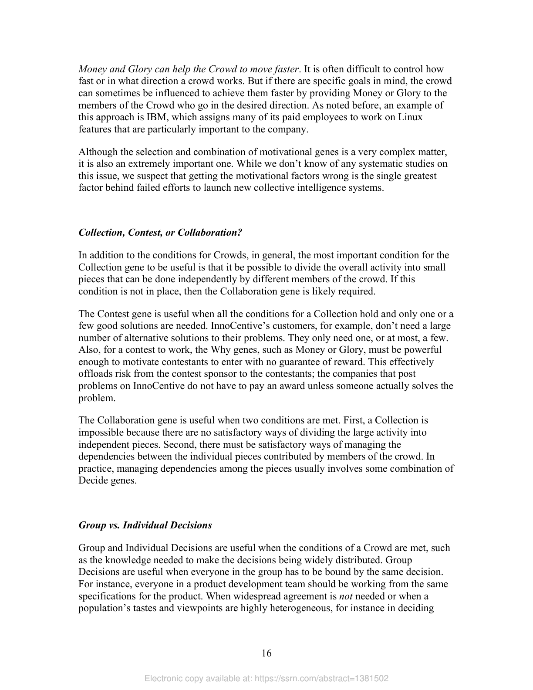

_Money and Glory can help the Crowd to move faster_ . It is often difficult to control how fast or in what direction a crowd works. But if there are specific goals in mind, the crowd can sometimes be influenced to achieve them faster by providing Money or Glory to the members of the Crowd who go in the desired direction. As noted before, an example of this approach is IBM, which assigns many of its paid employees to work on Linux features that are particularly important to the company.

Although the selection and combination of motivational genes is a very complex matter, it is also an extremely important one. While we don’t know of any systematic studies on this issue, we suspect that getting the motivational factors wrong is the single greatest factor behind failed efforts to launch new collective intelligence systems.

##### **_Collection, Contest, or Collaboration?_**

In addition to the conditions for Crowds, in general, the most important condition for the Collection gene to be useful is that it be possible to divide the overall activity into small pieces that can be done independently by different members of the crowd. If this condition is not in place, then the Collaboration gene is likely required.

The Contest gene is useful when all the conditions for a Collection hold and only one or a few good solutions are needed. InnoCentive’s customers, for example, don’t need a large number of alternative solutions to their problems. They only need one, or at most, a few. Also, for a contest to work, the Why genes, such as Money or Glory, must be powerful enough to motivate contestants to enter with no guarantee of reward. This effectively offloads risk from the contest sponsor to the contestants; the companies that post problems on InnoCentive do not have to pay an award unless someone actually solves the problem.

The Collaboration gene is useful when two conditions are met. First, a Collection is impossible because there are no satisfactory ways of dividing the large activity into independent pieces. Second, there must be satisfactory ways of managing the dependencies between the individual pieces contributed by members of the crowd. In practice, managing dependencies among the pieces usually involves some combination of Decide genes.

##### **_Group vs. Individual Decisions_**

Group and Individual Decisions are useful when the conditions of a Crowd are met, such as the knowledge needed to make the decisions being widely distributed. Group Decisions are useful when everyone in the group has to be bound by the same decision. For instance, everyone in a product development team should be working from the same specifications for the product. When widespread agreement is _not_ needed or when a population’s tastes and viewpoints are highly heterogeneous, for instance in deciding

#### Source page 18

[Open original PDF page 18](mod_02_readings/Mapping%20the%20Genome%20of%20Collective%20Intelligence%20-%20ssrn-1381502.pdf#page=18)

View original page 18, including its figures, tables, and equations

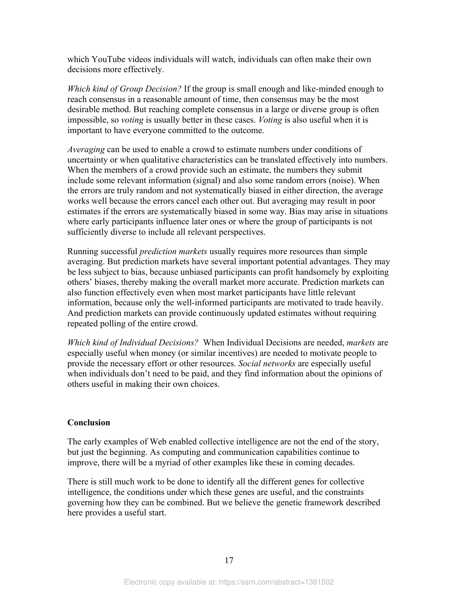

which YouTube videos individuals will watch, individuals can often make their own decisions more effectively.

_Which kind of Group Decision?_ If the group is small enough and like-minded enough to reach consensus in a reasonable amount of time, then consensus may be the most desirable method. But reaching complete consensus in a large or diverse group is often impossible, so _voting_ is usually better in these cases. _Voting_ is also useful when it is important to have everyone committed to the outcome.

_Averaging_ can be used to enable a crowd to estimate numbers under conditions of uncertainty or when qualitative characteristics can be translated effectively into numbers. When the members of a crowd provide such an estimate, the numbers they submit include some relevant information (signal) and also some random errors (noise). When the errors are truly random and not systematically biased in either direction, the average works well because the errors cancel each other out. But averaging may result in poor estimates if the errors are systematically biased in some way. Bias may arise in situations where early participants influence later ones or where the group of participants is not sufficiently diverse to include all relevant perspectives.

Running successful _prediction markets_ usually requires more resources than simple averaging. But prediction markets have several important potential advantages. They may be less subject to bias, because unbiased participants can profit handsomely by exploiting others’ biases, thereby making the overall market more accurate. Prediction markets can also function effectively even when most market participants have little relevant information, because only the well-informed participants are motivated to trade heavily. And prediction markets can provide continuously updated estimates without requiring repeated polling of the entire crowd.

_Which kind of Individual Decisions?_ When Individual Decisions are needed, _markets_ are especially useful when money (or similar incentives) are needed to motivate people to provide the necessary effort or other resources. _Social networks_ are especially useful when individuals don’t need to be paid, and they find information about the opinions of others useful in making their own choices.

##### **Conclusion**

The early examples of Web enabled collective intelligence are not the end of the story, but just the beginning. As computing and communication capabilities continue to improve, there will be a myriad of other examples like these in coming decades.

There is still much work to be done to identify all the different genes for collective intelligence, the conditions under which these genes are useful, and the constraints governing how they can be combined. But we believe the genetic framework described here provides a useful start.

#### Source page 19

[Open original PDF page 19](mod_02_readings/Mapping%20the%20Genome%20of%20Collective%20Intelligence%20-%20ssrn-1381502.pdf#page=19)

View original page 19, including its figures, tables, and equations

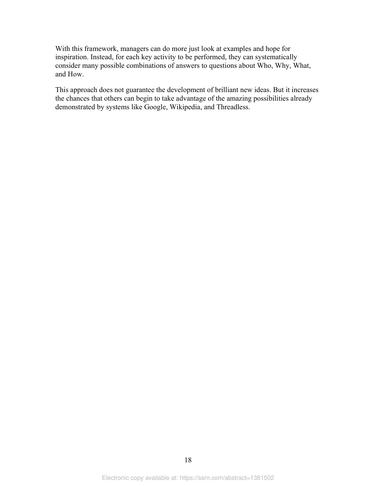

With this framework, managers can do more just look at examples and hope for inspiration. Instead, for each key activity to be performed, they can systematically consider many possible combinations of answers to questions about Who, Why, What, and How.

This approach does not guarantee the development of brilliant new ideas. But it increases the chances that others can begin to take advantage of the amazing possibilities already demonstrated by systems like Google, Wikipedia, and Threadless.

#### Source page 20

[Open original PDF page 20](mod_02_readings/Mapping%20the%20Genome%20of%20Collective%20Intelligence%20-%20ssrn-1381502.pdf#page=20)

View original page 20, including its figures, tables, and equations

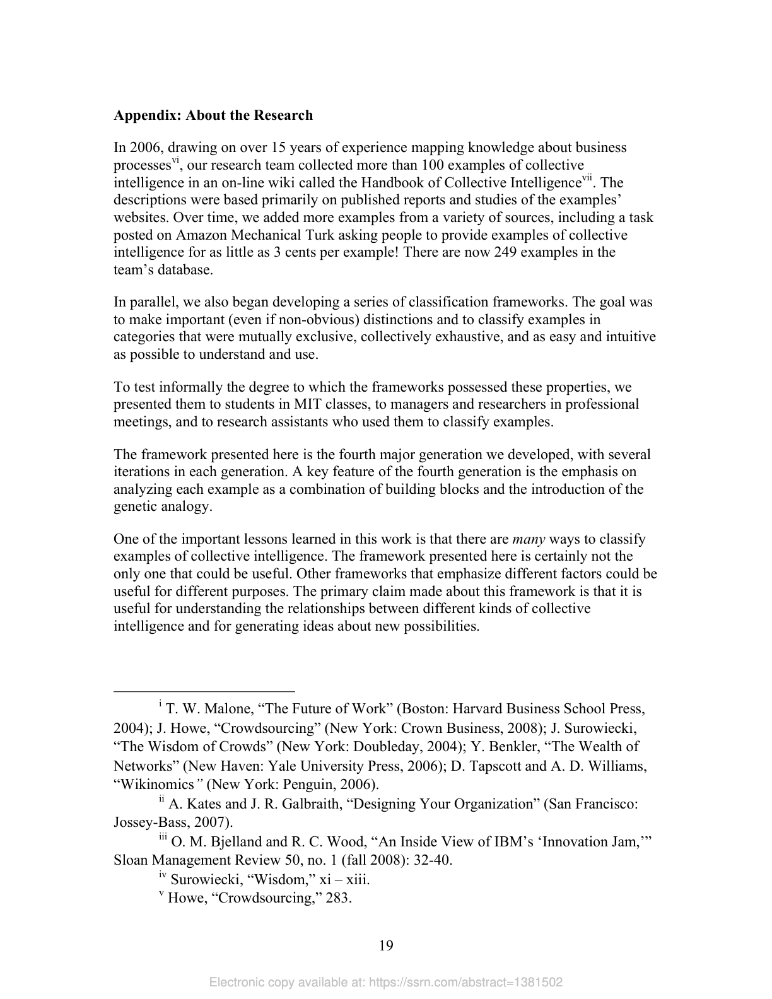

##### **Appendix: About the Research**

In 2006, drawing on over 15 years of experience mapping knowledge about business processesvi , our research team collected more than 100 examples of collective intelligence in an on-line wiki called the Handbook of Collective Intelligencevii . The descriptions were based primarily on published reports and studies of the examples’ websites. Over time, we added more examples from a variety of sources, including a task posted on Amazon Mechanical Turk asking people to provide examples of collective intelligence for as little as 3 cents per example! There are now 249 examples in the team’s database.

In parallel, we also began developing a series of classification frameworks. The goal was to make important (even if non-obvious) distinctions and to classify examples in categories that were mutually exclusive, collectively exhaustive, and as easy and intuitive as possible to understand and use.

To test informally the degree to which the frameworks possessed these properties, we presented them to students in MIT classes, to managers and researchers in professional meetings, and to research assistants who used them to classify examples.

The framework presented here is the fourth major generation we developed, with several iterations in each generation. A key feature of the fourth generation is the emphasis on analyzing each example as a combination of building blocks and the introduction of the genetic analogy.

One of the important lessons learned in this work is that there are _many_ ways to classify examples of collective intelligence. The framework presented here is certainly not the only one that could be useful. Other frameworks that emphasize different factors could be useful for different purposes. The primary claim made about this framework is that it is useful for understanding the relationships between different kinds of collective intelligence and for generating ideas about new possibilities.

i T. W. Malone, “The Future of Work” (Boston: Harvard Business School Press, 2004); J. Howe, “Crowdsourcing” (New York: Crown Business, 2008); J. Surowiecki, “The Wisdom of Crowds” (New York: Doubleday, 2004); Y. Benkler, “The Wealth of Networks” (New Haven: Yale University Press, 2006); D. Tapscott and A. D. Williams, “Wikinomics _”_ (New York: Penguin, 2006).

ii A. Kates and J. R. Galbraith, “Designing Your Organization” (San Francisco: Jossey-Bass, 2007).

iii O. M. Bjelland and R. C. Wood, “An Inside View of IBM’s ‘Innovation Jam,’” Sloan Management Review 50, no. 1 (fall 2008): 32-40.

iv Surowiecki, “Wisdom,” xi – xiii.

v Howe, “Crowdsourcing,” 283.

#### Source page 21

[Open original PDF page 21](mod_02_readings/Mapping%20the%20Genome%20of%20Collective%20Intelligence%20-%20ssrn-1381502.pdf#page=21)

View original page 21, including its figures, tables, and equations

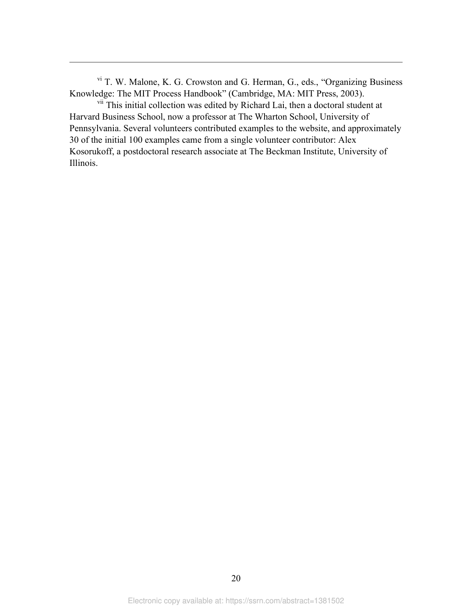

> vi T. W. Malone, K. G. Crowston and G. Herman, G., eds., “Organizing Business Knowledge: The MIT Process Handbook” (Cambridge, MA: MIT Press, 2003). vii This initial collection was edited by Richard Lai, then a doctoral student at Harvard Business School, now a professor at The Wharton School, University of Pennsylvania. Several volunteers contributed examples to the website, and approximately 30 of the initial 100 examples came from a single volunteer contributor: Alex Kosorukoff, a postdoctoral research associate at The Beckman Institute, University of Illinois.

---

## 2. Harnessing the Hybrid Intelligence of Crowd and Artificial Intelligence in Group Decision Making for Uncertain Disaster Response

**Source:** Tang, M., Li, M., & Xie, L. (2026). *Harnessing the Hybrid Intelligence of Crowd and Artificial Intelligence in Group Decision Making for Uncertain Disaster Response.* Risk Analysis, 46(5), e70254. DOI: 10.1111/risa.70254.

**Local PDF:** [Risk Analysis - 2026 - Tang - Harnessing the Hybrid Intelligence of Crowd and Artificial Intelligence in Group Decision.pdf](mod_02_readings/Risk%20Analysis%20-%202026%20-%20Tang%20-%20Harnessing%20the%20Hybrid%20Intelligence%20of%20Crowd%20and%20Artificial%20Intelligence%20in%20Group%20Decision.pdf)

### Takeaway

I need to account for people whose needs are missing from crowdsourced reports. This paper combines rescue posts, urgency classification, vulnerability-based demand estimates, stochastic optimization, and expert preferences to construct and rank dispatch alternatives. I should evaluate coverage and resource allocation alongside prediction quality, and distinguish expert consensus from independently verified decision quality. The results come from a retrospective case study and modeled scenarios.

### Interesting questions

- How would I identify a community whose low reporting rate reflects weak connectivity rather than low need?
- What does each component contribute: the crowd, BERT, the random forest, optimization, and experts?
- What assumptions determine the uncertainty scenarios and the final consensus ranking?
- How should I compare rescue counts, rescue percentages, time-window violations, and allocation to low-connectivity areas?
- What additional evidence would I need before claiming that the framework improved outcomes during a live disaster?

### Included diagrams and tables

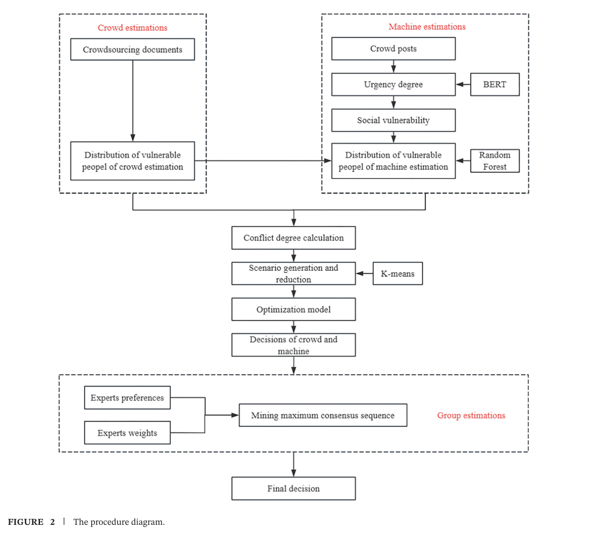

*Figure 2. The procedure of the proposed hybrid decision framework. [Source PDF p. 11](mod_02_readings/Risk%20Analysis%20-%202026%20-%20Tang%20-%20Harnessing%20the%20Hybrid%20Intelligence%20of%20Crowd%20and%20Artificial%20Intelligence%20in%20Group%20Decision.pdf#page=11).*

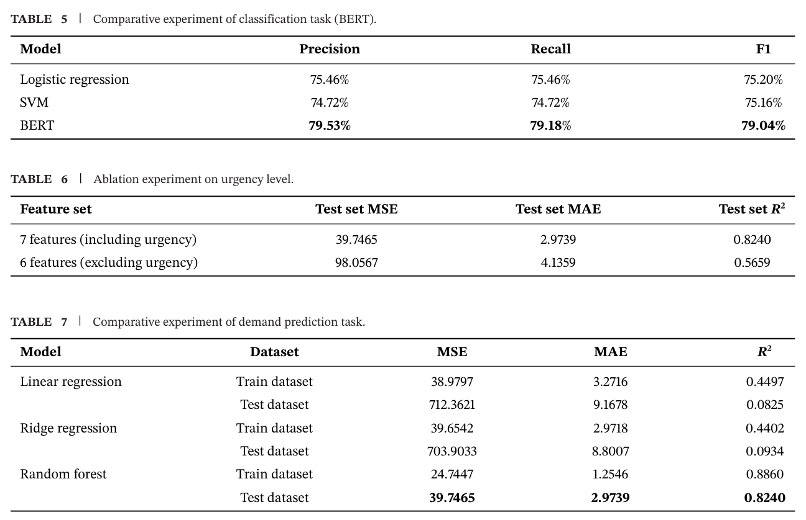

*Tables 5-7. Classification, urgency ablation, and demand prediction results. [Source PDF p. 14](mod_02_readings/Risk%20Analysis%20-%202026%20-%20Tang%20-%20Harnessing%20the%20Hybrid%20Intelligence%20of%20Crowd%20and%20Artificial%20Intelligence%20in%20Group%20Decision.pdf#page=14).*

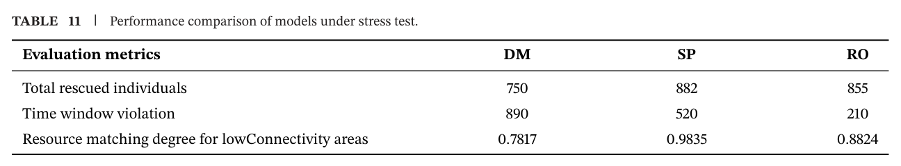

*Table 11. The modeled stress-test comparison. [Source PDF p. 17](mod_02_readings/Risk%20Analysis%20-%202026%20-%20Tang%20-%20Harnessing%20the%20Hybrid%20Intelligence%20of%20Crowd%20and%20Artificial%20Intelligence%20in%20Group%20Decision.pdf#page=17).*

### Assigned source text

#### Source page 1

[Open original PDF page 1](mod_02_readings/Risk%20Analysis%20-%202026%20-%20Tang%20-%20Harnessing%20the%20Hybrid%20Intelligence%20of%20Crowd%20and%20Artificial%20Intelligence%20in%20Group%20Decision.pdf#page=1)

View original page 1, including its figures, tables, and equations

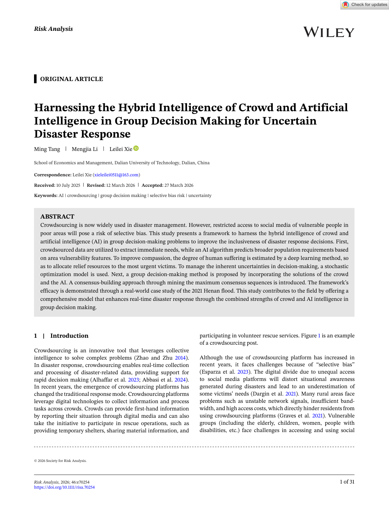

**_Risk_** **_Analysis_**

**ORIGINAL** **ARTICLE**

##### **Harnessing the Hybrid Intelligence of Crowd and Artificial** **Intelligence in Group Decision Making for Uncertain** **Disaster Response**

Ming Tang Mengjia Li Leilei Xie

School of Economics and Management, Dalian University of Technology, Dalian, China

**Correspondence:** Leilei Xie [(xieleilei0511@163.com)](mailto:xieleilei0511@163.com)

**Received:** 10 July 2025 **Revised:** 12 March 2026 **Accepted:** 27 March 2026

**Keywords:** AI | crowdsourcing | group decision making | selective bias risk | uncertainty

**ABSTRACT** Crowdsourcing is now widely used in disaster management. However, restricted access to social media of vulnerable people in

poor areas will pose a risk of selective bias. This study presents a framework to harness the hybrid intelligence of crowd and

artificial intelligence (AI) in group decision-making problems to improve the inclusiveness of disaster response decisions. First,

crowdsourced data are utilized to extract immediate needs, while an AI algorithm predicts broader population requirements based

<u>on</u> <u>area</u> <u>vulnerability</u> <u>features.</u> <u>To</u> <u>improve</u> <u>compassion,</u> <u>the</u> <u>degree</u> <u>of</u> <u>human</u> <u>suffering</u> <u>is</u> <u>estimated</u> <u>by</u> <u>a</u> <u>deep</u> <u>learning</u> <u>method,</u> <u>so</u>

as to allocate relief resources to the most urgent victims. To manage the inherent uncertainties in decision-making, a stochastic

optimization model is used. Next, a group decision-making method is proposed by incorporating the solutions of the crowd

and the AI. A consensus-building approach through mining the maximum consensus sequences is introduced. The framework’s

efficacy is demonstrated through a real-world case study of the 2021 Henan flood. This study contributes to the field by offering a

comprehensive model that enhances real-time disaster response through the combined strengths of crowd and AI intelligence in

group decision making.

**1** **Introduction**

Crowdsourcing is an innovative tool that leverages collective intelligence to solve complex problems (Zhao and Zhu 2014). In disaster response, crowdsourcing enables real-time collection and processing of disaster-related data, providing support for rapid decision making (Alhaffar et al. 2023; Abbasi et al. 2024). In recent years, the emergence of crowdsourcing platforms has changed the traditional response mode. Crowdsourcing platforms leverage digital technologies to collect information and process tasks across crowds. Crowds can provide first-hand information by reporting their situation through digital media and can also take the initiative to participate in rescue operations, such as providing temporary shelters, sharing material information, and

© 2026 Society for Risk Analysis.

_Risk_ _Analysis_, 2026; 46:e70254 [https://doi.org/10.1111/risa.70254](https://doi.org/10.1111/risa.70254)

participating in volunteer rescue services. Figure 1 is an example of a crowdsourcing post.

Although the use of crowdsourcing platform has increased in recent years, it faces challenges because of “selective bias” (Esparza et al. 2023). The digital divide due to unequal access to social media platforms will distort situational awareness generated during disasters and lead to an underestimation of some victims’ needs (Dargin et al. 2021). Many rural areas face problems such as unstable network signals, insufficient bandwidth, and high access costs, which directly hinder residents from using crowdsourcing platforms (Graves et al. 2021). Vulnerable groups (including the elderly, children, women, people with disabilities, etc.) face challenges in accessing and using social

#### Source page 2

[Open original PDF page 2](mod_02_readings/Risk%20Analysis%20-%202026%20-%20Tang%20-%20Harnessing%20the%20Hybrid%20Intelligence%20of%20Crowd%20and%20Artificial%20Intelligence%20in%20Group%20Decision.pdf#page=2)

View original page 2, including its figures, tables, and equations

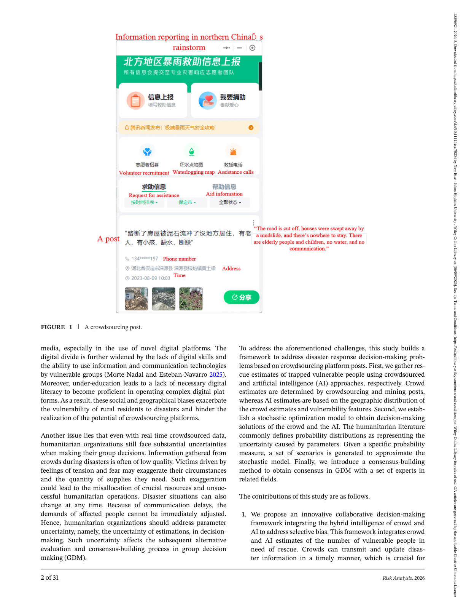

**FIGURE** **1** A crowdsourcing post.

media, especially in the use of novel digital platforms. The digital divide is further widened by the lack of digital skills and the ability to use information and communication technologies by vulnerable groups (Morte-Nadal and Esteban-Navarro 2025). Moreover, under-education leads to a lack of necessary digital literacy to become proficient in operating complex digital platforms. As a result, these social and geographical biases exacerbate the vulnerability of rural residents to disasters and hinder the realization of the potential of crowdsourcing platforms.

Another issue lies that even with real-time crowdsourced data, humanitarian organizations still face substantial uncertainties when making their group decisions. Information gathered from crowds during disasters is often of low quality. Victims driven by feelings of tension and fear may exaggerate their circumstances and the quantity of supplies they need. Such exaggeration could lead to the misallocation of crucial resources and unsuccessful humanitarian operations. Disaster situations can also change at any time. Because of communication delays, the demands of affected people cannot be immediately adjusted. Hence, humanitarian organizations should address parameter uncertainty, namely, the uncertainty of estimations, in decisionmaking. Such uncertainty affects the subsequent alternative evaluation and consensus-building process in group decision making (GDM).

To address the aforementioned challenges, this study builds a framework to address disaster response decision-making problems based on crowdsourcing platform posts. First, we gather rescue estimates of trapped vulnerable people using crowdsourced and artificial intelligence (AI) approaches, respectively. Crowd estimates are determined by crowdsourcing and mining posts, whereas AI estimates are based on the geographic distribution of the crowd estimates and vulnerability features. Second, we establish a stochastic optimization model to obtain decision-making solutions of the crowd and the AI. The humanitarian literature commonly defines probability distributions as representing the uncertainty caused by parameters. Given a specific probability measure, a set of scenarios is generated to approximate the stochastic model. Finally, we introduce a consensus-building method to obtain consensus in GDM with a set of experts in related fields.

The contributions of this study are as follows.

1. We propose an innovative collaborative decision-making framework integrating the hybrid intelligence of crowd and AI to address selective bias. This framework integrates crowd and AI estimates of the number of vulnerable people in need of rescue. Crowds can transmit and update disaster information in a timely manner, which is crucial for

#### Source page 3

[Open original PDF page 3](mod_02_readings/Risk%20Analysis%20-%202026%20-%20Tang%20-%20Harnessing%20the%20Hybrid%20Intelligence%20of%20Crowd%20and%20Artificial%20Intelligence%20in%20Group%20Decision.pdf#page=3)

View original page 3, including its figures, tables, and equations

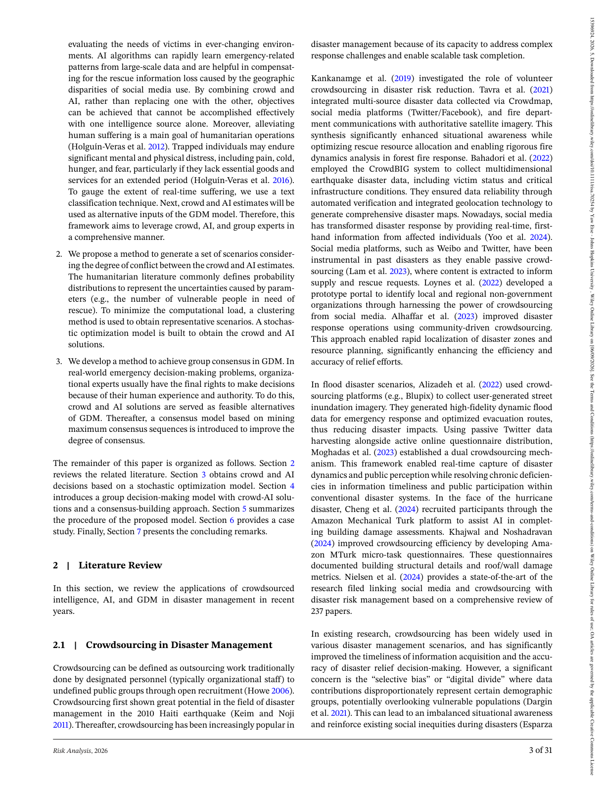

evaluating the needs of victims in ever-changing environments. AI algorithms can rapidly learn emergency-related patterns from large-scale data and are helpful in compensating for the rescue information loss caused by the geographic disparities of social media use. By combining crowd and AI, rather than replacing one with the other, objectives can be achieved that cannot be accomplished effectively with one intelligence source alone. Moreover, alleviating human suffering is a main goal of humanitarian operations (Holguín-Veras et al. 2012). Trapped individuals may endure significant mental and physical distress, including pain, cold, hunger, and fear, particularly if they lack essential goods and services for an extended period (Holguín-Veras et al. 2016). To gauge the extent of real-time suffering, we use a text classification technique. Next, crowd and AI estimates will be used as alternative inputs of the GDM model. Therefore, this framework aims to leverage crowd, AI, and group experts in a comprehensive manner.

2. We propose a method to generate a set of scenarios considering the degree of conflict between the crowd and AI estimates. The humanitarian literature commonly defines probability distributions to represent the uncertainties caused by parameters (e.g., the number of vulnerable people in need of rescue). To minimize the computational load, a clustering method is used to obtain representative scenarios. A stochastic optimization model is built to obtain the crowd and AI solutions.

3. We develop a method to achieve group consensus in GDM. In real-world emergency decision-making problems, organizational experts usually have the final rights to make decisions because of their human experience and authority. To do this, crowd and AI solutions are served as feasible alternatives of GDM. Thereafter, a consensus model based on mining maximum consensus sequences is introduced to improve the degree of consensus.

The remainder of this paper is organized as follows. Section 2 reviews the related literature. Section 3 obtains crowd and AI decisions based on a stochastic optimization model. Section 4 introduces a group decision-making model with crowd-AI solutions and a consensus-building approach. Section 5 summarizes the procedure of the proposed model. Section 6 provides a case study. Finally, Section 7 presents the concluding remarks.

**2** **Literature** **Review**

In this section, we review the applications of crowdsourced intelligence, AI, and GDM in disaster management in recent years.

**2.1** **Crowdsourcing** **in** **Disaster** **Management**

Crowdsourcing can be defined as outsourcing work traditionally done by designated personnel (typically organizational staff) to undefined public groups through open recruitment (Howe 2006). Crowdsourcing first shown great potential in the field of disaster management in the 2010 Haiti earthquake (Keim and Noji 2011). Thereafter, crowdsourcing has been increasingly popular in

disaster management because of its capacity to address complex response challenges and enable scalable task completion.

Kankanamge et al. (2019) investigated the role of volunteer crowdsourcing in disaster risk reduction. Tavra et al. (2021) integrated multi-source disaster data collected via Crowdmap, social media platforms (Twitter/Facebook), and fire department communications with authoritative satellite imagery. This synthesis significantly enhanced situational awareness while optimizing rescue resource allocation and enabling rigorous fire dynamics analysis in forest fire response. Bahadori et al. (2022) employed the CrowdBIG system to collect multidimensional earthquake disaster data, including victim status and critical infrastructure conditions. They ensured data reliability through automated verification and integrated geolocation technology to generate comprehensive disaster maps. Nowadays, social media has transformed disaster response by providing real-time, firsthand information from affected individuals (Yoo et al. 2024). Social media platforms, such as Weibo and Twitter, have been instrumental in past disasters as they enable passive crowdsourcing (Lam et al. 2023), where content is extracted to inform supply and rescue requests. Loynes et al. (2022) developed a prototype portal to identify local and regional non-government organizations through harnessing the power of crowdsourcing from social media. Alhaffar et al. (2023) improved disaster response operations using community-driven crowdsourcing. This approach enabled rapid localization of disaster zones and resource planning, significantly enhancing the efficiency and accuracy of relief efforts.

In flood disaster scenarios, Alizadeh et al. (2022) used crowdsourcing platforms (e.g., Blupix) to collect user-generated street inundation imagery. They generated high-fidelity dynamic flood data for emergency response and optimized evacuation routes, thus reducing disaster impacts. Using passive Twitter data harvesting alongside active online questionnaire distribution, Moghadas et al. (2023) established a dual crowdsourcing mechanism. This framework enabled real-time capture of disaster dynamics and public perception while resolving chronic deficiencies in information timeliness and public participation within conventional disaster systems. In the face of the hurricane disaster, Cheng et al. (2024) recruited participants through the Amazon Mechanical Turk platform to assist AI in completing building damage assessments. Khajwal and Noshadravan (2024) improved crowdsourcing efficiency by developing Amazon MTurk micro-task questionnaires. These questionnaires documented building structural details and roof/wall damage metrics. Nielsen et al. (2024) provides a state-of-the-art of the research filed linking social media and crowdsourcing with disaster risk management based on a comprehensive review of 237 papers.

In existing research, crowdsourcing has been widely used in various disaster management scenarios, and has significantly improved the timeliness of information acquisition and the accuracy of disaster relief decision-making. However, a significant concern is the “selective bias” or “digital divide” where data contributions disproportionately represent certain demographic groups, potentially overlooking vulnerable populations (Dargin et al. 2021). This can lead to an imbalanced situational awareness and reinforce existing social inequities during disasters (Esparza

#### Source page 4

[Open original PDF page 4](mod_02_readings/Risk%20Analysis%20-%202026%20-%20Tang%20-%20Harnessing%20the%20Hybrid%20Intelligence%20of%20Crowd%20and%20Artificial%20Intelligence%20in%20Group%20Decision.pdf#page=4)

View original page 4, including its figures, tables, and equations

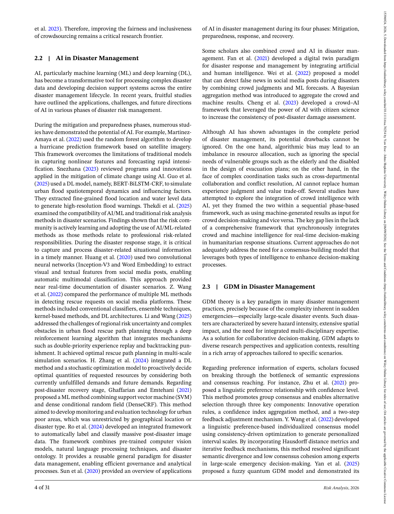

et al. 2023). Therefore, improving the fairness and inclusiveness of crowdsourcing remains a critical research frontier.

**2.2** **AI** **in** **Disaster** **Management**

AI, particularly machine learning (ML) and deep learning (DL), has become a transformative tool for processing complex disaster data and developing decision support systems across the entire disaster management lifecycle. In recent years, fruitful studies have outlined the applications, challenges, and future directions of AI in various phases of disaster risk management.

During the mitigation and preparedness phases, numerous studies have demonstrated the potential of AI. For example, MartinezAmaya et al. (2022) used the random forest algorithm to develop a hurricane prediction framework based on satellite imagery. This framework overcomes the limitations of traditional models in capturing nonlinear features and forecasting rapid intensification. Snezhana (2023) reviewed programs and innovations applied in the mitigation of climate change using AI. Guo et al. (2025) used a DL model, namely, BERT-BiLSTM-CRF, to simulate urban flood spatiotemporal dynamics and influencing factors. They extracted fine-grained flood location and water level data to generate high-resolution flood warnings. Thekdi et al. (2025) examined the compatibility of AI/ML and traditional risk analysis methods in disaster scenarios. Findings shown that the risk community is actively learning and adopting the use of AI/ML-related methods as those methods relate to professional risk-related responsibilities. During the disaster response stage, it is critical to capture and process disaster-related situational information in a timely manner. Huang et al. (2020) used two convolutional neural networks (Inception-V3 and Word Embedding) to extract visual and textual features from social media posts, enabling automatic multimodal classification. This approach provided near real-time documentation of disaster scenarios. Z. Wang et al. (2022) compared the performance of multiple ML methods in detecting rescue requests on social media platforms. These methods included conventional classifiers, ensemble techniques, kernel-based methods, and DL architectures. Li and Wang (2025) addressed the challenges of regional risk uncertainty and complex obstacles in urban flood rescue path planning through a deep reinforcement learning algorithm that integrates mechanisms such as double-priority experience replay and backtracking punishment. It achieved optimal rescue path planning in multi-scale simulation scenarios. H. Zhang et al. (2024) integrated a DL method and a stochastic optimization model to proactively decide optimal quantities of requested resources by considering both currently unfulfilled demands and future demands. Regarding post-disaster recovery stage, Ghaffarian and Emtehani (2021) proposed a ML method combining support vector machine (SVM) and dense conditional random field (DenseCRF). This method aimed to develop monitoring and evaluation technology for urban poor areas, which was unrestricted by geographical location or disaster type. Ro et al. (2024) developed an integrated framework to automatically label and classify massive post-disaster image data. The framework combines pre-trained computer vision models, natural language processing techniques, and disaster ontology. It provides a reusable general paradigm for disaster data management, enabling efficient governance and analytical processes. Sun et al. (2020) provided an overview of applications

of AI in disaster management during its four phases: Mitigation, preparedness, response, and recovery.

Some scholars also combined crowd and AI in disaster management. Fan et al. (2021) developed a digital twin paradigm for disaster response and management by integrating artificial and human intelligence. Wei et al. (2022) proposed a model that can detect false news in social media posts during disasters by combining crowd judgments and ML forecasts. A Bayesian aggregation method was introduced to aggregate the crowd and machine results. Cheng et al. (2023) developed a crowd–AI framework that leveraged the power of AI with citizen science to increase the consistency of post-disaster damage assessment.

Although AI has shown advantages in the complete period of disaster management, its potential drawbacks cannot be ignored. On the one hand, algorithmic bias may lead to an imbalance in resource allocation, such as ignoring the special needs of vulnerable groups such as the elderly and the disabled in the design of evacuation plans; on the other hand, in the face of complex coordination tasks such as cross-departmental collaboration and conflict resolution, AI cannot replace human experience judgment and value trade-off. Several studies have attempted to explore the integration of crowd intelligence with AI, yet they framed the two within a sequential phase-based framework, such as using machine-generated results as input for crowd decision-making and vice versa. The key gap lies in the lack of a comprehensive framework that synchronously integrates crowd and machine intelligence for real-time decision-making in humanitarian response situations. Current approaches do not adequately address the need for a consensus-building model that leverages both types of intelligence to enhance decision-making processes.

**2.3** **GDM** **in** **Disaster** **Management**

GDM theory is a key paradigm in many disaster management practices, precisely because of the complexity inherent in sudden emergencies - especially large-scale disaster events. Such disasters are characterized by severe hazard intensity, extensive spatial impact, and the need for integrated multi-disciplinary expertise. As a solution for collaborative decision-making, GDM adapts to diverse research perspectives and application contexts, resulting in a rich array of approaches tailored to specific scenarios.

Regarding preference information of experts, scholars focused on breaking through the bottleneck of semantic expressions and consensus reaching. For instance, Zhu et al. (2021) proposed a linguistic preference relationship with confidence level. This method promotes group consensus and enables alternative selection through three key components: Innovative operation rules, a confidence index aggregation method, and a two-step feedback adjustment mechanism. Y. Wang et al. (2022) developed a linguistic preference-based individualized consensus model using consistency-driven optimization to generate personalized interval scales. By incorporating Hausdorff distance metrics and iterative feedback mechanisms, this method resolved significant semantic divergence and low consensus cohesion among experts in large-scale emergency decision-making. Yan et al. (2025) proposed a fuzzy quantum GDM model and demonstrated its

#### Source page 5

[Open original PDF page 5](mod_02_readings/Risk%20Analysis%20-%202026%20-%20Tang%20-%20Harnessing%20the%20Hybrid%20Intelligence%20of%20Crowd%20and%20Artificial%20Intelligence%20in%20Group%20Decision.pdf#page=5)

View original page 5, including its figures, tables, and equations

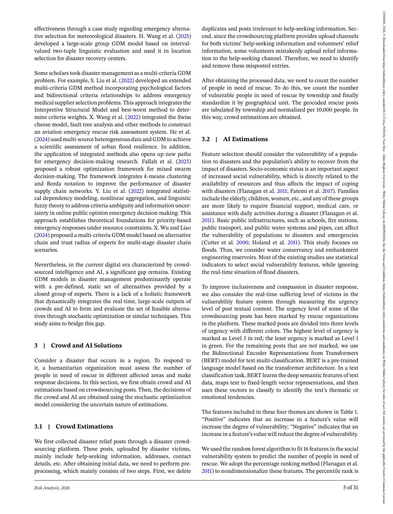

effectiveness through a case study regarding emergency alternative selection for meteorological disasters. H. Wang et al. (2025) developed a large-scale group GDM model based on intervalvalued two-tuple linguistic evaluation and used it in location selection for disaster recovery centers.

Some scholars took disaster management as a multi-criteria GDM problem. For example, S. Liu et al. (2022) developed an extended multi-criteria GDM method incorporating psychological factors and bidirectional criteria relationships to address emergency medical supplier selection problems. This approach integrates the Interpretive Structural Model and best-worst method to determine criteria weights. X. Wang et al. (2022) integrated the Swiss cheese model, fault tree analysis and other methods to construct an aviation emergency rescue risk assessment system. He et al. (2024) used multi-source heterogeneous data and GDM to achieve a scientific assessment of urban flood resilience. In addition, the application of integrated methods also opens up new paths for emergency decision-making research. Fallah et al. (2023) proposed a robust optimization framework for mixed swarm decision-making. The framework integrates _k_ -means clustering and Borda notation to improve the performance of disaster supply chain networks. Y. Liu et al. (2022) integrated statistical dependency modeling, nonlinear aggregation, and linguistic fuzzy theory to address criteria ambiguity and information uncertainty in online public opinion emergency decision-making. This approach establishes theoretical foundations for priority-based emergency responses under resource constraints. X. Wu and Liao (2024) proposed a multi-criteria GDM model based on alternative chain and trust radius of experts for multi-stage disaster chain scenarios.

Nevertheless, in the current digital era characterized by crowdsourced intelligence and AI, a significant gap remains. Existing GDM models in disaster management predominantly operate with a pre-defined, static set of alternatives provided by a closed group of experts. There is a lack of a holistic framework that dynamically integrates the real-time, large-scale outputs of crowds and AI to form and evaluate the set of feasible alternatives through stochastic optimization or similar techniques. This study aims to bridge this gap.

**3** **Crowd** **and** **AI** **Solutions**

Consider a disaster that occurs in a region. To respond to it, a humanitarian organization must assess the number of people in need of rescue in different affected areas and make response decisions. In this section, we first obtain crowd and AI estimations based on crowdsourcing posts. Then, the decisions of the crowd and AI are obtained using the stochastic optimization model considering the uncertain nature of estimations.

**3.1** **Crowd** **Estimations**

We first collected disaster relief posts through a disaster crowdsourcing platform. These posts, uploaded by disaster victims, mainly include help-seeking information, addresses, contact details, etc. After obtaining initial data, we need to perform preprocessing, which mainly consists of two steps. First, we delete

duplicates and posts irrelevant to help-seeking information. Second, since the crowdsourcing platform provides upload channels for both victims’ help-seeking information and volunteers’ relief information, some volunteers mistakenly upload relief information to the help-seeking channel. Therefore, we need to identify and remove these misposted entries.

After obtaining the processed data, we need to count the number of people in need of rescue. To do this, we count the number of vulnerable people in need of rescue by township and finally standardize it by geographical unit. The geocoded rescue posts are tabulated by township and normalized per 10,000 people. In this way, crowd estimations are obtained.

**3.2** **AI** **Estimations**

Feature selection should consider the vulnerability of a population to disasters and the population’s ability to recover from the impact of disasters. Socio-economic status is an important aspect of increased social vulnerability, which is directly related to the availability of resources and thus affects the impact of coping with disasters (Flanagan et al. 2011; Fatemi et al. 2017). Families include the elderly, children, women, etc., and any of these groups are more likely to require financial support, medical care, or assistance with daily activities during a disaster (Flanagan et al. 2011). Basic public infrastructures, such as schools, fire stations, public transport, and public water systems and pipes, can affect the vulnerability of populations to disasters and emergencies (Cutter et al. 2000; Holand et al. 2011). This study focuses on floods. Thus, we consider water conservancy and embankment engineering reservoirs. Most of the existing studies use statistical indicators to select social vulnerability features, while ignoring the real-time situation of flood disasters.

To improve inclusiveness and compassion in disaster response, we also consider the real-time suffering level of victims in the vulnerability feature system through measuring the urgency level of post textual content. The urgency level of some of the crowdsourcing posts has been marked by rescue organizations in the platform. These marked posts are divided into three levels of urgency with different colors. The highest level of urgency is marked as Level 3 in red; the least urgency is marked as Level 1 in green. For the remaining posts that are not marked, we use the Bidirectional Encoder Representations from Transformers (BERT) model for text multi-classification. BERT is a pre-trained language model based on the transformer architecture. In a text classification task, BERT learns the deep semantic features of text data, maps text to fixed-length vector representations, and then uses these vectors to classify to identify the text’s thematic or emotional tendencies.

The features included in these four themes are shown in Table 1. “Positive” indicates that an increase in a feature’s value will increase the degree of vulnerability; “Negative” indicates that an increase in a feature’s value will reduce the degree of vulnerability.

We used the random forest algorithm to fit 16 features in the social vulnerability system to predict the number of people in need of rescue. We adopt the percentage ranking method (Flanagan et al. 2011) to nondimensionalize these features. The percentile rank is

#### Source page 6

[Open original PDF page 6](mod_02_readings/Risk%20Analysis%20-%202026%20-%20Tang%20-%20Harnessing%20the%20Hybrid%20Intelligence%20of%20Crowd%20and%20Artificial%20Intelligence%20in%20Group%20Decision.pdf#page=6)

View original page 6, including its figures, tables, and equations

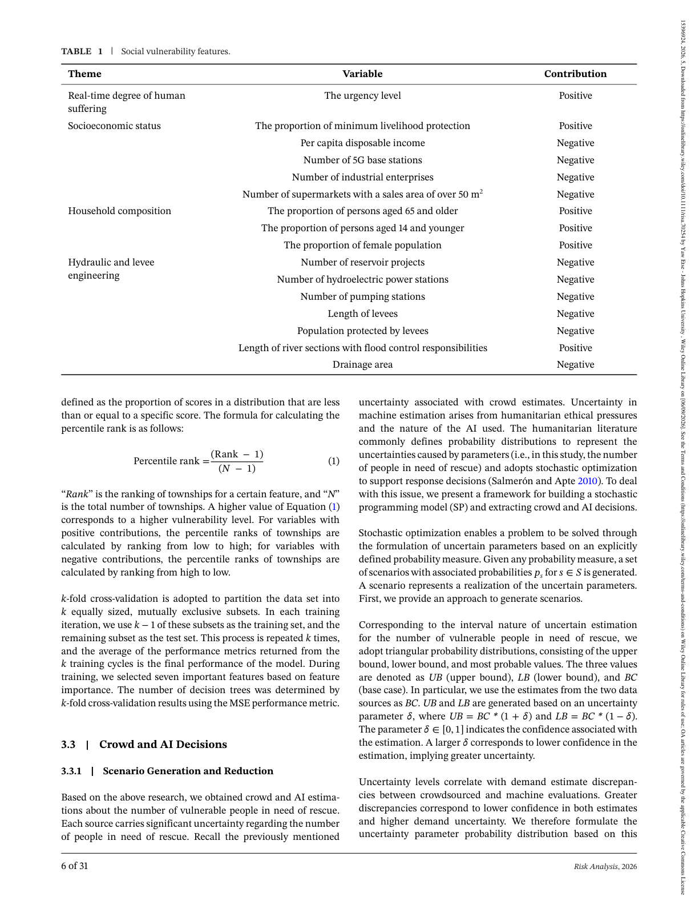

**TABLE** **1** Social vulnerability features.

**Theme** **Variable** **Contribution**

Real-time degree of human suffering

The urgency level Positive

Socioeconomic status The proportion of minimum livelihood protection Positive

Per capita disposable income Negative

Number of 5G base stations Negative

Number of industrial enterprises Negative

Number of supermarkets with a sales area of over 50 m 2 Negative

Household composition The proportion of persons aged 65 and older Positive

The proportion of persons aged 14 and younger Positive

The proportion of female population Positive

Hydraulic and levee engineering

Number of reservoir projects Negative

Number of hydroelectric power stations Negative

Number of pumping stations Negative

Length of levees Negative

Population protected by levees Negative

Length of river sections with flood control responsibilities Positive

Drainage area Negative

defined as the proportion of scores in a distribution that are less than or equal to a specific score. The formula for calculating the percentile rank is as follows:

Percentile rank = (Rank <u>−</u> 1) (1)

(𝑁              - 1)

“ _Rank_ ” is the ranking of townships for a certain feature, and “ _N_ ” is the total number of townships. A higher value of Equation (1) corresponds to a higher vulnerability level. For variables with positive contributions, the percentile ranks of townships are calculated by ranking from low to high; for variables with negative contributions, the percentile ranks of townships are calculated by ranking from high to low.

_k_ -fold cross-validation is adopted to partition the data set into _k_ equally sized, mutually exclusive subsets. In each training iteration, we use _k_ - 1 of these subsets as the training set, and the remaining subset as the test set. This process is repeated _k_ times, and the average of the performance metrics returned from the _k_ training cycles is the final performance of the model. During training, we selected seven important features based on feature importance. The number of decision trees was determined by _k_ -fold cross-validation results using the MSE performance metric.

**3.3** **Crowd** **and** **AI** **Decisions**

**3.3.1** **Scenario** **Generation** **and** **Reduction**

Based on the above research, we obtained crowd and AI estimations about the number of vulnerable people in need of rescue. Each source carries significant uncertainty regarding the number of people in need of rescue. Recall the previously mentioned

uncertainty associated with crowd estimates. Uncertainty in machine estimation arises from humanitarian ethical pressures and the nature of the AI used. The humanitarian literature commonly defines probability distributions to represent the uncertainties caused by parameters (i.e., in this study, the number of people in need of rescue) and adopts stochastic optimization to support response decisions (Salmerón and Apte 2010). To deal with this issue, we present a framework for building a stochastic programming model (SP) and extracting crowd and AI decisions.

Stochastic optimization enables a problem to be solved through the formulation of uncertain parameters based on an explicitly defined probability measure. Given any probability measure, a set of scenarios with associated probabilities 𝑝𝑠 for 𝑠 ∈𝑆 is generated. A scenario represents a realization of the uncertain parameters. First, we provide an approach to generate scenarios.

Corresponding to the interval nature of uncertain estimation for the number of vulnerable people in need of rescue, we adopt triangular probability distributions, consisting of the upper bound, lower bound, and most probable values. The three values are denoted as _UB_ (upper bound), _LB_ (lower bound), and _BC_ (base case). In particular, we use the estimates from the two data sources as _BC_ . _UB_ and _LB_ are generated based on an uncertainty parameter 𝛿, where _UB_ = _BC_ _*_ (1 + 𝛿) and _LB_ = _BC_ _*_ (1 - 𝛿). The parameter 𝛿∈[0, 1] indicates the confidence associated with the estimation. A larger 𝛿 corresponds to lower confidence in the estimation, implying greater uncertainty.

Uncertainty levels correlate with demand estimate discrepancies between crowdsourced and machine evaluations. Greater discrepancies correspond to lower confidence in both estimates and higher demand uncertainty. We therefore formulate the uncertainty parameter probability distribution based on this

#### Source page 7

[Open original PDF page 7](mod_02_readings/Risk%20Analysis%20-%202026%20-%20Tang%20-%20Harnessing%20the%20Hybrid%20Intelligence%20of%20Crowd%20and%20Artificial%20Intelligence%20in%20Group%20Decision.pdf#page=7)

View original page 7, including its figures, tables, and equations

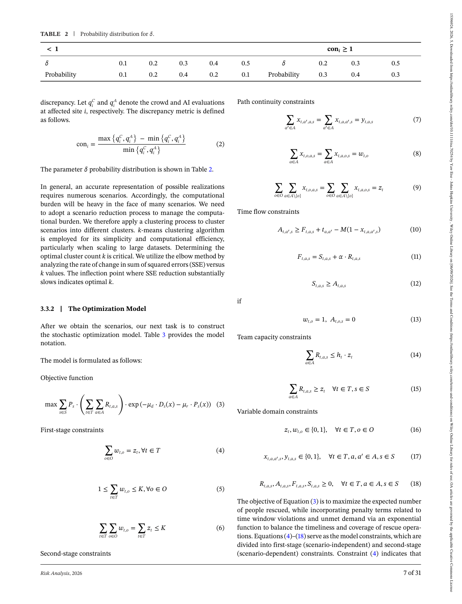

**TABLE** **2** Probability distribution for 𝛿.

**_<_** 𝟏 𝐜𝐨𝐧𝒊 **≥** 𝟏

𝛿 0.1 0.2 0.3 0.4 0.5 𝛿 0.2 0.3 0.5

Probability 0.1 0.2 0.4 0.2 0.1 Probability 0.3 0.4 0.3

discrepancy. Let 𝑞𝑖 𝐶

𝑖 𝐶 and 𝑞 𝑖 𝐴

discrepancy. Let 𝑞𝑖 𝐶 and 𝑞 𝑖 𝐴 denote the crowd and AI evaluations

at affected site _i_, respectively. The discrepancy metric is defined as follows.

Path continuity constraints

∑

𝑥𝑡,𝑎′,𝑎,𝑠 =

𝑥𝑡,𝑎,𝑎′,𝑠 = 𝑦𝑡,𝑎,𝑠 (7)

∑

𝑥𝑡,𝑜,𝑎,𝑠 =

𝑎 ′ ∈𝐴

{

𝑖 𝐶, 𝑞 𝑖 𝐴

- min

{

𝑖 𝐶, 𝑞 𝑖 𝐴

𝑞𝑖 𝐶,

𝑖

}

𝑖

}

𝑞𝑖 𝐶,

~~{~~

con𝑖 =

{

max

min

𝑖 𝐶, 𝑞 𝑖 𝐴

𝑎 ′ ∈𝐴

∑

𝑥𝑡,𝑎,𝑜,𝑠 = 𝑤𝑡,𝑜 (8)

𝑖

𝑖

~~}~~ (2)

𝑞𝑖 𝐶,

∑

𝑥𝑡,𝑜,𝑎,𝑠 =

𝑎∈𝐴

The parameter 𝛿 probability distribution is shown in Table 2.

In general, an accurate representation of possible realizations requires numerous scenarios. Accordingly, the computational burden will be heavy in the face of many scenarios. We need to adopt a scenario reduction process to manage the computational burden. We therefore apply a clustering process to cluster scenarios into different clusters. _k_ -means clustering algorithm is employed for its simplicity and computational efficiency, particularly when scaling to large datasets. Determining the optimal cluster count _k_ is critical. We utilize the elbow method by analyzing the rate of change in sum of squared errors (SSE) versus _k_ values. The inflection point where SSE reduction substantially slows indicates optimal _k_ .

**3.3.2** **The** **Optimization** **Model**

After we obtain the scenarios, our next task is to construct the stochastic optimization model. Table 3 provides the model notation.

The model is formulated as follows:

Objective function

∑

∑

𝑎∈𝐴

∑

𝑥𝑡,𝑎,𝑜,𝑠 = 𝑧𝑡 (9)

∑

∑

𝑜∈𝑂 𝑎∈𝐴⧵{𝑜}

Time flow constraints

𝑜∈𝑂 𝑎∈𝐴⧵{𝑜}

if

𝐴𝑡,𝑎′,𝑠 ≥ 𝐹𝑡,𝑎,𝑠 + 𝑡𝑎,𝑎′ - 𝑀(1 - 𝑥𝑡,𝑎,𝑎′,𝑠) (10)

𝐹𝑡,𝑎,𝑠 = 𝑆𝑡,𝑎,𝑠 + 𝛼⋅𝑅𝑡,𝑎,𝑠 (11)

𝑆𝑡,𝑎,𝑠 ≥ 𝐴𝑡,𝑎,𝑠 (12)

𝑤𝑡,𝑜 = 1, 𝐴𝑡,𝑜,𝑠 = 0 (13)

Team capacity constraints

∑

𝑅𝑡,𝑎,𝑠 ≤ ℎ𝑡 ⋅𝑧𝑡 (14)

𝑎∈𝐴

𝑅𝑡,𝑎,𝑠 ≥ 𝑧𝑡 ∀𝑡 ∈𝑇, 𝑠 ∈𝑆 (15)

∑

max 𝑃𝑠 ⋅

𝑠∈𝑆

(

∑ ∑

𝑅𝑡,𝑎,𝑠

𝑡∈𝑇 𝑎∈𝐴

)

⋅exp (−𝜇𝑑 ⋅𝐷𝑠(𝑥) - 𝜇𝑟 ⋅𝑃𝑠(𝑥)) (3)

First-stage constraints

∑

𝑤𝑡,𝑜 = 𝑧𝑡, ∀𝑡 ∈𝑇 (4)

𝑜∈𝑂

∑ 1 ≤ 𝑤𝑡,𝑜 ≤ 𝐾, ∀𝑜 ∈𝑂 (5)

𝑡∈𝑇

∑ ∑

𝑤𝑡,𝑜 =

∑

𝑧𝑡 ≤ 𝐾 (6)

𝑎∈𝐴

Variable domain constraints

𝑧𝑡, 𝑤𝑡,𝑜 ∈{0, 1}, ∀𝑡 ∈𝑇, 𝑜 ∈𝑂 (16)

𝑥𝑡,𝑎,𝑎′,𝑠, 𝑦𝑡,𝑎,𝑠 ∈{0, 1}, ∀𝑡 ∈𝑇, 𝑎, 𝑎 ′ ∈𝐴, 𝑠 ∈𝑆 (17)

𝑅𝑡,𝑎,𝑠, 𝐴𝑡,𝑎,𝑠, 𝐹𝑡,𝑎,𝑠, 𝑆𝑡,𝑎,𝑠 ≥ 0, ∀𝑡 ∈𝑇, 𝑎 ∈𝐴, 𝑠 ∈𝑆 (18)

The objective of Equation (3) is to maximize the expected number of people rescued, while incorporating penalty terms related to time window violations and unmet demand via an exponential function to balance the timeliness and coverage of rescue operations. Equations (4)–(18) serve as the model constraints, which are divided into first-stage (scenario-independent) and second-stage (scenario-dependent) constraints. Constraint (4) indicates that

𝑡∈𝑇 𝑜∈𝑂

𝑡∈𝑇

Second-stage constraints

#### Source page 8

[Open original PDF page 8](mod_02_readings/Risk%20Analysis%20-%202026%20-%20Tang%20-%20Harnessing%20the%20Hybrid%20Intelligence%20of%20Crowd%20and%20Artificial%20Intelligence%20in%20Group%20Decision.pdf#page=8)

View original page 8, including its figures, tables, and equations

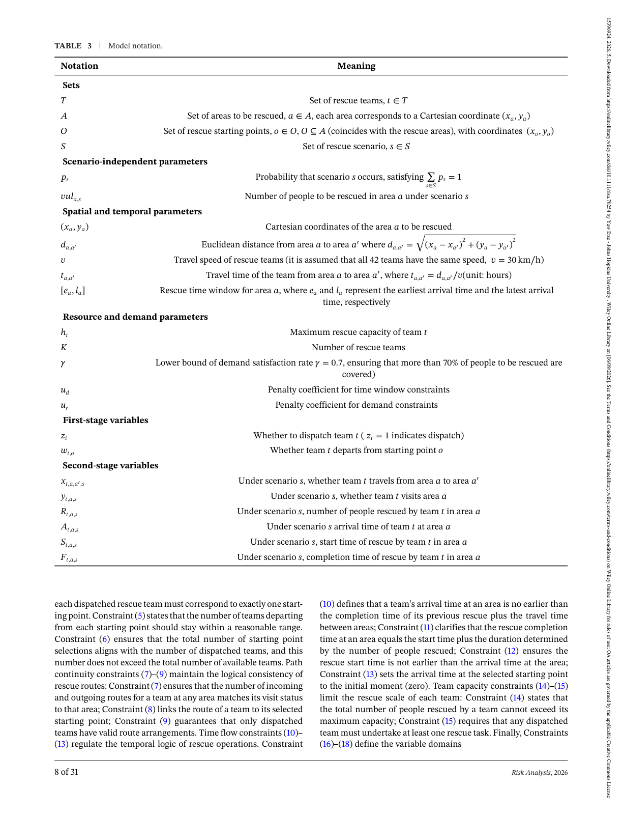

**TABLE** **3** Model notation.

**Notation** **Meaning**

**Sets**

𝑇 Set of rescue teams, 𝑡 ∈𝑇

𝐴 Set of areas to be rescued, 𝑎 ∈𝐴, each area corresponds to a Cartesian coordinate (𝑥𝑎, 𝑦𝑎)

𝑂 Set of rescue starting points, 𝑜 ∈𝑂, 𝑂 ⊆𝐴 (coincides with the rescue areas), with coordinates (𝑥𝑜, 𝑦𝑜)

𝑆 Set of rescue scenario, 𝑠 ∈𝑆

**Scenario-independent** **parameters**

𝑝𝑠 Probability that scenario 𝑠 occurs, satisfying ∑

𝑝𝑠 = 1

𝑠∈𝑆

𝑣𝑢𝑙𝑎,𝑠 Number of people to be rescued in area 𝑎 under scenario 𝑠

**Spatial** **and** **temporal** **parameters**

(𝑥𝑎, 𝑦𝑎) Cartesian coordinates of the area 𝑎 to be rescued

~~√~~

2 + (𝑦𝑎 - 𝑦𝑎′ )2

𝑑𝑎,𝑎′ Euclidean distance from area 𝑎 to area 𝑎 ′ where 𝑑𝑎,𝑎′ =

(𝑥𝑎 - 𝑥𝑎′ )2

𝑣 Travel speed of rescue teams (it is assumed that all 42 teams have the same speed, 𝑣 = 30 km∕h)

𝑡𝑎,𝑎′ Travel time of the team from area 𝑎 to area 𝑎 ′, where 𝑡𝑎,𝑎′ = 𝑑𝑎,𝑎′ ∕𝑣(unit: hours)

[𝑒𝑎, 𝑙𝑎] Rescue time window for area 𝑎, where 𝑒𝑎 and 𝑙𝑎 represent the earliest arrival time and the latest arrival

time, respectively

**Resource** **and** **demand** **parameters**

ℎ𝑡 Maximum rescue capacity of team 𝑡

𝐾 Number of rescue teams

𝛾 Lower bound of demand satisfaction rate 𝛾 = 0.7, ensuring that more than 70% of people to be rescued are

covered)

𝑢𝑑 Penalty coefficient for time window constraints

𝑢𝑟 Penalty coefficient for demand constraints

**First-stage** **variables**

𝑧𝑡 Whether to dispatch team 𝑡 ( 𝑧𝑡 = 1 indicates dispatch)

𝑤𝑡,𝑜 Whether team 𝑡 departs from starting point 𝑜

**Second-stage** **variables**

𝑥𝑡,𝑎,𝑎′,𝑠 Under scenario 𝑠, whether team 𝑡 travels from area 𝑎 to area 𝑎 ′

𝑦𝑡,𝑎,𝑠 Under scenario 𝑠, whether team 𝑡 visits area 𝑎

𝑅𝑡,𝑎,𝑠 Under scenario 𝑠, number of people rescued by team 𝑡 in area 𝑎

𝐴𝑡,𝑎,𝑠 Under scenario 𝑠 arrival time of team 𝑡 at area 𝑎

𝑆𝑡,𝑎,𝑠 Under scenario 𝑠, start time of rescue by team 𝑡 in area 𝑎

𝐹𝑡,𝑎,𝑠 Under scenario 𝑠, completion time of rescue by team 𝑡 in area 𝑎

each dispatched rescue team must correspond to exactly one starting point. Constraint (5) states that the number of teams departing from each starting point should stay within a reasonable range. Constraint (6) ensures that the total number of starting point selections aligns with the number of dispatched teams, and this number does not exceed the total number of available teams. Path continuity constraints (7)–(9) maintain the logical consistency of rescue routes: Constraint (7) ensures that the number of incoming and outgoing routes for a team at any area matches its visit status to that area; Constraint (8) links the route of a team to its selected starting point; Constraint (9) guarantees that only dispatched teams have valid route arrangements. Time flow constraints (10)– (13) regulate the temporal logic of rescue operations. Constraint

(10) defines that a team’s arrival time at an area is no earlier than the completion time of its previous rescue plus the travel time between areas; Constraint (11) clarifies that the rescue completion time at an area equals the start time plus the duration determined by the number of people rescued; Constraint (12) ensures the rescue start time is not earlier than the arrival time at the area; Constraint (13) sets the arrival time at the selected starting point to the initial moment (zero). Team capacity constraints (14)–(15) limit the rescue scale of each team: Constraint (14) states that the total number of people rescued by a team cannot exceed its maximum capacity; Constraint (15) requires that any dispatched team must undertake at least one rescue task. Finally, Constraints (16)–(18) define the variable domains

#### Source page 9

[Open original PDF page 9](mod_02_readings/Risk%20Analysis%20-%202026%20-%20Tang%20-%20Harnessing%20the%20Hybrid%20Intelligence%20of%20Crowd%20and%20Artificial%20Intelligence%20in%20Group%20Decision.pdf#page=9)

View original page 9, including its figures, tables, and equations

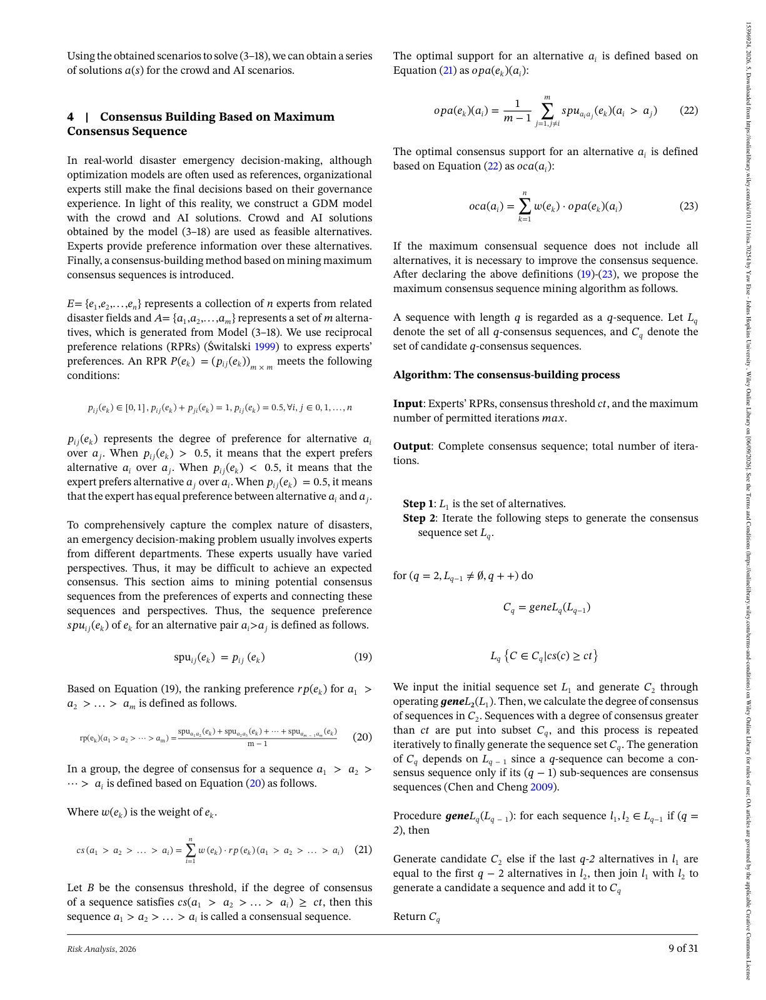

Using the obtained scenarios to solve (3–18), we can obtain a series of solutions 𝑎(𝑠) for the crowd and AI scenarios.

**4** **Consensus** **Building** **Based** **on** **Maximum** **Consensus** **Sequence**

In real-world disaster emergency decision-making, although optimization models are often used as references, organizational experts still make the final decisions based on their governance experience. In light of this reality, we construct a GDM model with the crowd and AI solutions. Crowd and AI solutions obtained by the model (3–18) are used as feasible alternatives. Experts provide preference information over these alternatives. Finally, a consensus-building method based on mining maximum consensus sequences is introduced.

𝐸= {𝑒1,𝑒2,. . .,𝑒𝑛} represents a collection of _n_ experts from related disaster fields and 𝐴= {𝑎1,𝑎2,. . .,𝑎𝑚} represents a set of _m_ alternatives, which is generated from Model (3–18). We use reciprocal preference relations (RPRs) (Świtalski 1999) to express experts’ preferences. An RPR 𝑃(𝑒𝑘) = (𝑝𝑖𝑗(𝑒𝑘))𝑚 × 𝑚 meets the following conditions:

𝑝𝑖𝑗(𝑒𝑘) ∈[0, 1], 𝑝𝑖𝑗(𝑒𝑘) + 𝑝𝑗𝑖(𝑒𝑘) = 1, 𝑝𝑖𝑗(𝑒𝑘) = 0.5, ∀𝑖, 𝑗 ∈0, 1, . . ., 𝑛

𝑝𝑖𝑗(𝑒𝑘) represents the degree of preference for alternative 𝑎𝑖 over 𝑎𝑗. When 𝑝𝑖𝑗(𝑒𝑘) _>_ 0.5, it means that the expert prefers alternative 𝑎𝑖 over 𝑎𝑗. When 𝑝𝑖𝑗(𝑒𝑘) _<_ 0.5, it means that the expert prefers alternative 𝑎𝑗 over 𝑎𝑖. When 𝑝𝑖𝑗(𝑒𝑘) = 0.5, it means that the expert has equal preference between alternative 𝑎𝑖 and 𝑎𝑗.

To comprehensively capture the complex nature of disasters, an emergency decision-making problem usually involves experts from different departments. These experts usually have varied perspectives. Thus, it may be difficult to achieve an expected consensus. This section aims to mining potential consensus sequences from the preferences of experts and connecting these sequences and perspectives. Thus, the sequence preference 𝑠𝑝𝑢𝑖𝑗(𝑒𝑘) of 𝑒𝑘 for an alternative pair 𝑎𝑖 _>_ 𝑎𝑗 is defined as follows.

spu𝑖𝑗(𝑒𝑘) = 𝑝𝑖𝑗 (𝑒𝑘) (19)

Based on Equation (19), the ranking preference 𝑟𝑝(𝑒𝑘) for 𝑎1 _>_ 𝑎2 _>_ . . . _>_ 𝑎𝑚 is defined as follows.

The optimal support for an alternative 𝑎𝑖 is defined based on Equation (21) as 𝑜𝑝𝑎(𝑒𝑘)(𝑎𝑖):

𝑠𝑝𝑢𝑎𝑖 𝑎𝑗 (𝑒𝑘)(𝑎𝑖 _>_ 𝑎𝑗) (22)

1 𝑜𝑝𝑎(𝑒𝑘)(𝑎𝑖) = 𝑚    - 1

∑𝑚

𝑗=1,𝑗≠𝑖

The optimal consensus support for an alternative 𝑎𝑖 is defined based on Equation (22) as 𝑜𝑐𝑎(𝑎𝑖):

𝑜𝑐𝑎(𝑎𝑖) =

∑𝑛

𝑤(𝑒𝑘) ⋅𝑜𝑝𝑎(𝑒𝑘)(𝑎𝑖) (23)

𝑘=1

If the maximum consensual sequence does not include all alternatives, it is necessary to improve the consensus sequence. After declaring the above definitions (19)-(23), we propose the maximum consensus sequence mining algorithm as follows.

A sequence with length 𝑞 is regarded as a 𝑞-sequence. Let 𝐿𝑞 denote the set of all 𝑞-consensus sequences, and 𝐶𝑞 denote the set of candidate 𝑞-consensus sequences.

**Algorithm:** **The** **consensus-building** **process**

**Input** : Experts’ RPRs, consensus threshold 𝑐𝑡, and the maximum number of permitted iterations 𝑚𝑎𝑥.

**Output** : Complete consensus sequence; total number of iterations.

**Step** **1** : 𝐿1 is the set of alternatives. **Step** **2** : Iterate the following steps to generate the consensus

sequence set 𝐿𝑞.

for (𝑞 = 2, 𝐿𝑞−1 ≠ ∅, 𝑞 + +) do

𝐶𝑞 = 𝑔𝑒𝑛𝑒𝐿𝑞(𝐿𝑞−1)

{

𝐿𝑞

}

𝐶 ∈𝐶𝑞|𝑐𝑠(𝑐) ≥ 𝑐𝑡

spu𝑎1 𝑎2 (𝑒𝑘) + spu𝑎2 𝑎3 (𝑒𝑘) + ⋯ + spu𝑎𝑚 - 1 𝑎𝑚 (𝑒𝑘)

We input the initial sequence set 𝐿1 and generate 𝐶2 through operating 𝒈𝒆𝒏𝒆𝐿𝟐(𝐿1). Then, we calculate the degree of consensus of sequences in 𝐶2. Sequences with a degree of consensus greater than 𝑐𝑡 are put into subset 𝐶𝑞, and this process is repeated iteratively to finally generate the sequence set 𝐶𝑞. The generation of 𝐶𝑞 depends on 𝐿𝑞 - 1 since a _q_ -sequence can become a consensus sequence only if its ( _q_ - 1) sub-sequences are consensus sequences (Chen and Cheng 2009).

Procedure 𝒈𝒆𝒏𝒆𝐿𝑞(𝐿𝑞 - 1): for each sequence 𝑙1, 𝑙2 ∈𝐿𝑞−1 if ( _q_ = _2_ ), then

Generate candidate 𝐶2 else if the last _q-2_ alternatives in 𝑙1 are equal to the first _q_ - 2 alternatives in 𝑙2, then join 𝑙1 with 𝑙2 to generate a candidate a sequence and add it to 𝐶𝑞

Return 𝐶𝑞

rp(ek)(𝑎1 _>_ 𝑎2 _>_ ⋯ _>_ 𝑎m) =

(𝑒𝑘) + ⋯ + spu𝑎𝑚 - 1 𝑎𝑚 (𝑒𝑘)

(20) m - 1

In a group, the degree of consensus for a sequence 𝑎1 _>_ 𝑎2 _>_ ⋯ _>_ 𝑎𝑖 is defined based on Equation (20) as follows.

Where 𝑤(𝑒𝑘) is the weight of 𝑒𝑘.

𝑤(𝑒𝑘) ⋅𝑟𝑝(𝑒𝑘) (𝑎1 _>_ 𝑎2 _>_ . . . _>_ 𝑎𝑖) (21)

𝑐𝑠(𝑎1 _>_ 𝑎2 _>_ . . . _>_ 𝑎𝑖) =

∑𝑛

𝑖=1

Let _B_ be the consensus threshold, if the degree of consensus of a sequence satisfies 𝑐𝑠(𝑎1 _>_ 𝑎2 _>_ . . . _>_ 𝑎𝑖) ≥ 𝑐𝑡, then this sequence 𝑎1 _>_ 𝑎2 _>_ . . . _>_ 𝑎𝑖 is called a consensual sequence.

#### Source page 10

[Open original PDF page 10](mod_02_readings/Risk%20Analysis%20-%202026%20-%20Tang%20-%20Harnessing%20the%20Hybrid%20Intelligence%20of%20Crowd%20and%20Artificial%20Intelligence%20in%20Group%20Decision.pdf#page=10)

View original page 10, including its figures, tables, and equations

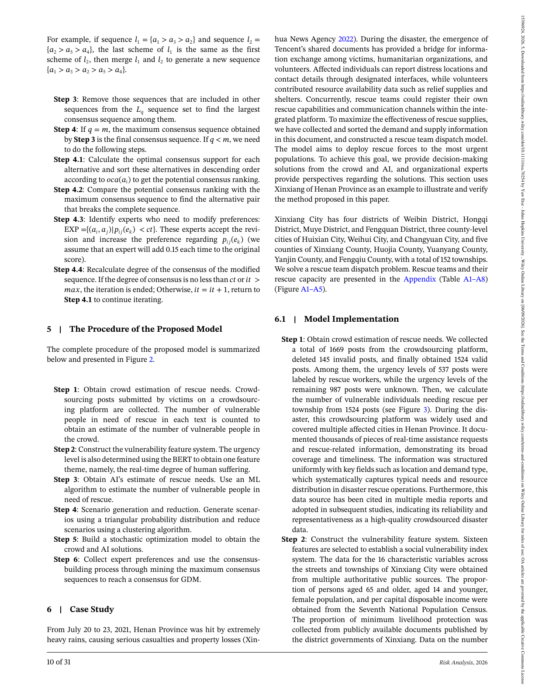

For example, if sequence 𝑙1 = {𝑎1 _>_ 𝑎3 _>_ 𝑎2} and sequence 𝑙2 = {𝑎2 _>_ 𝑎5 _>_ 𝑎4}, the last scheme of 𝑙1 is the same as the first scheme of 𝑙2, then merge 𝑙1 and 𝑙2 to generate a new sequence {𝑎1 _>_ 𝑎3 _>_ 𝑎2 _>_ 𝑎5 _>_ 𝑎4}.

**Step** **3** : Remove those sequences that are included in other

sequences from the 𝐿𝑞 sequence set to find the largest consensus sequence among them. **Step** **4** : If _q_ = _m_, the maximum consensus sequence obtained

by **Step** **3** is the final consensus sequence. If _q_ _<_ _m_, we need to do the following steps. **Step** **4.1** : Calculate the optimal consensus support for each

alternative and sort these alternatives in descending order according to 𝑜𝑐𝑎(𝑎𝑖) to get the potential consensus ranking. **Step** **4.2** : Compare the potential consensus ranking with the

maximum consensus sequence to find the alternative pair that breaks the complete sequence. **Step** **4.3** : Identify experts who need to modify preferences:

EXP ={(𝑎𝑖, 𝑎𝑗)|𝑝𝑖𝑗(𝑒𝑘) _<_ 𝑐𝑡}. These experts accept the revision and increase the preference regarding 𝑝𝑖𝑗(𝑒𝑘) (we assume that an expert will add 0.15 each time to the original score). **Step** **4.4** : Recalculate degree of the consensus of the modified

sequence. If the degree of consensus is no less than 𝑐𝑡 or 𝑖𝑡 _>_ 𝑚𝑎𝑥, the iteration is ended; Otherwise, 𝑖𝑡 = 𝑖𝑡 + 1, return to **Step** **4.1** to continue iterating.

**5** **The** **Procedure** **of** **the** **Proposed** **Model**

The complete procedure of the proposed model is summarized below and presented in Figure 2.

**Step** **1** : Obtain crowd estimation of rescue needs. Crowd sourcing posts submitted by victims on a crowdsourcing platform are collected. The number of vulnerable people in need of rescue in each text is counted to obtain an estimate of the number of vulnerable people in the crowd. **Step** **2** : Construct the vulnerability feature system. The urgency

level is also determined using the BERT to obtain one feature theme, namely, the real-time degree of human suffering. **Step** **3** : Obtain AI’s estimate of rescue needs. Use an ML

algorithm to estimate the number of vulnerable people in need of rescue. **Step** **4** : Scenario generation and reduction. Generate scenar ios using a triangular probability distribution and reduce scenarios using a clustering algorithm. **Step** **5** : Build a stochastic optimization model to obtain the

crowd and AI solutions. **Step** **6** : Collect expert preferences and use the consensus building process through mining the maximum consensus sequences to reach a consensus for GDM.

**6** **Case** **Study**

From July 20 to 23, 2021, Henan Province was hit by extremely heavy rains, causing serious casualties and property losses (Xin

hua News Agency 2022). During the disaster, the emergence of Tencent’s shared documents has provided a bridge for information exchange among victims, humanitarian organizations, and volunteers. Affected individuals can report distress locations and contact details through designated interfaces, while volunteers contributed resource availability data such as relief supplies and shelters. Concurrently, rescue teams could register their own rescue capabilities and communication channels within the integrated platform. To maximize the effectiveness of rescue supplies, we have collected and sorted the demand and supply information in this document, and constructed a rescue team dispatch model. The model aims to deploy rescue forces to the most urgent populations. To achieve this goal, we provide decision-making solutions from the crowd and AI, and organizational experts provide perspectives regarding the solutions. This section uses Xinxiang of Henan Province as an example to illustrate and verify the method proposed in this paper.

Xinxiang City has four districts of Weibin District, Hongqi District, Muye District, and Fengquan District, three county-level cities of Huixian City, Weihui City, and Changyuan City, and five counties of Xinxiang County, Huojia County, Yuanyang County, Yanjin County, and Fengqiu County, with a total of 152 townships. We solve a rescue team dispatch problem. Rescue teams and their rescue capacity are presented in the Appendix (Table A1–A8) (Figure A1–A5).

**6.1** **Model** **Implementation**

**Step** **1** : Obtain crowd estimation of rescue needs. We collected

a total of 1669 posts from the crowdsourcing platform, deleted 145 invalid posts, and finally obtained 1524 valid posts. Among them, the urgency levels of 537 posts were labeled by rescue workers, while the urgency levels of the remaining 987 posts were unknown. Then, we calculate the number of vulnerable individuals needing rescue per township from 1524 posts (see Figure 3). During the disaster, this crowdsourcing platform was widely used and covered multiple affected cities in Henan Province. It documented thousands of pieces of real-time assistance requests and rescue-related information, demonstrating its broad coverage and timeliness. The information was structured uniformly with key fields such as location and demand type, which systematically captures typical needs and resource distribution in disaster rescue operations. Furthermore, this data source has been cited in multiple media reports and adopted in subsequent studies, indicating its reliability and representativeness as a high-quality crowdsourced disaster data. **Step** **2** : Construct the vulnerability feature system. Sixteen

features are selected to establish a social vulnerability index system. The data for the 16 characteristic variables across the streets and townships of Xinxiang City were obtained from multiple authoritative public sources. The proportion of persons aged 65 and older, aged 14 and younger, female population, and per capital disposable income were obtained from the Seventh National Population Census. The proportion of minimum livelihood protection was collected from publicly available documents published by the district governments of Xinxiang. Data on the number

#### Source page 11

[Open original PDF page 11](mod_02_readings/Risk%20Analysis%20-%202026%20-%20Tang%20-%20Harnessing%20the%20Hybrid%20Intelligence%20of%20Crowd%20and%20Artificial%20Intelligence%20in%20Group%20Decision.pdf#page=11)

View original page 11, including its figures, tables, and equations

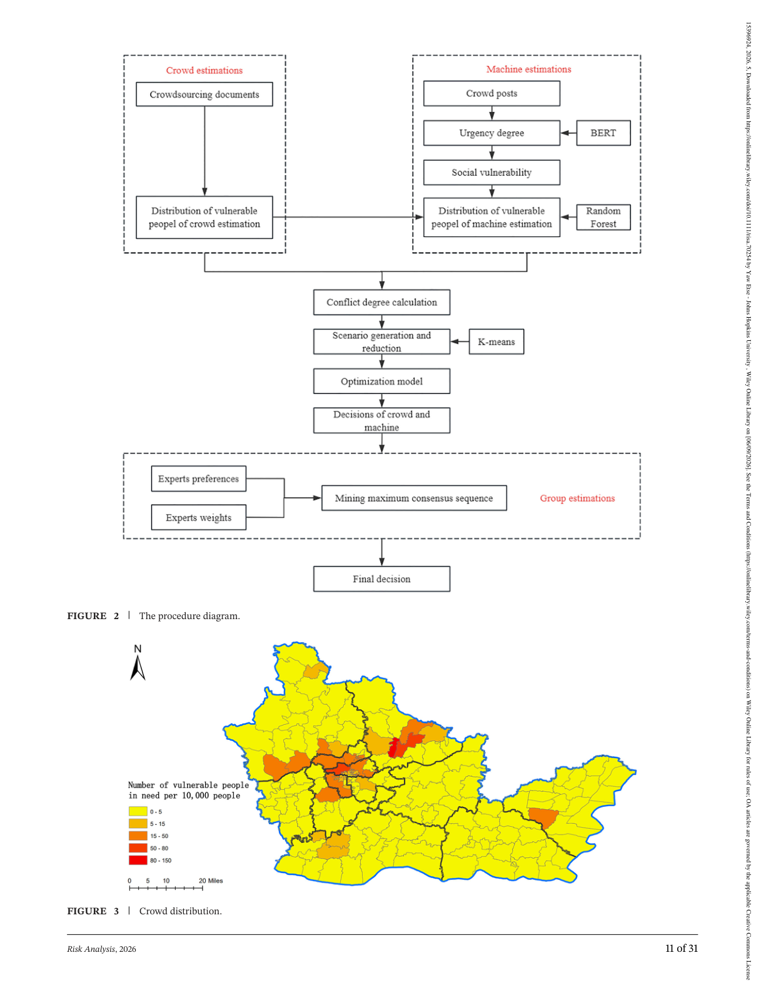

**FIGURE** **2** The procedure diagram.

**FIGURE** **3** Crowd distribution.

#### Source page 12

[Open original PDF page 12](mod_02_readings/Risk%20Analysis%20-%202026%20-%20Tang%20-%20Harnessing%20the%20Hybrid%20Intelligence%20of%20Crowd%20and%20Artificial%20Intelligence%20in%20Group%20Decision.pdf#page=12)

View original page 12, including its figures, tables, and equations

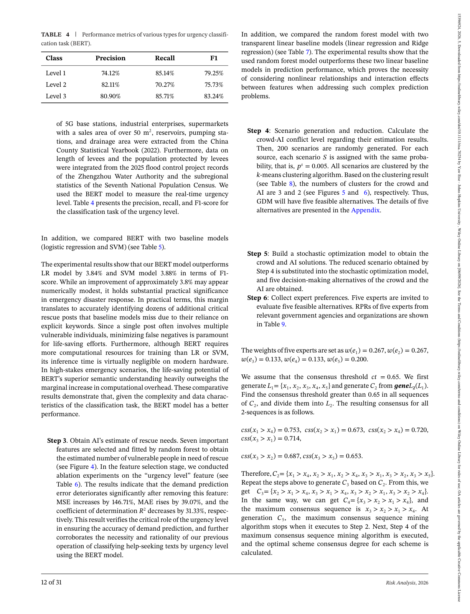

**TABLE** **4** Performance metrics of various types for urgency classification task (BERT).

**Class** **Precision** **Recall** **F1**

Level 1 74.12% 85.14% 79.25%

Level 2 82.11% 70.27% 75.73%

Level 3 80.90% 85.71% 83.24%

of 5G base stations, industrial enterprises, supermarkets with a sales area of over 50 m 2, reservoirs, pumping stations, and drainage area were extracted from the China County Statistical Yearbook (2022). Furthermore, data on length of levees and the population protected by levees were integrated from the 2025 flood control project records of the Zhengzhou Water Authority and the subregional statistics of the Seventh National Population Census. We used the BERT model to measure the real-time urgency level. Table 4 presents the precision, recall, and F1-score for the classification task of the urgency level.

In addition, we compared BERT with two baseline models (logistic regression and SVM) (see Table 5).

The experimental results show that our BERT model outperforms LR model by 3.84% and SVM model 3.88% in terms of F1score. While an improvement of approximately 3.8% may appear numerically modest, it holds substantial practical significance in emergency disaster response. In practical terms, this margin translates to accurately identifying dozens of additional critical rescue posts that baseline models miss due to their reliance on explicit keywords. Since a single post often involves multiple vulnerable individuals, minimizing false negatives is paramount for life-saving efforts. Furthermore, although BERT requires more computational resources for training than LR or SVM, its inference time is virtually negligible on modern hardware. In high-stakes emergency scenarios, the life-saving potential of BERT’s superior semantic understanding heavily outweighs the marginal increase in computational overhead. These comparative results demonstrate that, given the complexity and data characteristics of the classification task, the BERT model has a better performance.

**Step** **3** . Obtain AI’s estimate of rescue needs. Seven important

features are selected and fitted by random forest to obtain the estimated number of vulnerable people in need of rescue (see Figure 4). In the feature selection stage, we conducted ablation experiments on the “urgency level” feature (see Table 6). The results indicate that the demand prediction error deteriorates significantly after removing this feature: MSE increases by 146.71%, MAE rises by 39.07%, and the coefficient of determination _R_ 2 decreases by 31.33%, respectively. This result verifies the critical role of the urgency level in ensuring the accuracy of demand prediction, and further corroborates the necessity and rationality of our previous operation of classifying help-seeking texts by urgency level using the BERT model.

In addition, we compared the random forest model with two transparent linear baseline models (linear regression and Ridge regression) (see Table 7). The experimental results show that the used random forest model outperforms these two linear baseline models in prediction performance, which proves the necessity of considering nonlinear relationships and interaction effects between features when addressing such complex prediction problems.

**Step** **4** : Scenario generation and reduction. Calculate the

crowd-AI conflict level regarding their estimation results. Then, 200 scenarios are randomly generated. For each source, each scenario 𝑆 is assigned with the same probability, that is, 𝑝 𝑠 = 0.005. All scenarios are clustered by the _k_ -means clustering algorithm. Based on the clustering result (see Table 8), the numbers of clusters for the crowd and AI are 3 and 2 (see Figures 5 and 6), respectively. Thus, GDM will have five feasible alternatives. The details of five alternatives are presented in the Appendix.

**Step** **5** : Build a stochastic optimization model to obtain the

crowd and AI solutions. The reduced scenario obtained by Step 4 is substituted into the stochastic optimization model, and five decision-making alternatives of the crowd and the AI are obtained. **Step** **6** : Collect expert preferences. Five experts are invited to

evaluate five feasible alternatives. RPRs of five experts from relevant government agencies and organizations are shown in Table 9.

The weights of five experts are set as 𝑤(𝑒1) = 0.267, 𝑤(𝑒2) = 0.267, 𝑤(𝑒3) = 0.133, 𝑤(𝑒4) = 0.133, 𝑤(𝑒5) = 0.200.

We assume that the consensus threshold 𝑐𝑡 = 0.65. We first generate 𝐿1= {𝑥1, 𝑥2, 𝑥3, 𝑥4, 𝑥5} and generate 𝐶2 from 𝒈𝒆𝒏𝒆𝐿𝟐(𝐿1). Find the consensus threshold greater than 0.65 in all sequences of 𝐶2, and divide them into 𝐿2. The resulting consensus for all 2-sequences is as follows.

𝑐𝑠𝑠(𝑥1 _>_ 𝑥4) = 0.753, 𝑐𝑠𝑠(𝑥2 _>_ 𝑥1) = 0.673, 𝑐𝑠𝑠(𝑥2 _>_ 𝑥4) = 0.720, 𝑐𝑠𝑠(𝑥3 _>_ 𝑥1) = 0.714,

𝑐𝑠𝑠(𝑥3 _>_ 𝑥2) = 0.687, 𝑐𝑠𝑠(𝑥3 _>_ 𝑥5) = 0.653.

Therefore, 𝐶2= {𝑥1 _>_ 𝑥4, 𝑥2 _>_ 𝑥1, 𝑥2 _>_ 𝑥4, 𝑥3 _>_ 𝑥1, 𝑥3 _>_ 𝑥2, 𝑥3 _>_ 𝑥5}. Repeat the steps above to generate 𝐶3 based on 𝐶2. From this, we get 𝐶3= {𝑥2 _>_ 𝑥1 _>_ 𝑥4, 𝑥3 _>_ 𝑥1 _>_ 𝑥4, 𝑥3 _>_ 𝑥2 _>_ 𝑥1, 𝑥3 _>_ 𝑥2 _>_ 𝑥4}. In the same way, we can get 𝐶4= {𝑥3 _>_ 𝑥2 _>_ 𝑥1 _>_ 𝑥4}, and the maximum consensus sequence is 𝑥3 _>_ 𝑥2 _>_ 𝑥1 _>_ 𝑥4. At generation 𝐶5, the maximum consensus sequence mining algorithm stops when it executes to Step 2. Next, Step 4 of the maximum consensus sequence mining algorithm is executed, and the optimal scheme consensus degree for each scheme is calculated.

#### Source page 13

[Open original PDF page 13](mod_02_readings/Risk%20Analysis%20-%202026%20-%20Tang%20-%20Harnessing%20the%20Hybrid%20Intelligence%20of%20Crowd%20and%20Artificial%20Intelligence%20in%20Group%20Decision.pdf#page=13)

View original page 13, including its figures, tables, and equations

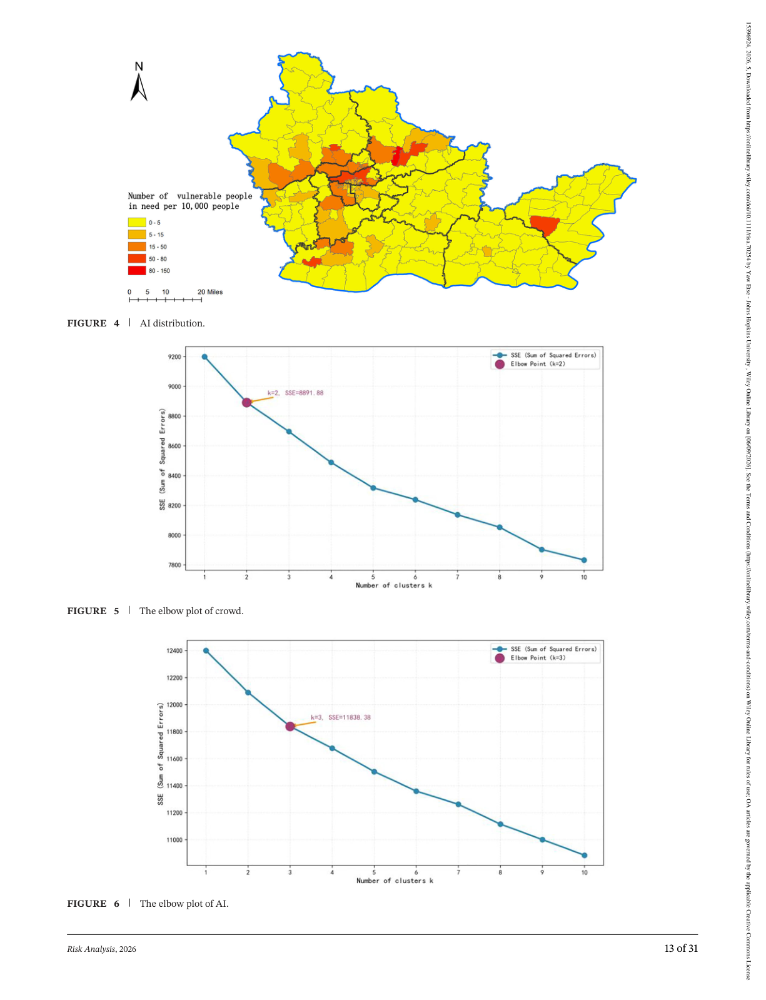

**FIGURE** **4** AI distribution.

**FIGURE** **5** The elbow plot of crowd.

**FIGURE** **6** The elbow plot of AI.

#### Source page 14

[Open original PDF page 14](mod_02_readings/Risk%20Analysis%20-%202026%20-%20Tang%20-%20Harnessing%20the%20Hybrid%20Intelligence%20of%20Crowd%20and%20Artificial%20Intelligence%20in%20Group%20Decision.pdf#page=14)

View original page 14, including its figures, tables, and equations

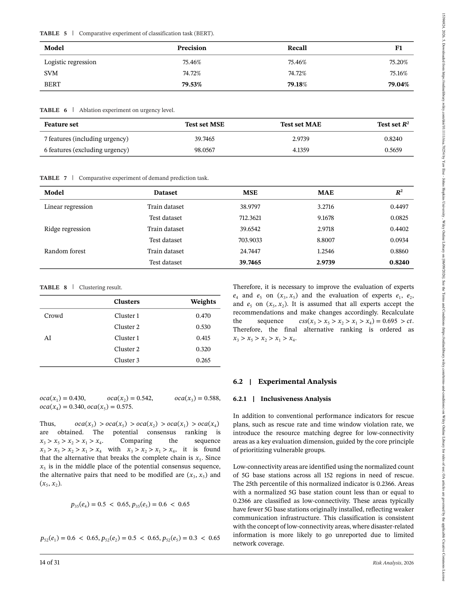

**TABLE** **5** Comparative experiment of classification task (BERT).

**Model** **Precision** **Recall** **F1**

Logistic regression 75.46% 75.46% 75.20%

SVM 74.72% 74.72% 75.16%

BERT **79.53%** **79.18** % **79.04%**

**TABLE** **6** Ablation experiment on urgency level.

**Feature** **set** **Test** **set** **MSE** **Test** **set** **MAE** **Test** **set** **_R_** **2**

7 features (including urgency) 39.7465 2.9739 0.8240

6 features (excluding urgency) 98.0567 4.1359 0.5659

**TABLE** **7** Comparative experiment of demand prediction task.

**Model** **Dataset** **MSE** **MAE** **_R_** **2**

Linear regression Train dataset 38.9797 3.2716 0.4497

Test dataset 712.3621 9.1678 0.0825

Ridge regression Train dataset 39.6542 2.9718 0.4402

Test dataset 703.9033 8.8007 0.0934

Random forest Train dataset 24.7447 1.2546 0.8860

Test dataset **39.7465** **2.9739** **0.8240**

**TABLE** **8** Clustering result.

**Clusters** **Weights**

Crowd Cluster 1 0.470

Cluster 2 0.530

AI Cluster 1 0.415

Cluster 2 0.320

Cluster 3 0.265

𝑜𝑐𝑎(𝑥1) = 0.430, 𝑜𝑐𝑎(𝑥2) = 0.542, 𝑜𝑐𝑎(𝑥3) = 0.588, 𝑜𝑐𝑎(𝑥4) = 0.340, 𝑜𝑐𝑎(𝑥5) = 0.575.

Thus, 𝑜𝑐𝑎(𝑥3) _>_ 𝑜𝑐𝑎(𝑥5) _>_ 𝑜𝑐𝑎(𝑥2) _>_ 𝑜𝑐𝑎(𝑥1) _>_ 𝑜𝑐𝑎(𝑥4) are obtained. The potential consensus ranking is 𝑥3 _>_ 𝑥5 _>_ 𝑥2 _>_ 𝑥1 _>_ 𝑥4. Comparing the sequence 𝑥3 _>_ 𝑥5 _>_ 𝑥2 _>_ 𝑥1 _>_ 𝑥4 with 𝑥3 _>_ 𝑥2 _>_ 𝑥1 _>_ 𝑥4, it is found that the alternative that breaks the complete chain is 𝑥5. Since 𝑥5 is in the middle place of the potential consensus sequence, the alternative pairs that need to be modified are (𝑥3, 𝑥5) and (𝑥5, 𝑥2).

𝑝35(𝑒4) = 0.5 _<_ 0.65, 𝑝35(𝑒5) = 0.6 _<_ 0.65

𝑝52(𝑒1) = 0.6 _<_ 0.65, 𝑝52(𝑒2) = 0.5 _<_ 0.65, 𝑝52(𝑒5) = 0.3 _<_ 0.65

Therefore, it is necessary to improve the evaluation of experts 𝑒4 and 𝑒5 on (𝑥3, 𝑥5) and the evaluation of experts 𝑒1, 𝑒2, and 𝑒5 on (𝑥5, 𝑥2). It is assumed that all experts accept the recommendations and make changes accordingly. Recalculate the sequence 𝑐𝑠𝑠(𝑥3 _>_ 𝑥5 _>_ 𝑥2 _>_ 𝑥1 _>_ 𝑥4) = 0.695 _>_ 𝑐𝑡. Therefore, the final alternative ranking is ordered as 𝑥3 _>_ 𝑥5 _>_ 𝑥2 _>_ 𝑥1 _>_ 𝑥4.

**6.2** **Experimental** **Analysis**

**6.2.1** **Inclusiveness** **Analysis**

In addition to conventional performance indicators for rescue plans, such as rescue rate and time window violation rate, we introduce the resource matching degree for low-connectivity areas as a key evaluation dimension, guided by the core principle of prioritizing vulnerable groups.

Low-connectivity areas are identified using the normalized count of 5G base stations across all 152 regions in need of rescue. The 25th percentile of this normalized indicator is 0.2366. Areas with a normalized 5G base station count less than or equal to 0.2366 are classified as low-connectivity. These areas typically have fewer 5G base stations originally installed, reflecting weaker communication infrastructure. This classification is consistent with the concept of low-connectivity areas, where disaster-related information is more likely to go unreported due to limited network coverage.

#### Source page 15

[Open original PDF page 15](mod_02_readings/Risk%20Analysis%20-%202026%20-%20Tang%20-%20Harnessing%20the%20Hybrid%20Intelligence%20of%20Crowd%20and%20Artificial%20Intelligence%20in%20Group%20Decision.pdf#page=15)

View original page 15, including its figures, tables, and equations

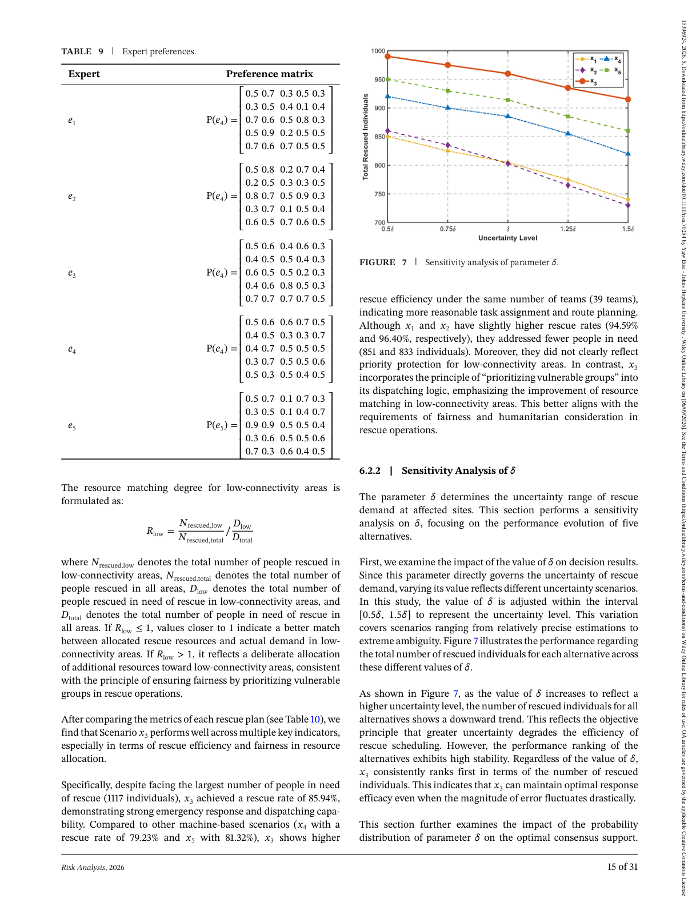

**TABLE** **9** Expert preferences.

**Expert** **Preference** **matrix**

⎡ ⎢ ⎢ ⎢ ⎢ ⎢ ⎣

⎤ ⎥ ⎥ ⎥ ⎥ ⎥ ⎦

𝑒1 P(𝑒4) =

0.5 0.7 0.3 0.5 0.3 0.3 0.5 0.4 0.1 0.4 0.7 0.6 0.5 0.8 0.3 0.5 0.9 0.2 0.5 0.5 0.7 0.6 0.7 0.5 0.5

⎡ ⎢ ⎢ ⎢ ⎢ ⎢ ⎣

⎤ ⎥ ⎥ ⎥ ⎥ ⎥ ⎦

𝑒2 P(𝑒4) =

0.5 0.8 0.2 0.7 0.4 0.2 0.5 0.3 0.3 0.5 0.8 0.7 0.5 0.9 0.3 0.3 0.7 0.1 0.5 0.4 0.6 0.5 0.7 0.6 0.5

⎡ ⎢ ⎢ ⎢ ⎢ ⎢ ⎣

⎤ ⎥ ⎥ ⎥ ⎥ ⎥ ⎦

𝑒3 P(𝑒4) =

0.5 0.6 0.4 0.6 0.3 0.4 0.5 0.5 0.4 0.3 0.6 0.5 0.5 0.2 0.3 0.4 0.6 0.8 0.5 0.3 0.7 0.7 0.7 0.7 0.5

⎡ ⎢ ⎢ ⎢ ⎢ ⎢ ⎣

⎤ ⎥ ⎥ ⎥ ⎥ ⎥ ⎦

𝑒4 P(𝑒4) =

0.5 0.6 0.6 0.7 0.5 0.4 0.5 0.3 0.3 0.7 0.4 0.7 0.5 0.5 0.5 0.3 0.7 0.5 0.5 0.6 0.5 0.3 0.5 0.4 0.5

⎡ ⎢ ⎢ ⎢ ⎢ ⎢ <u>⎣</u>

⎤ ⎥ ⎥ ⎥ ⎥ ⎥ <u>⎦</u>

𝑒5 P(𝑒5) =

0.5 0.7 0.1 0.7 0.3 0.3 0.5 0.1 0.4 0.7 0.9 0.9 0.5 0.5 0.4 0.3 0.6 0.5 0.5 0.6 0.7 0.3 0.6 0.4 0.5

The resource matching degree for low-connectivity areas is formulated as:

𝑅low = 𝑁rescued,low

∕ 𝐷low

𝑁rescued,total

𝐷total

where 𝑁rescued,low denotes the total number of people rescued in low-connectivity areas, 𝑁rescued,total denotes the total number of people rescued in all areas, 𝐷low denotes the total number of people rescued in need of rescue in low-connectivity areas, and 𝐷total denotes the total number of people in need of rescue in all areas. If 𝑅low ≤ 1, values closer to 1 indicate a better match between allocated rescue resources and actual demand in lowconnectivity areas. If 𝑅low _>_ 1, it reflects a deliberate allocation of additional resources toward low-connectivity areas, consistent with the principle of ensuring fairness by prioritizing vulnerable groups in rescue operations.

After comparing the metrics of each rescue plan (see Table 10), we find that Scenario 𝑥3 performs well across multiple key indicators, especially in terms of rescue efficiency and fairness in resource allocation.

Specifically, despite facing the largest number of people in need of rescue (1117 individuals), 𝑥3 achieved a rescue rate of 85.94%, demonstrating strong emergency response and dispatching capability. Compared to other machine-based scenarios (𝑥4 with a rescue rate of 79.23% and 𝑥5 with 81.32%), 𝑥3 shows higher

**FIGURE** **7** Sensitivity analysis of parameter 𝛿.

rescue efficiency under the same number of teams (39 teams), indicating more reasonable task assignment and route planning. Although 𝑥1 and 𝑥2 have slightly higher rescue rates (94.59% and 96.40%, respectively), they addressed fewer people in need (851 and 833 individuals). Moreover, they did not clearly reflect priority protection for low-connectivity areas. In contrast, 𝑥3 incorporates the principle of “prioritizing vulnerable groups” into its dispatching logic, emphasizing the improvement of resource matching in low-connectivity areas. This better aligns with the requirements of fairness and humanitarian consideration in rescue operations.

**6.2.2** **Sensitivity** **Analysis** **of** 𝜹

The parameter 𝛿 determines the uncertainty range of rescue demand at affected sites. This section performs a sensitivity analysis on 𝛿, focusing on the performance evolution of five alternatives.

First, we examine the impact of the value of 𝛿 on decision results. Since this parameter directly governs the uncertainty of rescue demand, varying its value reflects different uncertainty scenarios. In this study, the value of 𝛿 is adjusted within the interval

[0.5𝛿, 1.5𝛿] to represent the uncertainty level. This variation covers scenarios ranging from relatively precise estimations to extreme ambiguity. Figure 7 illustrates the performance regarding the total number of rescued individuals for each alternative across these different values of 𝛿.

As shown in Figure 7, as the value of 𝛿 increases to reflect a higher uncertainty level, the number of rescued individuals for all alternatives shows a downward trend. This reflects the objective principle that greater uncertainty degrades the efficiency of rescue scheduling. However, the performance ranking of the alternatives exhibits high stability. Regardless of the value of 𝛿, 𝑥3 consistently ranks first in terms of the number of rescued individuals. This indicates that 𝑥3 can maintain optimal response efficacy even when the magnitude of error fluctuates drastically.

This section further examines the impact of the probability distribution of parameter 𝛿 on the optimal consensus support.

#### Source page 16

[Open original PDF page 16](mod_02_readings/Risk%20Analysis%20-%202026%20-%20Tang%20-%20Harnessing%20the%20Hybrid%20Intelligence%20of%20Crowd%20and%20Artificial%20Intelligence%20in%20Group%20Decision.pdf#page=16)

View original page 16, including its figures, tables, and equations

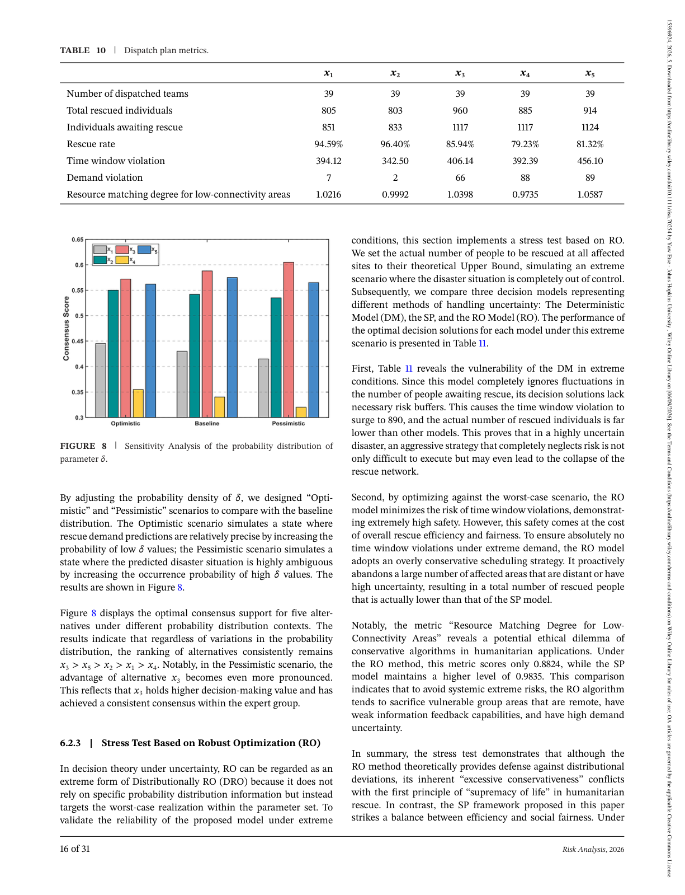

**TABLE** **10** Dispatch plan metrics.

𝒙𝟏 𝒙𝟐 𝒙𝟑 𝒙𝟒 𝒙𝟓

Number of dispatched teams 39 39 39 39 39

Total rescued individuals 805 803 960 885 914

Individuals awaiting rescue 851 833 1117 1117 1124

Rescue rate 94.59% 96.40% 85.94% 79.23% 81.32%

Time window violation 394.12 342.50 406.14 392.39 456.10

Demand violation 7 2 66 88 89

Resource matching degree for low-connectivity areas 1.0216 0.9992 1.0398 0.9735 1.0587

conditions, this section implements a stress test based on RO. We set the actual number of people to be rescued at all affected sites to their theoretical Upper Bound, simulating an extreme scenario where the disaster situation is completely out of control. Subsequently, we compare three decision models representing different methods of handling uncertainty: The Deterministic Model (DM), the SP, and the RO Model (RO). The performance of the optimal decision solutions for each model under this extreme scenario is presented in Table 11.

**FIGURE** **8** Sensitivity Analysis of the probability distribution of parameter 𝛿.

By adjusting the probability density of 𝛿, we designed “Optimistic” and “Pessimistic” scenarios to compare with the baseline distribution. The Optimistic scenario simulates a state where rescue demand predictions are relatively precise by increasing the probability of low 𝛿 values; the Pessimistic scenario simulates a state where the predicted disaster situation is highly ambiguous by increasing the occurrence probability of high 𝛿 values. The results are shown in Figure 8.

Figure 8 displays the optimal consensus support for five alternatives under different probability distribution contexts. The results indicate that regardless of variations in the probability distribution, the ranking of alternatives consistently remains 𝑥3 _>_ 𝑥5 _>_ 𝑥2 _>_ 𝑥1 _>_ 𝑥4. Notably, in the Pessimistic scenario, the advantage of alternative 𝑥3 becomes even more pronounced. This reflects that 𝑥3 holds higher decision-making value and has achieved a consistent consensus within the expert group.

**6.2.3** **Stress** **Test** **Based** **on** **Robust** **Optimization** **(RO)**

In decision theory under uncertainty, RO can be regarded as an extreme form of Distributionally RO (DRO) because it does not rely on specific probability distribution information but instead targets the worst-case realization within the parameter set. To validate the reliability of the proposed model under extreme

First, Table 11 reveals the vulnerability of the DM in extreme conditions. Since this model completely ignores fluctuations in the number of people awaiting rescue, its decision solutions lack necessary risk buffers. This causes the time window violation to surge to 890, and the actual number of rescued individuals is far lower than other models. This proves that in a highly uncertain disaster, an aggressive strategy that completely neglects risk is not only difficult to execute but may even lead to the collapse of the rescue network.

Second, by optimizing against the worst-case scenario, the RO model minimizes the risk of time window violations, demonstrating extremely high safety. However, this safety comes at the cost of overall rescue efficiency and fairness. To ensure absolutely no time window violations under extreme demand, the RO model adopts an overly conservative scheduling strategy. It proactively abandons a large number of affected areas that are distant or have high uncertainty, resulting in a total number of rescued people that is actually lower than that of the SP model.

Notably, the metric “Resource Matching Degree for LowConnectivity Areas” reveals a potential ethical dilemma of conservative algorithms in humanitarian applications. Under the RO method, this metric scores only 0.8824, while the SP model maintains a higher level of 0.9835. This comparison indicates that to avoid systemic extreme risks, the RO algorithm tends to sacrifice vulnerable group areas that are remote, have weak information feedback capabilities, and have high demand uncertainty.

In summary, the stress test demonstrates that although the RO method theoretically provides defense against distributional deviations, its inherent “excessive conservativeness” conflicts with the first principle of “supremacy of life” in humanitarian rescue. In contrast, the SP framework proposed in this paper strikes a balance between efficiency and social fairness. Under

#### Source page 17

[Open original PDF page 17](mod_02_readings/Risk%20Analysis%20-%202026%20-%20Tang%20-%20Harnessing%20the%20Hybrid%20Intelligence%20of%20Crowd%20and%20Artificial%20Intelligence%20in%20Group%20Decision.pdf#page=17)

View original page 17, including its figures, tables, and equations

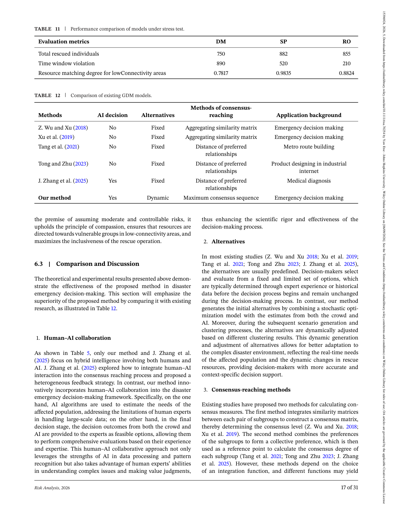

**TABLE** **11** Performance comparison of models under stress test.

**Evaluation** **metrics** **DM** **SP** **RO**

Total rescued individuals 750 882 855

Time window violation 890 520 210

Resource matching degree for lowConnectivity areas 0.7817 0.9835 0.8824

**TABLE** **12** Comparison of existing GDM models.

**Methods** **of** **consensus-**

**Methods** **AI** **decision** **Alternatives**

**reaching** **Application** **background**

Z. Wu and Xu (2018) No Fixed Aggregating similarity matrix Emergency decision making

Xu et al. (2019) No Fixed Aggregating similarity matrix Emergency decision making

Tang et al. (2021) No Fixed Distance of preferred

relationships

Tong and Zhu (2023) No Fixed Distance of preferred

relationships

J. Zhang et al. (2025) Yes Fixed Distance of preferred

relationships

Metro route building

Product designing in industrial

internet

Medical diagnosis

**Our** **method** Yes Dynamic Maximum consensus sequence Emergency decision making

the premise of assuming moderate and controllable risks, it upholds the principle of compassion, ensures that resources are directed towards vulnerable groups in low-connectivity areas, and maximizes the inclusiveness of the rescue operation.

**6.3** **Comparison** **and** **Discussion**

The theoretical and experimental results presented above demonstrate the effectiveness of the proposed method in disaster emergency decision-making. This section will emphasize the superiority of the proposed method by comparing it with existing research, as illustrated in Table 12.

1. **Human–AI** **collaboration**

As shown in Table 5, only our method and J. Zhang et al. (2025) focus on hybrid intelligence involving both humans and AI. J. Zhang et al. (2025) explored how to integrate human–AI interaction into the consensus reaching process and proposed a heterogeneous feedback strategy. In contrast, our method innovatively incorporates human–AI collaboration into the disaster emergency decision-making framework. Specifically, on the one hand, AI algorithms are used to estimate the needs of the affected population, addressing the limitations of human experts in handling large-scale data; on the other hand, in the final decision stage, the decision outcomes from both the crowd and AI are provided to the experts as feasible options, allowing them to perform comprehensive evaluations based on their experience and expertise. This human–AI collaborative approach not only leverages the strengths of AI in data processing and pattern recognition but also takes advantage of human experts’ abilities in understanding complex issues and making value judgments,

thus enhancing the scientific rigor and effectiveness of the decision-making process.

2. **Alternatives**

In most existing studies (Z. Wu and Xu 2018; Xu et al. 2019; Tang et al. 2021; Tong and Zhu 2023; J. Zhang et al. 2025), the alternatives are usually predefined. Decision-makers select and evaluate from a fixed and limited set of options, which are typically determined through expert experience or historical data before the decision process begins and remain unchanged during the decision-making process. In contrast, our method generates the initial alternatives by combining a stochastic optimization model with the estimates from both the crowd and AI. Moreover, during the subsequent scenario generation and clustering processes, the alternatives are dynamically adjusted based on different clustering results. This dynamic generation and adjustment of alternatives allows for better adaptation to the complex disaster environment, reflecting the real-time needs of the affected population and the dynamic changes in rescue resources, providing decision-makers with more accurate and context-specific decision support.

3. **Consensus-reaching** **methods**

Existing studies have proposed two methods for calculating consensus measures. The first method integrates similarity matrices between each pair of subgroups to construct a consensus matrix, thereby determining the consensus level (Z. Wu and Xu. 2018; Xu et al. 2019). The second method combines the preferences of the subgroups to form a collective preference, which is then used as a reference point to calculate the consensus degree of each subgroup (Tang et al. 2021; Tong and Zhu 2023; J. Zhang et al. 2025). However, these methods depend on the choice of an integration function, and different functions may yield

#### Source page 18

[Open original PDF page 18](mod_02_readings/Risk%20Analysis%20-%202026%20-%20Tang%20-%20Harnessing%20the%20Hybrid%20Intelligence%20of%20Crowd%20and%20Artificial%20Intelligence%20in%20Group%20Decision.pdf#page=18)

View original page 18, including its figures, tables, and equations

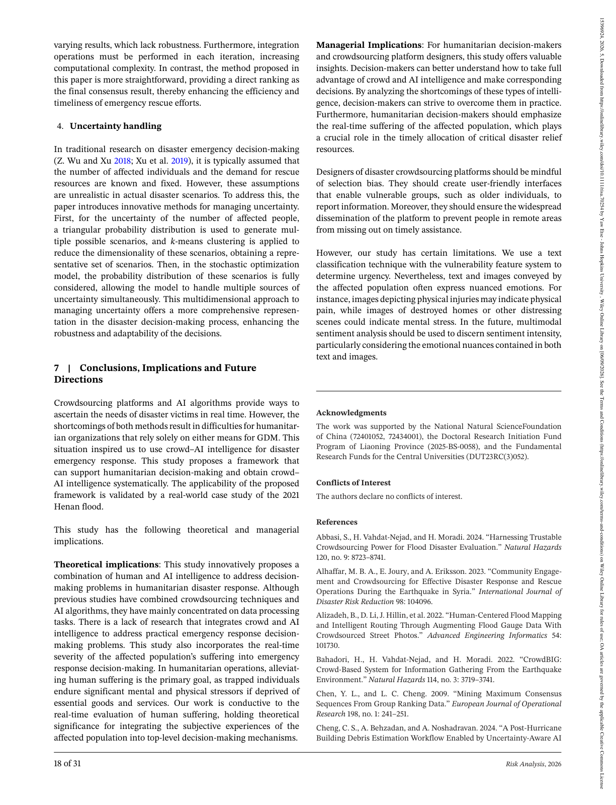

varying results, which lack robustness. Furthermore, integration operations must be performed in each iteration, increasing computational complexity. In contrast, the method proposed in this paper is more straightforward, providing a direct ranking as the final consensus result, thereby enhancing the efficiency and timeliness of emergency rescue efforts.

4. **Uncertainty** **handling**

In traditional research on disaster emergency decision-making (Z. Wu and Xu 2018; Xu et al. 2019), it is typically assumed that the number of affected individuals and the demand for rescue resources are known and fixed. However, these assumptions are unrealistic in actual disaster scenarios. To address this, the paper introduces innovative methods for managing uncertainty. First, for the uncertainty of the number of affected people, a triangular probability distribution is used to generate multiple possible scenarios, and _k_ -means clustering is applied to reduce the dimensionality of these scenarios, obtaining a representative set of scenarios. Then, in the stochastic optimization model, the probability distribution of these scenarios is fully considered, allowing the model to handle multiple sources of uncertainty simultaneously. This multidimensional approach to managing uncertainty offers a more comprehensive representation in the disaster decision-making process, enhancing the robustness and adaptability of the decisions.

**7** **Conclusions,** **Implications** **and** **Future** **Directions**

Crowdsourcing platforms and AI algorithms provide ways to ascertain the needs of disaster victims in real time. However, the shortcomings of both methods result in difficulties for humanitarian organizations that rely solely on either means for GDM. This situation inspired us to use crowd–AI intelligence for disaster emergency response. This study proposes a framework that can support humanitarian decision-making and obtain crowd– AI intelligence systematically. The applicability of the proposed framework is validated by a real-world case study of the 2021 Henan flood.

This study has the following theoretical and managerial implications.

**Theoretical** **implications** : This study innovatively proposes a combination of human and AI intelligence to address decisionmaking problems in humanitarian disaster response. Although previous studies have combined crowdsourcing techniques and AI algorithms, they have mainly concentrated on data processing tasks. There is a lack of research that integrates crowd and AI intelligence to address practical emergency response decisionmaking problems. This study also incorporates the real-time severity of the affected population’s suffering into emergency response decision-making. In humanitarian operations, alleviating human suffering is the primary goal, as trapped individuals endure significant mental and physical stressors if deprived of essential goods and services. Our work is conductive to the real-time evaluation of human suffering, holding theoretical significance for integrating the subjective experiences of the affected population into top-level decision-making mechanisms.

**Managerial** **Implications** : For humanitarian decision-makers and crowdsourcing platform designers, this study offers valuable insights. Decision-makers can better understand how to take full advantage of crowd and AI intelligence and make corresponding decisions. By analyzing the shortcomings of these types of intelligence, decision-makers can strive to overcome them in practice. Furthermore, humanitarian decision-makers should emphasize the real-time suffering of the affected population, which plays a crucial role in the timely allocation of critical disaster relief resources.

Designers of disaster crowdsourcing platforms should be mindful of selection bias. They should create user-friendly interfaces that enable vulnerable groups, such as older individuals, to report information. Moreover, they should ensure the widespread dissemination of the platform to prevent people in remote areas from missing out on timely assistance.

However, our study has certain limitations. We use a text classification technique with the vulnerability feature system to determine urgency. Nevertheless, text and images conveyed by the affected population often express nuanced emotions. For instance, images depicting physical injuries may indicate physical pain, while images of destroyed homes or other distressing scenes could indicate mental stress. In the future, multimodal sentiment analysis should be used to discern sentiment intensity, particularly considering the emotional nuances contained in both text and images.

**Acknowledgments**

The work was supported by the National Natural ScienceFoundation of China (72401052, 72434001), the Doctoral Research Initiation Fund Program of Liaoning Province (2025-BS-0058), and the Fundamental Research Funds for the Central Universities (DUT23RC(3)052).

**Conflicts** **of** **Interest**

The authors declare no conflicts of interest.

**References**

Abbasi, S., H. Vahdat-Nejad, and H. Moradi. 2024. “Harnessing Trustable Crowdsourcing Power for Flood Disaster Evaluation.” _Natural_ _Hazards_ 120, no. 9: 8723–8741.

Alhaffar, M. B. A., E. Joury, and A. Eriksson. 2023. “Community Engagement and Crowdsourcing for Effective Disaster Response and Rescue Operations During the Earthquake in Syria.” _International_ _Journal_ _of_ _Disaster_ _Risk_ _Reduction_ 98: 104096.

Alizadeh, B., D. Li, J. Hillin, et al. 2022. “Human-Centered Flood Mapping and Intelligent Routing Through Augmenting Flood Gauge Data With Crowdsourced Street Photos.” _Advanced_ _Engineering_ _Informatics_ 54: 101730.

Bahadori, H., H. Vahdat-Nejad, and H. Moradi. 2022. “CrowdBIG: Crowd-Based System for Information Gathering From the Earthquake Environment.” _Natural_ _Hazards_ 114, no. 3: 3719–3741.

Chen, Y. L., and L. C. Cheng. 2009. “Mining Maximum Consensus Sequences From Group Ranking Data.” _European_ _Journal_ _of_ _Operational_ _Research_ 198, no. 1: 241–251.

Cheng, C. S., A. Behzadan, and A. Noshadravan. 2024. “A Post-Hurricane Building Debris Estimation Workflow Enabled by Uncertainty-Aware AI

#### Source page 19

[Open original PDF page 19](mod_02_readings/Risk%20Analysis%20-%202026%20-%20Tang%20-%20Harnessing%20the%20Hybrid%20Intelligence%20of%20Crowd%20and%20Artificial%20Intelligence%20in%20Group%20Decision.pdf#page=19)

View original page 19, including its figures, tables, and equations

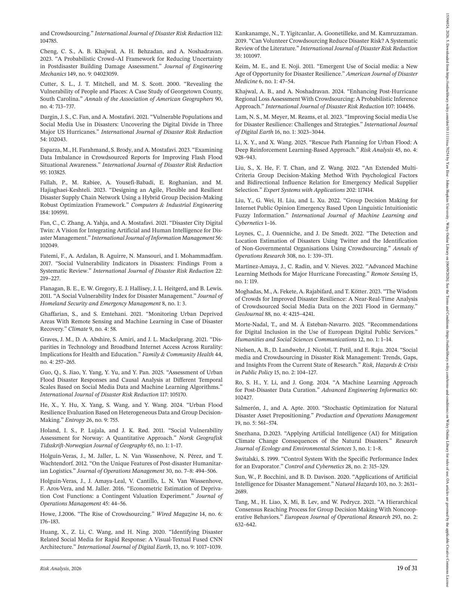

and Crowdsourcing.” _International_ _Journal_ _of_ _Disaster_ _Risk_ _Reduction_ 112: 104785.

Cheng, C. S., A. B. Khajwal, A. H. Behzadan, and A. Noshadravan. 2023. “A Probabilistic Crowd–AI Framework for Reducing Uncertainty in Postdisaster Building Damage Assessment.” _Journal_ _of_ _Engineering_ _Mechanics_ 149, no. 9: 04023059.

Cutter, S. L., J. T. Mitchell, and M. S. Scott. 2000. “Revealing the Vulnerability of People and Places: A Case Study of Georgetown County, South Carolina.” _Annals_ _of_ _the_ _Association_ _of_ _American_ _Geographers_ 90, no. 4: 713–737.

Dargin, J. S., C. Fan, and A. Mostafavi. 2021. “Vulnerable Populations and Social Media Use in Disasters: Uncovering the Digital Divide in Three Major US Hurricanes.” _International_ _Journal_ _of_ _Disaster_ _Risk_ _Reduction_ 54: 102043.

Esparza, M., H. Farahmand, S. Brody, and A. Mostafavi. 2023. “Examining Data Imbalance in Crowdsourced Reports for Improving Flash Flood Situational Awareness.” _International_ _Journal_ _of_ _Disaster_ _Risk_ _Reduction_ 95: 103825.

Fallah, P., M. Rabiee, A. Yousefi-Babadi, E. Roghanian, and M. Hajiaghaei-Keshteli. 2023. “Designing an Agile, Flexible and Resilient Disaster Supply Chain Network Using a Hybrid Group Decision-Making Robust Optimization Framework.” _Computers_ _&_ _Industrial_ _Engineering_ 184: 109591.

Fan, C., C. Zhang, A. Yahja, and A. Mostafavi. 2021. “Disaster City Digital Twin: A Vision for Integrating Artificial and Human Intelligence for Disaster Management.” _International_ _Journal_ _of_ _Information_ _Management_ 56: 102049.

Fatemi, F., A. Ardalan, B. Aguirre, N. Mansouri, and I. Mohammadfam. 2017. “Social Vulnerability Indicators in Disasters: Findings From a Systematic Review.” _International_ _Journal_ _of_ _Disaster_ _Risk_ _Reduction_ 22: 219–227.

Flanagan, B. E., E. W. Gregory, E. J. Hallisey, J. L. Heitgerd, and B. Lewis. 2011. “A Social Vulnerability Index for Disaster Management.” _Journal_ _of_ _Homeland_ _Security_ _and_ _Emergency_ _Management_ 8, no. 1: 3.

Ghaffarian, S., and S. Emtehani. 2021. “Monitoring Urban Deprived Areas With Remote Sensing and Machine Learning in Case of Disaster Recovery.” _Climate_ 9, no. 4: 58.

Graves, J. M., D. A. Abshire, S. Amiri, and J. L. Mackelprang. 2021. “Disparities in Technology and Broadband Internet Access Across Rurality: Implications for Health and Education.” _Family_ _&_ _Community_ _Health_ 44, no. 4: 257–265.

Guo, Q., S. Jiao, Y. Yang, Y. Yu, and Y. Pan. 2025. “Assessment of Urban Flood Disaster Responses and Causal Analysis at Different Temporal Scales Based on Social Media Data and Machine Learning Algorithms.” _International_ _Journal_ _of_ _Disaster_ _Risk_ _Reduction_ 117: 105170.

He, X., Y. Hu, X. Yang, S. Wang, and Y. Wang. 2024. “Urban Flood Resilience Evaluation Based on Heterogeneous Data and Group DecisionMaking.” _Entropy_ 26, no. 9: 755.

Holand, I. S., P. Lujala, and J. K. Rød. 2011. “Social Vulnerability Assessment for Norway: A Quantitative Approach.” _Norsk_ _Geografisk_ _Tidsskrift-Norwegian_ _Journal_ _of_ _Geography_ 65, no. 1: 1–17.

Holguín-Veras, J., M. Jaller, L. N. Van Wassenhove, N. Pérez, and T. Wachtendorf. 2012. “On the Unique Features of Post-disaster Humanitarian Logistics.” _Journal_ _of_ _Operations_ _Management_ 30, no. 7–8: 494–506.

Holguín-Veras, J., J. Amaya-Leal, V. Cantillo, L. N. Van Wassenhove, F. Aros-Vera, and M. Jaller. 2016. “Econometric Estimation of Deprivation Cost Functions: a Contingent Valuation Experiment.” _Journal_ _of_ _Operations_ _Management_ 45: 44–56.

Howe, J.2006. “The Rise of Crowdsourcing.” _Wired_ _Magazine_ 14, no. 6: 176–183.

Huang, X., Z. Li, C. Wang, and H. Ning. 2020. “Identifying Disaster Related Social Media for Rapid Response: A Visual-Textual Fused CNN Architecture.” _International_ _Journal_ _of_ _Digital_ _Earth_, 13, no. 9: 1017–1039.

Kankanamge, N., T. Yigitcanlar, A. Goonetilleke, and M. Kamruzzaman. 2019. “Can Volunteer Crowdsourcing Reduce Disaster Risk? A Systematic Review of the Literature.” _International_ _Journal_ _of_ _Disaster_ _Risk_ _Reduction_ 35: 101097.

Keim, M. E., and E. Noji. 2011. “Emergent Use of Social media: a New Age of Opportunity for Disaster Resilience.” _American_ _Journal_ _of_ _Disaster_ _Medicine_ 6, no. 1: 47–54.

Khajwal, A. B., and A. Noshadravan. 2024. “Enhancing Post-Hurricane Regional Loss Assessment With Crowdsourcing: A Probabilistic Inference Approach.” _International_ _Journal_ _of_ _Disaster_ _Risk_ _Reduction_ 107: 104456.

Lam, N. S., M. Meyer, M. Reams, et al. 2023. “Improving Social media Use for Disaster Resilience: Challenges and Strategies.” _International_ _Journal_ _of_ _Digital_ _Earth_ 16, no. 1: 3023–3044.

Li, X. Y., and X. Wang. 2025. “Rescue Path Planning for Urban Flood: A Deep Reinforcement Learning-Based Approach.” _Risk_ _Analysis_ 45, no. 4: 928–943.

Liu, S., X. He, F. T. Chan, and Z. Wang. 2022. “An Extended MultiCriteria Group Decision-Making Method With Psychological Factors and Bidirectional Influence Relation for Emergency Medical Supplier Selection.” _Expert_ _Systems_ _with_ _Applications_ 202: 117414.

Liu, Y., G. Wei, H. Liu, and L. Xu. 2022. “Group Decision Making for Internet Public Opinion Emergency Based Upon Linguistic Intuitionistic Fuzzy Information.” _International_ _Journal_ _of_ _Machine_ _Learning_ _and_ _Cybernetics_ 1–16.

Loynes, C., J. Ouenniche, and J. De Smedt. 2022. “The Detection and Location Estimation of Disasters Using Twitter and the Identification of Non-Governmental Organisations Using Crowdsourcing.” _Annals_ _of_ _Operations_ _Research_ 308, no. 1: 339–371.

Martinez-Amaya, J., C. Radin, and V. Nieves. 2022. “Advanced Machine Learning Methods for Major Hurricane Forecasting.” _Remote_ _Sensing_ 15, no. 1: 119.

Moghadas, M., A. Fekete, A. Rajabifard, and T. Kötter. 2023. “The Wisdom of Crowds for Improved Disaster Resilience: A Near-Real-Time Analysis of Crowdsourced Social Media Data on the 2021 Flood in Germany.” _GeoJournal_ 88, no. 4: 4215–4241.

Morte-Nadal, T., and M. Á Esteban-Navarro. 2025. “Recommendations for Digital Inclusion in the Use of European Digital Public Services.” _Humanities_ _and_ _Social_ _Sciences_ _Communications_ 12, no. 1: 1–14.

Nielsen, A. B., D. Landwehr, J. Nicolaï, T. Patil, and E. Raju. 2024. “Social media and Crowdsourcing in Disaster Risk Management: Trends, Gaps, and Insights From the Current State of Research.” _Risk,_ _Hazards_ _&_ _Crisis_ _in_ _Public_ _Policy_ 15, no. 2: 104–127.

Ro, S. H., Y. Li, and J. Gong. 2024. “A Machine Learning Approach for Post-Disaster Data Curation.” _Advanced_ _Engineering_ _Informatics_ 60: 102427.

Salmerón, J., and A. Apte. 2010. “Stochastic Optimization for Natural Disaster Asset Prepositioning.” _Production_ _and_ _Operations_ _Management_ 19, no. 5: 561–574.

Snezhana, D.2023. “Applying Artificial Intelligence (AI) for Mitigation Climate Change Consequences of the Natural Disasters.” _Research_ _Journal_ _of_ _Ecology_ _and_ _Environmental_ _Sciences_ 3, no. 1: 1–8.

Świtalski, S. 1999. “Control System With the Specific Performance Index for an Evaporator.” _Control_ _and_ _Cybernetics_ 28, no. 2: 315–329.

Sun, W., P. Bocchini, and B. D. Davison. 2020. “Applications of Artificial Intelligence for Disaster Management.” _Natural_ _Hazards_ 103, no. 3: 2631– 2689.

Tang, M., H. Liao, X. Mi, B. Lev, and W. Pedrycz. 2021. “A Hierarchical Consensus Reaching Process for Group Decision Making With Noncooperative Behaviors.” _European_ _Journal_ _of_ _Operational_ _Research_ 293, no. 2: 632–642.

#### Source page 20

[Open original PDF page 20](mod_02_readings/Risk%20Analysis%20-%202026%20-%20Tang%20-%20Harnessing%20the%20Hybrid%20Intelligence%20of%20Crowd%20and%20Artificial%20Intelligence%20in%20Group%20Decision.pdf#page=20)

View original page 20, including its figures, tables, and equations

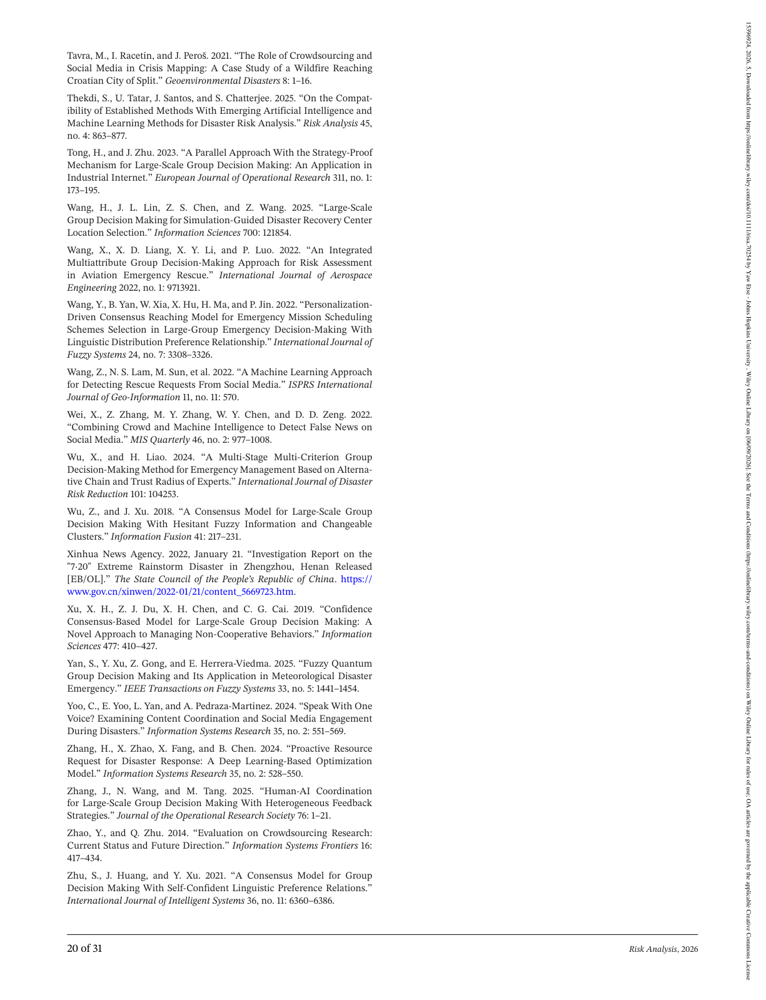

Tavra, M., I. Racetin, and J. Peroš. 2021. “The Role of Crowdsourcing and Social Media in Crisis Mapping: A Case Study of a Wildfire Reaching Croatian City of Split.” _Geoenvironmental_ _Disasters_ 8: 1–16.

Thekdi, S., U. Tatar, J. Santos, and S. Chatterjee. 2025. “On the Compatibility of Established Methods With Emerging Artificial Intelligence and Machine Learning Methods for Disaster Risk Analysis.” _Risk_ _Analysis_ 45, no. 4: 863–877.

Tong, H., and J. Zhu. 2023. “A Parallel Approach With the Strategy-Proof Mechanism for Large-Scale Group Decision Making: An Application in Industrial Internet.” _European_ _Journal_ _of_ _Operational_ _Research_ 311, no. 1: 173–195.

Wang, H., J. L. Lin, Z. S. Chen, and Z. Wang. 2025. “Large-Scale Group Decision Making for Simulation-Guided Disaster Recovery Center Location Selection.” _Information_ _Sciences_ 700: 121854.

Wang, X., X. D. Liang, X. Y. Li, and P. Luo. 2022. “An Integrated Multiattribute Group Decision-Making Approach for Risk Assessment in Aviation Emergency Rescue.” _International_ _Journal_ _of_ _Aerospace_ _Engineering_ 2022, no. 1: 9713921.

Wang, Y., B. Yan, W. Xia, X. Hu, H. Ma, and P. Jin. 2022. “PersonalizationDriven Consensus Reaching Model for Emergency Mission Scheduling Schemes Selection in Large-Group Emergency Decision-Making With Linguistic Distribution Preference Relationship.” _International_ _Journal_ _of_ _Fuzzy_ _Systems_ 24, no. 7: 3308–3326.

Wang, Z., N. S. Lam, M. Sun, et al. 2022. “A Machine Learning Approach for Detecting Rescue Requests From Social Media.” _ISPRS_ _International_ _Journal_ _of_ _Geo-Information_ 11, no. 11: 570.

Wei, X., Z. Zhang, M. Y. Zhang, W. Y. Chen, and D. D. Zeng. 2022. “Combining Crowd and Machine Intelligence to Detect False News on Social Media.” _MIS_ _Quarterly_ 46, no. 2: 977–1008.

Wu, X., and H. Liao. 2024. “A Multi-Stage Multi-Criterion Group Decision-Making Method for Emergency Management Based on Alternative Chain and Trust Radius of Experts.” _International_ _Journal_ _of_ _Disaster_ _Risk_ _Reduction_ 101: 104253.

Wu, Z., and J. Xu. 2018. “A Consensus Model for Large-Scale Group Decision Making With Hesitant Fuzzy Information and Changeable Clusters.” _Information_ _Fusion_ 41: 217–231.

Xinhua News Agency. 2022, January 21. “Investigation Report on the "7⋅20" Extreme Rainstorm Disaster in Zhengzhou, Henan Released

[EB/OL].” _The_ _State_ _Council_ _of_ _the_ _People’s_ _Republic_ _of_ _China_ . https:// www.gov.cn/xinwen/2022-01/21/content_5669723.htm.

Xu, X. H., Z. J. Du, X. H. Chen, and C. G. Cai. 2019. “Confidence Consensus-Based Model for Large-Scale Group Decision Making: A Novel Approach to Managing Non-Cooperative Behaviors.” _Information_ _Sciences_ 477: 410–427.

Yan, S., Y. Xu, Z. Gong, and E. Herrera-Viedma. 2025. “Fuzzy Quantum Group Decision Making and Its Application in Meteorological Disaster Emergency.” _IEEE_ _Transactions_ _on_ _Fuzzy_ _Systems_ 33, no. 5: 1441–1454.

Yoo, C., E. Yoo, L. Yan, and A. Pedraza-Martinez. 2024. “Speak With One Voice? Examining Content Coordination and Social Media Engagement During Disasters.” _Information_ _Systems_ _Research_ 35, no. 2: 551–569.

Zhang, H., X. Zhao, X. Fang, and B. Chen. 2024. “Proactive Resource Request for Disaster Response: A Deep Learning-Based Optimization Model.” _Information_ _Systems_ _Research_ 35, no. 2: 528–550.

Zhang, J., N. Wang, and M. Tang. 2025. “Human-AI Coordination for Large-Scale Group Decision Making With Heterogeneous Feedback Strategies.” _Journal_ _of_ _the_ _Operational_ _Research_ _Society_ 76: 1–21.

Zhao, Y., and Q. Zhu. 2014. “Evaluation on Crowdsourcing Research: Current Status and Future Direction.” _Information_ _Systems_ _Frontiers_ 16: 417–434.

Zhu, S., J. Huang, and Y. Xu. 2021. “A Consensus Model for Group Decision Making With Self-Confident Linguistic Preference Relations.” _International_ _Journal_ _of_ _Intelligent_ _Systems_ 36, no. 11: 6360–6386.

#### Source page 21

[Open original PDF page 21](mod_02_readings/Risk%20Analysis%20-%202026%20-%20Tang%20-%20Harnessing%20the%20Hybrid%20Intelligence%20of%20Crowd%20and%20Artificial%20Intelligence%20in%20Group%20Decision.pdf#page=21)

View original page 21, including its figures, tables, and equations

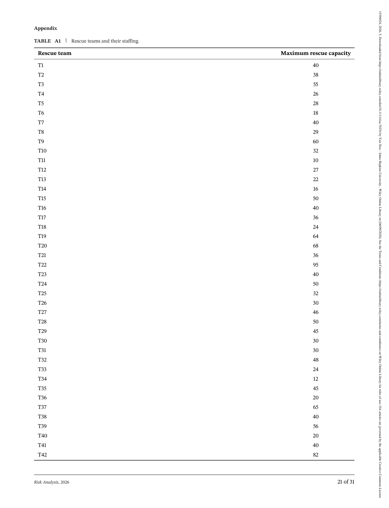

**Appendix**

**TABLE** **A1** Rescue teams and their staffing.

**Rescue** **team** **Maximum** **rescue** **capacity**

T1 40

T2 38

T3 55

T4 26

T5 28

T6 18

T7 40

T8 29

T9 60

T10 32

T11 10

T12 27

T13 22

T14 16

T15 50

T16 40

T17 36

T18 24

T19 64

T20 68

T21 36

T22 95

T23 40

T24 50

T25 32

T26 30

T27 46

T28 50

T29 45

T30 30

T31 30

T32 48

T33 24

T34 12

T35 45

T36 20

T37 65

T38 40

T39 56

T40 20

T41 40

T42 82

#### Source page 22

[Open original PDF page 22](mod_02_readings/Risk%20Analysis%20-%202026%20-%20Tang%20-%20Harnessing%20the%20Hybrid%20Intelligence%20of%20Crowd%20and%20Artificial%20Intelligence%20in%20Group%20Decision.pdf#page=22)

View original page 22, including its figures, tables, and equations

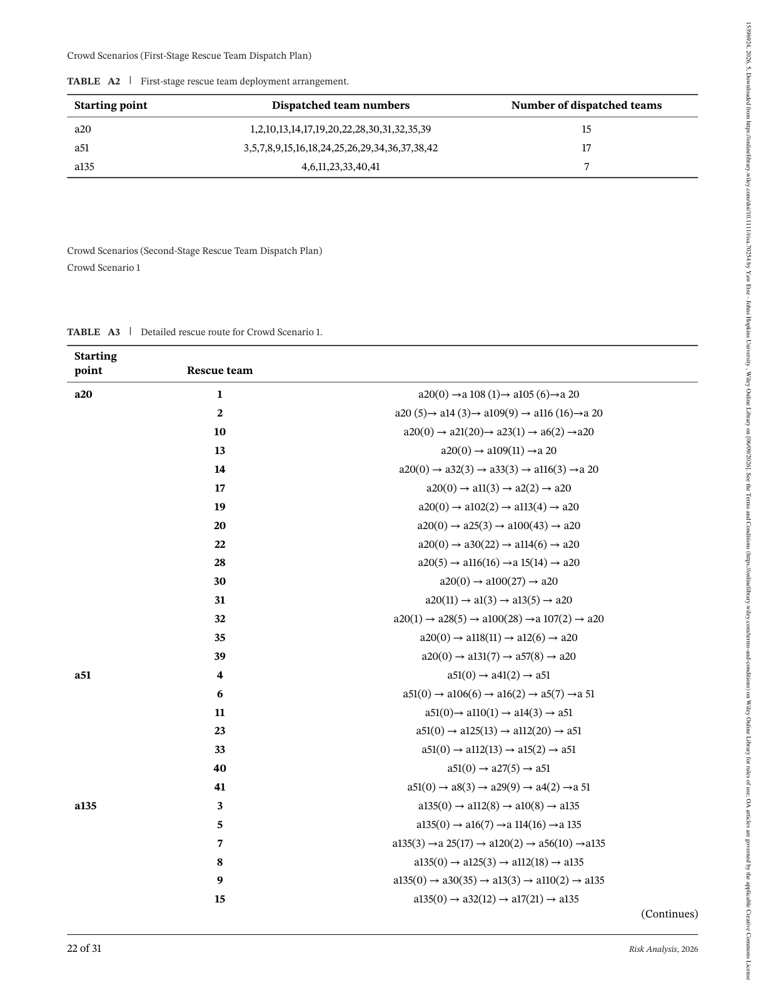

Crowd Scenarios (First-Stage Rescue Team Dispatch Plan)

**TABLE** **A2** First-stage rescue team deployment arrangement.

**Starting** **point** **Dispatched** **team** **numbers** **Number** **of** **dispatched** **teams**

a20 1,2,10,13,14,17,19,20,22,28,30,31,32,35,39 15

a51 3,5,7,8,9,15,16,18,24,25,26,29,34,36,37,38,42 17

a135 4,6,11,23,33,40,41 7

Crowd Scenarios (Second-Stage Rescue Team Dispatch Plan)

Crowd Scenario 1

**TABLE** **A3** Detailed rescue route for Crowd Scenario 1.

**Starting** **point** **Rescue** **team**

**a20** **1** a20(0) →a 108 (1)→ a105 (6)→a 20

**2** a20 (5)→ a14 (3)→ a109(9) → a116 (16)→a 20

**10** a20(0) → a21(20)→ a23(1) → a6(2) →a20

**13** a20(0) → a109(11) →a 20

**14** a20(0) → a32(3) → a33(3) → a116(3) →a 20

**17** a20(0) → a11(3) → a2(2) → a20

**19** a20(0) → a102(2) → a113(4) → a20

**20** a20(0) → a25(3) → a100(43) → a20

**22** a20(0) → a30(22) → a114(6) → a20

**28** a20(5) → a116(16) →a 15(14) → a20

**30** a20(0) → a100(27) → a20

**31** a20(11) → a1(3) → a13(5) → a20

**32** a20(1) → a28(5) → a100(28) →a 107(2) → a20

**35** a20(0) → a118(11) → a12(6) → a20

**39** a20(0) → a131(7) → a57(8) → a20

**a51** **4** a51(0) → a41(2) → a51

**6** a51(0) → a106(6) → a16(2) → a5(7) →a 51

**11** a51(0)→ a110(1) → a14(3) → a51

**23** a51(0) → a125(13) → a112(20) → a51

**33** a51(0) → a112(13) → a15(2) → a51

**40** a51(0) → a27(5) → a51

**41** a51(0) → a8(3) → a29(9) → a4(2) →a 51

**a135** **3** a135(0) → a112(8) → a10(8) → a135

**5** a135(0) → a16(7) →a 114(16) →a 135

**7** a135(3) →a 25(17) → a120(2) → a56(10) →a135

**8** a135(0) → a125(3) → a112(18) → a135

**9** a135(0) → a30(35) → a13(3) → a110(2) → a135

**15** a135(0) → a32(12) → a17(21) → a135

(Continues)

#### Source page 23

[Open original PDF page 23](mod_02_readings/Risk%20Analysis%20-%202026%20-%20Tang%20-%20Harnessing%20the%20Hybrid%20Intelligence%20of%20Crowd%20and%20Artificial%20Intelligence%20in%20Group%20Decision.pdf#page=23)

View original page 23, including its figures, tables, and equations

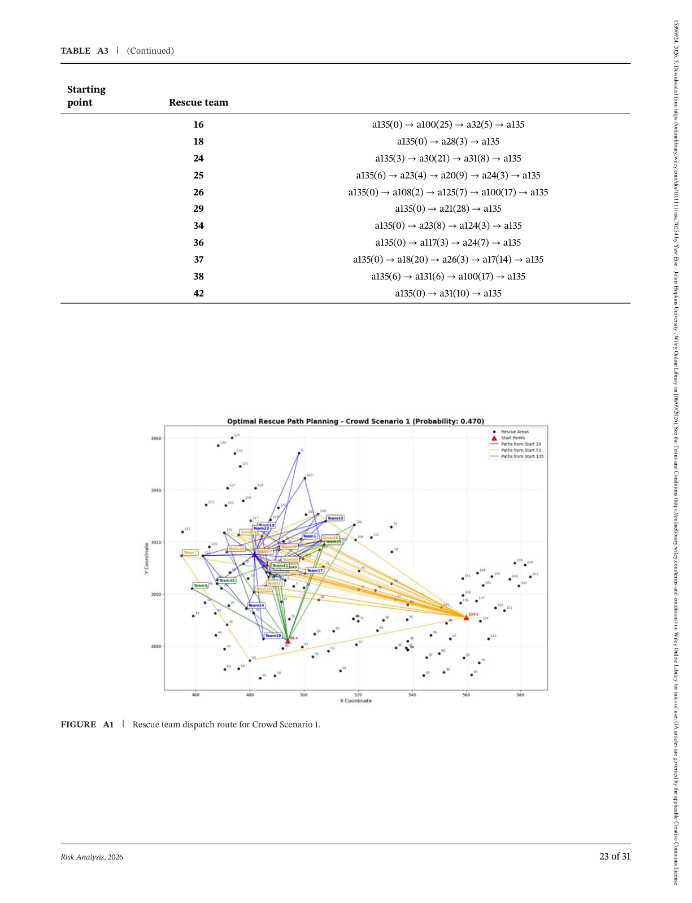

**TABLE** **A3** (Continued)

**Starting** **point** **Rescue** **team**

**16** a135(0) → a100(25) → a32(5) → a135

**18** a135(0) → a28(3) → a135

**24** a135(3) → a30(21) → a31(8) → a135

**25** a135(6) → a23(4) → a20(9) → a24(3) → a135

**26** a135(0) → a108(2) → a125(7) → a100(17) → a135

**29** a135(0) → a21(28) → a135

**34** a135(0) → a23(8) → a124(3) → a135

**36** a135(0) → a117(3) → a24(7) → a135

**37** a135(0) → a18(20) → a26(3) → a17(14) → a135

**38** a135(6) → a131(6) → a100(17) → a135

**42** a135(0) → a31(10) → a135

**FIGURE** **A1** Rescue team dispatch route for Crowd Scenario 1.

#### Source page 24

[Open original PDF page 24](mod_02_readings/Risk%20Analysis%20-%202026%20-%20Tang%20-%20Harnessing%20the%20Hybrid%20Intelligence%20of%20Crowd%20and%20Artificial%20Intelligence%20in%20Group%20Decision.pdf#page=24)

View original page 24, including its figures, tables, and equations

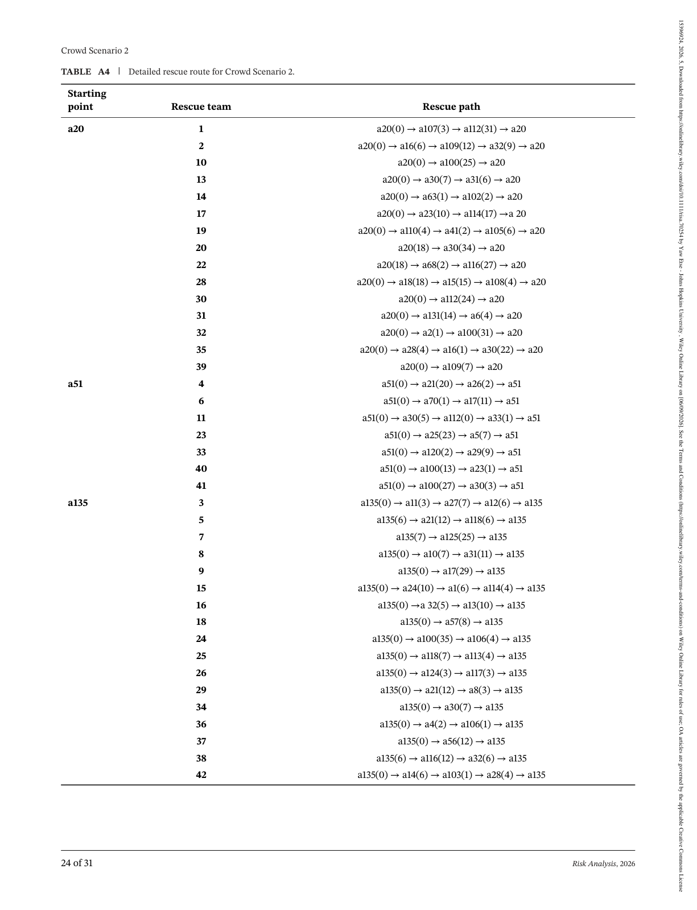

Crowd Scenario 2

**TABLE** **A4** Detailed rescue route for Crowd Scenario 2.

**Starting** **point** **Rescue** **team** **Rescue** **path**

**a20** **1** a20(0) → a107(3) → a112(31) → a20

**2** a20(0) → a16(6) → a109(12) → a32(9) → a20

**10** a20(0) → a100(25) → a20

**13** a20(0) → a30(7) → a31(6) → a20

**14** a20(0) → a63(1) → a102(2) → a20

**17** a20(0) → a23(10) → a114(17) →a 20

**19** a20(0) → a110(4) → a41(2) → a105(6) → a20

**20** a20(18) → a30(34) → a20

**22** a20(18) → a68(2) → a116(27) → a20

**28** a20(0) → a18(18) → a15(15) → a108(4) → a20

**30** a20(0) → a112(24) → a20

**31** a20(0) → a131(14) → a6(4) → a20

**32** a20(0) → a2(1) → a100(31) → a20

**35** a20(0) → a28(4) → a16(1) → a30(22) → a20

**39** a20(0) → a109(7) → a20

**a51** **4** a51(0) → a21(20) → a26(2) → a51

**6** a51(0) → a70(1) → a17(11) → a51

**11** a51(0) → a30(5) → a112(0) → a33(1) → a51

**23** a51(0) → a25(23) → a5(7) → a51

**33** a51(0) → a120(2) → a29(9) → a51

**40** a51(0) → a100(13) → a23(1) → a51

**41** a51(0) → a100(27) → a30(3) → a51

**a135** **3** a135(0) → a11(3) → a27(7) → a12(6) → a135

**5** a135(6) → a21(12) → a118(6) → a135

**7** a135(7) → a125(25) → a135

**8** a135(0) → a10(7) → a31(11) → a135

**9** a135(0) → a17(29) → a135

**15** a135(0) → a24(10) → a1(6) → a114(4) → a135

**16** a135(0) →a 32(5) → a13(10) → a135

**18** a135(0) → a57(8) → a135

**24** a135(0) → a100(35) → a106(4) → a135

**25** a135(0) → a118(7) → a113(4) → a135

**26** a135(0) → a124(3) → a117(3) → a135

**29** a135(0) → a21(12) → a8(3) → a135

**34** a135(0) → a30(7) → a135

**36** a135(0) → a4(2) → a106(1) → a135

**37** a135(0) → a56(12) → a135

**38** a135(6) → a116(12) → a32(6) → a135

**42** a135(0) → a14(6) → a103(1) → a28(4) → a135

#### Source page 25

[Open original PDF page 25](mod_02_readings/Risk%20Analysis%20-%202026%20-%20Tang%20-%20Harnessing%20the%20Hybrid%20Intelligence%20of%20Crowd%20and%20Artificial%20Intelligence%20in%20Group%20Decision.pdf#page=25)

View original page 25, including its figures, tables, and equations

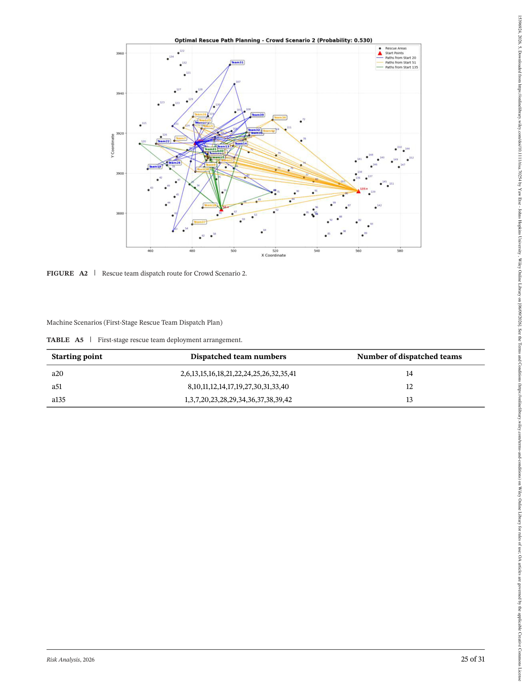

**FIGURE** **A2** Rescue team dispatch route for Crowd Scenario 2.

Machine Scenarios (First-Stage Rescue Team Dispatch Plan)

**TABLE** **A5** First-stage rescue team deployment arrangement.

**Starting** **point** **Dispatched** **team** **numbers** **Number** **of** **dispatched** **teams**

a20 2,6,13,15,16,18,21,22,24,25,26,32,35,41 14

a51 8,10,11,12,14,17,19,27,30,31,33,40 12

a135 1,3,7,20,23,28,29,34,36,37,38,39,42 13

#### Source page 26

[Open original PDF page 26](mod_02_readings/Risk%20Analysis%20-%202026%20-%20Tang%20-%20Harnessing%20the%20Hybrid%20Intelligence%20of%20Crowd%20and%20Artificial%20Intelligence%20in%20Group%20Decision.pdf#page=26)

View original page 26, including its figures, tables, and equations

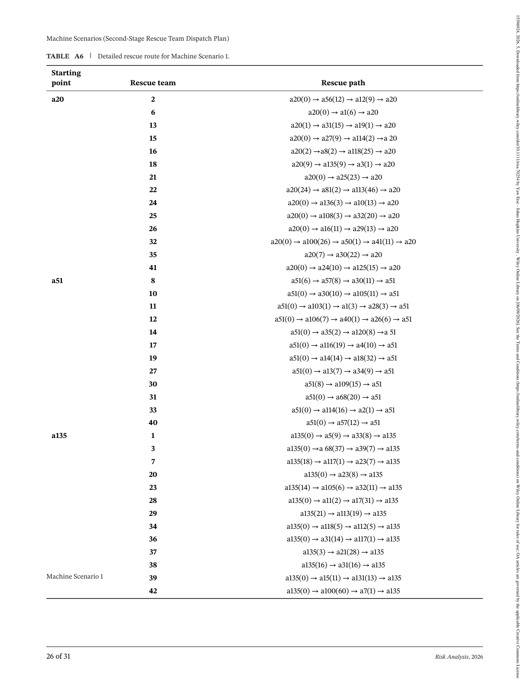

Machine Scenarios (Second-Stage Rescue Team Dispatch Plan)

**TABLE** **A6** Detailed rescue route for Machine Scenario 1.

**Starting** **point** **Rescue** **team** **Rescue** **path**

**a20** **2** a20(0) → a56(12) → a12(9) → a20

**6** a20(0) → a1(6) → a20

**13** a20(1) → a31(15) → a19(1) → a20

**15** a20(0) → a27(9) → a114(2) →a 20

**16** a20(2) →a8(2) → a118(25) → a20

**18** a20(9) → a135(9) → a3(1) → a20

**21** a20(0) → a25(23) → a20

**22** a20(24) → a81(2) → a113(46) → a20

**24** a20(0) → a136(3) → a10(13) → a20

**25** a20(0) → a108(3) → a32(20) → a20

**26** a20(0) → a16(11) → a29(13) → a20

**32** a20(0) → a100(26) → a50(1) → a41(11) → a20

**35** a20(7) → a30(22) → a20

**41** a20(0) → a24(10) → a125(15) → a20

**a51** **8** a51(6) → a57(8) → a30(11) → a51

**10** a51(0) → a30(10) → a105(11) → a51

**11** a51(0) → a103(1) → a1(3) → a28(3) → a51

**12** a51(0) → a106(7) → a40(1) → a26(6) → a51

**14** a51(0) → a35(2) → a120(8) →a 51

**17** a51(0) → a116(19) → a4(10) → a51

**19** a51(0) → a14(14) → a18(32) → a51

**27** a51(0) → a13(7) → a34(9) → a51

**30** a51(8) → a109(15) → a51

**31** a51(0) → a68(20) → a51

**33** a51(0) → a114(16) → a2(1) → a51

**40** a51(0) → a57(12) → a51

**a135** **1** a135(0) → a5(9) → a33(8) → a135

**3** a135(0) →a 68(37) → a39(7) → a135

**7** a135(18) → a117(1) → a23(7) → a135

**20** a135(0) → a23(8) → a135

**23** a135(14) → a105(6) → a32(11) → a135

**28** a135(0) → a11(2) → a17(31) → a135

**29** a135(21) → a113(19) → a135

**34** a135(0) → a118(5) → a112(5) → a135

**36** a135(0) → a31(14) → a117(1) → a135

**37** a135(3) → a21(28) → a135

**38** a135(16) → a31(16) → a135

Machine Scenario 1

**39** a135(0) → a15(11) → a131(13) → a135

**42** a135(0) → a100(60) → a7(1) → a135

#### Source page 27

[Open original PDF page 27](mod_02_readings/Risk%20Analysis%20-%202026%20-%20Tang%20-%20Harnessing%20the%20Hybrid%20Intelligence%20of%20Crowd%20and%20Artificial%20Intelligence%20in%20Group%20Decision.pdf#page=27)

View original page 27, including its figures, tables, and equations

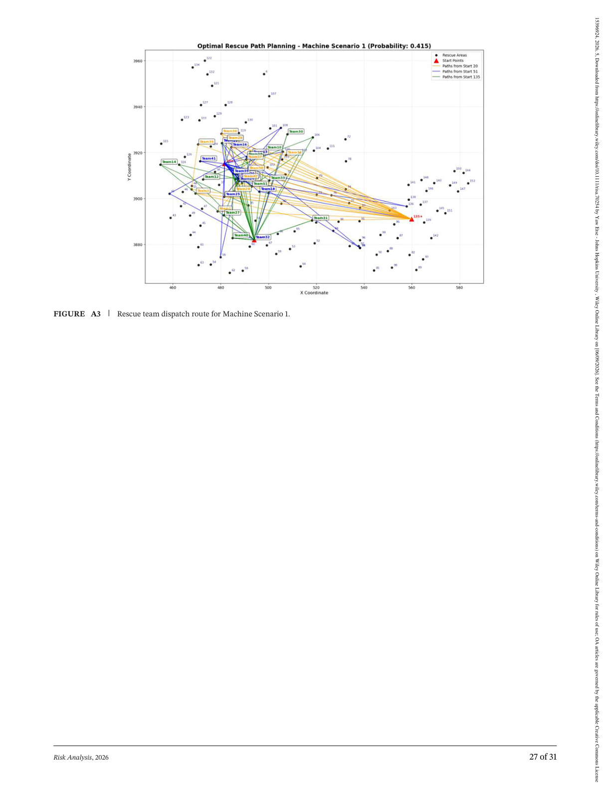

**FIGURE** **A3** Rescue team dispatch route for Machine Scenario 1.

#### Source page 28

[Open original PDF page 28](mod_02_readings/Risk%20Analysis%20-%202026%20-%20Tang%20-%20Harnessing%20the%20Hybrid%20Intelligence%20of%20Crowd%20and%20Artificial%20Intelligence%20in%20Group%20Decision.pdf#page=28)

View original page 28, including its figures, tables, and equations

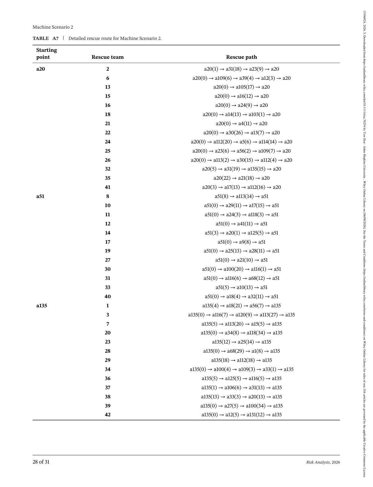

Machine Scenario 2

**TABLE** **A7** Detailed rescue route for Machine Scenario 2.

**Starting** **point** **Rescue** **team** **Rescue** **path**

**a20** **2** a20(1) → a31(18) → a23(9) → a20

**6** a20(0) → a109(6) → a39(4) → a12(3) → a20

**13** a20(0) → a105(17) → a20

**15** a20(0) → a16(12) → a20

**16** a20(0) → a24(9) → a20

**18** a20(0) → a14(13) → a103(1) → a20

**21** a20(0) → a4(11) → a20

**22** a20(0) → a30(26) → a13(7) → a20

**24** a20(0) → a112(20) → a5(6) → a114(14) → a20

**25** a20(0) → a23(6) → a56(2) → a109(7) → a20

**26** a20(0) → a113(2) → a30(15) → a112(4) → a20

**32** a20(5) → a31(19) → a135(15) → a20

**35** a20(22) → a21(18) → a20

**41** a20(3) → a17(13) → a112(16) → a20

**a51** **8** a51(8) → a113(14) → a51

**10** a51(0) → a29(11) → a17(15) → a51

**11** a51(0) → a24(3) → a118(3) → a51

**12** a51(0) → a41(11) → a51

**14** a51(3) → a20(1) → a125(5) → a51

**17** a51(0) → a9(8) → a51

**19** a51(0) → a25(13) → a28(11) → a51

**27** a51(0) → a21(10) → a51

**30** a51(0) → a100(20) → a116(1) → a51

**31** a51(0) → a116(6) → a68(12) → a51

**33** a51(5) → a10(13) → a51

**40** a51(0) → a18(4) → a32(11) → a51

**a135** **1** a135(4) → a18(21) → a56(7) → a135

**3** a135(0) → a116(7) → a120(9) → a113(27) → a135

**7** a135(5) → a113(20) → a15(5) → a135

**20** a135(0) → a34(8) → a118(34) → a135

**23** a135(12) → a25(14) → a135

**28** a135(0) → a68(29) → a1(8) → a135

**29** a135(18) → a112(18) → a135

**34** a135(0) → a100(4) → a109(3) → a33(1) → a135

**36** a135(5) → a125(5) → a116(5) → a135

**37** a135(1) → a106(6) → a31(13) → a135

**38** a135(13) → a33(3) → a20(13) → a135

**39** a135(0) → a27(5) → a100(34) → a135

**42** a135(0) → a12(5) → a131(12) → a135

#### Source page 29

[Open original PDF page 29](mod_02_readings/Risk%20Analysis%20-%202026%20-%20Tang%20-%20Harnessing%20the%20Hybrid%20Intelligence%20of%20Crowd%20and%20Artificial%20Intelligence%20in%20Group%20Decision.pdf#page=29)

View original page 29, including its figures, tables, and equations

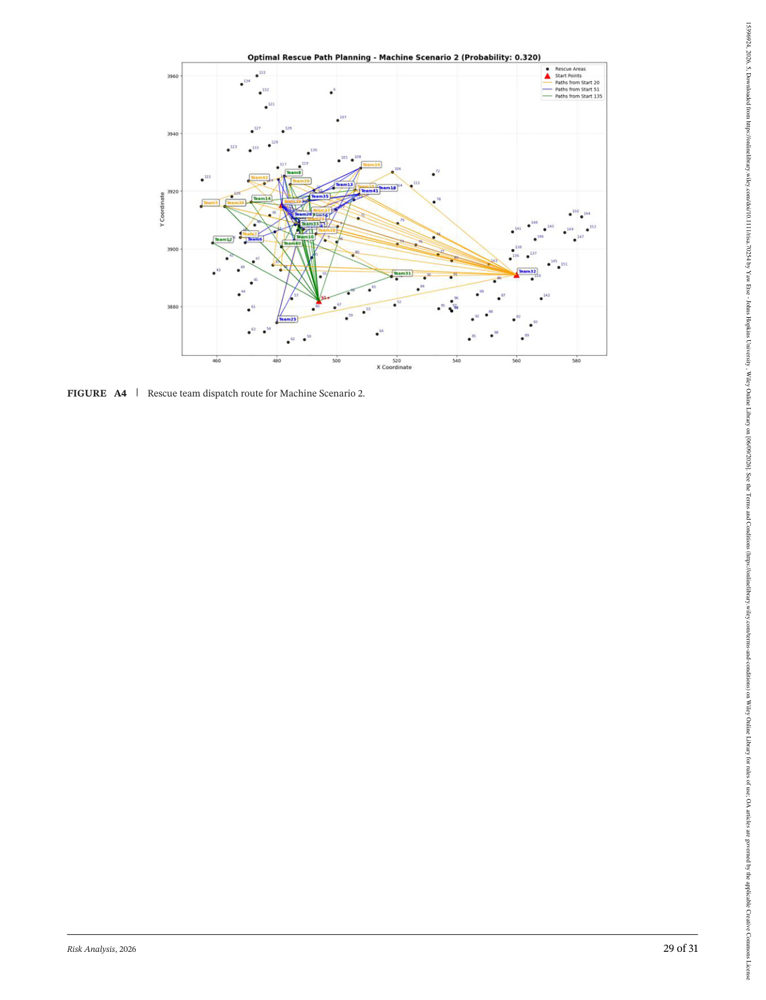

**FIGURE** **A4** Rescue team dispatch route for Machine Scenario 2.

#### Source page 30

[Open original PDF page 30](mod_02_readings/Risk%20Analysis%20-%202026%20-%20Tang%20-%20Harnessing%20the%20Hybrid%20Intelligence%20of%20Crowd%20and%20Artificial%20Intelligence%20in%20Group%20Decision.pdf#page=30)

View original page 30, including its figures, tables, and equations

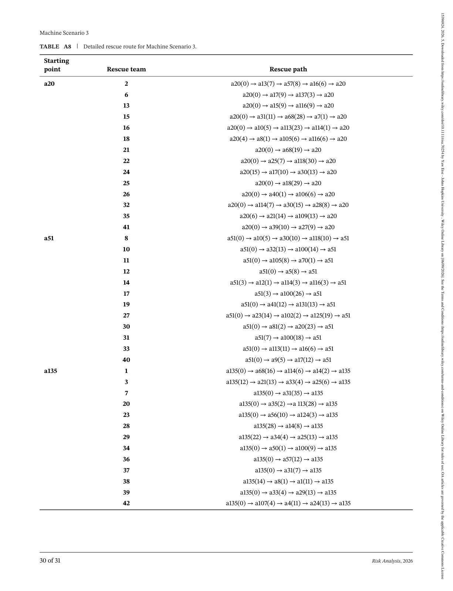

Machine Scenario 3

**TABLE** **A8** Detailed rescue route for Machine Scenario 3.

**Starting** **point** **Rescue** **team** **Rescue** **path**

**a20** **2** a20(0) → a13(7) → a57(8) → a16(6) → a20

**6** a20(0) → a17(9) → a137(3) → a20

**13** a20(0) → a15(9) → a116(9) → a20

**15** a20(0) → a31(11) → a68(28) → a7(1) → a20

**16** a20(0) → a10(5) → a113(23) → a114(1) → a20

**18** a20(4) → a8(1) → a105(6) → a116(6) → a20

**21** a20(0) → a68(19) → a20

**22** a20(0) → a25(7) → a118(30) → a20

**24** a20(15) → a17(10) → a30(13) → a20

**25** a20(0) → a18(29) → a20

**26** a20(0) → a40(1) → a106(6) → a20

**32** a20(0) → a114(7) → a30(15) → a28(8) → a20

**35** a20(6) → a21(14) → a109(13) → a20

**41** a20(0) → a39(10) → a27(9) → a20

**a51** **8** a51(0) → a10(5) → a30(10) → a118(10) → a51

**10** a51(0) → a32(13) → a100(14) → a51

**11** a51(0) → a105(8) → a70(1) → a51

**12** a51(0) → a5(8) → a51

**14** a51(3) → a12(1) → a114(3) → a116(3) → a51

**17** a51(3) → a100(26) → a51

**19** a51(0) → a41(12) → a131(13) → a51

**27** a51(0) → a23(14) → a102(2) → a125(19) → a51

**30** a51(0) → a81(2) → a20(23) → a51

**31** a51(7) → a100(18) → a51

**33** a51(0) → a113(11) → a16(6) → a51

**40** a51(0) → a9(5) → a17(12) → a51

**a135** **1** a135(0) → a68(16) → a114(6) → a14(2) → a135

**3** a135(12) → a21(13) → a33(4) → a25(6) → a135

**7** a135(0) → a31(35) → a135

**20** a135(0) → a35(2) →a 113(28) → a135

**23** a135(0) → a56(10) → a124(3) → a135

**28** a135(28) → a14(8) → a135

**29** a135(22) → a34(4) → a25(13) → a135

**34** a135(0) → a50(1) → a100(9) → a135

**36** a135(0) → a57(12) → a135

**37** a135(0) → a31(7) → a135

**38** a135(14) → a8(1) → a1(11) → a135

**39** a135(0) → a33(4) → a29(13) → a135

**42** a135(0) → a107(4) → a4(11) → a24(13) → a135

#### Source page 31

[Open original PDF page 31](mod_02_readings/Risk%20Analysis%20-%202026%20-%20Tang%20-%20Harnessing%20the%20Hybrid%20Intelligence%20of%20Crowd%20and%20Artificial%20Intelligence%20in%20Group%20Decision.pdf#page=31)

View original page 31, including its figures, tables, and equations

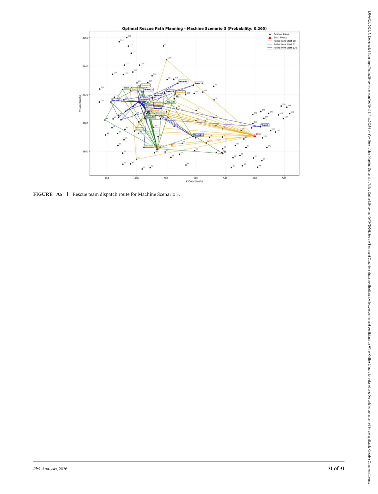

**FIGURE** **A5** Rescue team dispatch route for Machine Scenario 3.

---

## 3. Labeling Images with a Computer Game

**Source:** von Ahn, L., & Dabbish, L. (2004). *Labeling Images with a Computer Game.* Proceedings of the SIGCHI Conference on Human Factors in Computing Systems, 319-326. DOI: 10.1145/985692.985733.

**Local PDF:** [Labeling Images with a Computer Game - 985692.985733.pdf](mod_02_readings/Labeling%20Images%20with%20a%20Computer%20Game%20-%20985692.985733.pdf)

### Takeaway

I can align a participant incentive with a computational task: two players try to agree on words for an image, and their agreement supplies candidate image labels. Random pairing, limits on communication, taboo words, and the good label threshold shape the quality of that output. The evaluation gives me evidence of participation and useful labels within its study conditions; it does not make agreement equivalent to correctness.

### Interesting questions

- Why does agreement provide useful evidence when partners cannot communicate?
- How does the good label threshold change the balance between labeling speed and confidence?
- Do taboo words improve descriptive coverage, and what kinds of labels might they still miss?
- Which conclusions are supported by the small label studies, and which would require a broader evaluation?

### Included diagrams and tables

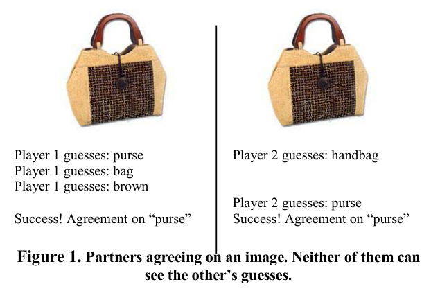

*Figure 1. Independent partners agreeing on an image label. [Source PDF p. 2](mod_02_readings/Labeling%20Images%20with%20a%20Computer%20Game%20-%20985692.985733.pdf#page=2).*

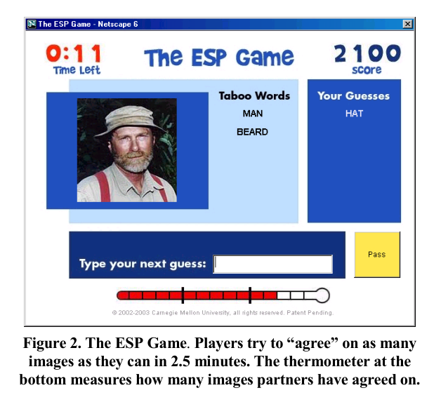

*Figure 2. The ESP Game interface and taboo words. [Source PDF p. 2](mod_02_readings/Labeling%20Images%20with%20a%20Computer%20Game%20-%20985692.985733.pdf#page=2).*

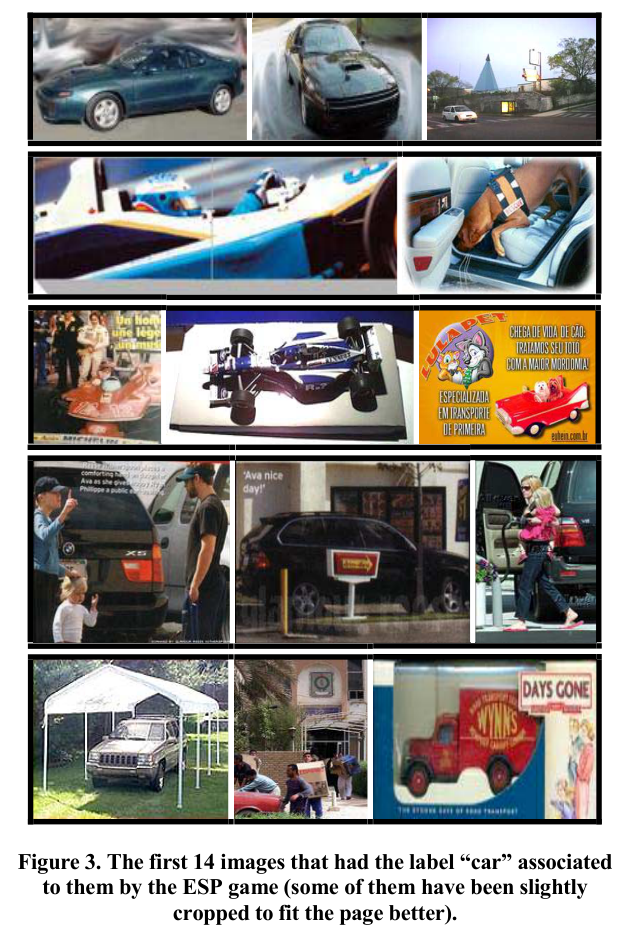

*Figure 3. Images retrieved with the game-generated label car. [Source PDF p. 5](mod_02_readings/Labeling%20Images%20with%20a%20Computer%20Game%20-%20985692.985733.pdf#page=5).*

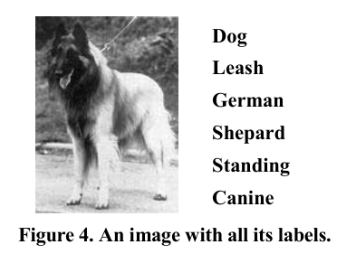

*Figure 4. An image and its labels used in evaluation. [Source PDF p. 6](mod_02_readings/Labeling%20Images%20with%20a%20Computer%20Game%20-%20985692.985733.pdf#page=6).*

### Assigned source text

#### Source page 1

[Open original PDF page 1](mod_02_readings/Labeling%20Images%20with%20a%20Computer%20Game%20-%20985692.985733.pdf#page=1)

View original page 1, including its figures, tables, and equations

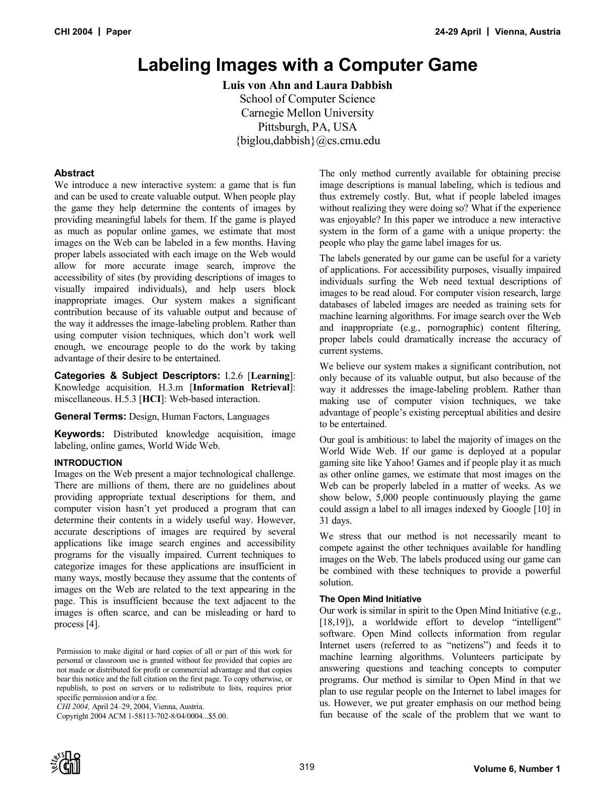

##### **Labeling Images with a Computer Game**

**Luis von Ahn and Laura Dabbish**

School of Computer Science

Carnegie Mellon University

Pittsburgh, PA, USA {biglou,dabbish}@cs.cmu.edu

**Abstract** We introduce a new interactive system: a game that is fun and can be used to create valuable output. When people play the game they help determine the contents of images by providing meaningful labels for them. If the game is played as much as popular online games, we estimate that most images on the Web can be labeled in a few months. Having proper labels associated with each image on the Web would allow for more accurate image search, improve the accessibility of sites (by providing descriptions of images to visually impaired individuals), and help users block inappropriate images. Our system makes a significant contribution because of its valuable output and because of the way it addresses the image-labeling problem. Rather than using computer vision techniques, which don’t work well enough, we encourage people to do the work by taking advantage of their desire to be entertained.

**Categories & Subject Descriptors:** I.2.6 [ **Learning** ]: Knowledge acquisition. H.3.m [ **Information Retrieval** ]: miscellaneous. H.5.3 [ **HCI** ]: Web-based interaction.

**General Terms:** Design, Human Factors, Languages

**Keywords:** Distributed knowledge acquisition, image labeling, online games, World Wide Web.

**INTRODUCTION** Images on the Web present a major technological challenge. There are millions of them, there are no guidelines about providing appropriate textual descriptions for them, and computer vision hasn’t yet produced a program that can determine their contents in a widely useful way. However, accurate descriptions of images are required by several applications like image search engines and accessibility programs for the visually impaired. Current techniques to categorize images for these applications are insufficient in many ways, mostly because they assume that the contents of images on the Web are related to the text appearing in the page. This is insufficient because the text adjacent to the images is often scarce, and can be misleading or hard to process [4].

Permission to make digital or hard copies of all or part of this work for personal or classroom use is granted without fee provided that copies are not made or distributed for profit or commercial advantage and that copies bear this notice and the full citation on the first page. To copy otherwise, or republish, to post on servers or to redistribute to lists, requires prior specific permission and/or a fee. _CHI 2004,_ April 24–29, 2004, Vienna, Austria. Copyright 2004 ACM 1-58113-702-8/04/0004...$5.00.

The only method currently available for obtaining precise image descriptions is manual labeling, which is tedious and thus extremely costly. But, what if people labeled images without realizing they were doing so? What if the experience was enjoyable? In this paper we introduce a new interactive system in the form of a game with a unique property: the people who play the game label images for us.

The labels generated by our game can be useful for a variety of applications. For accessibility purposes, visually impaired individuals surfing the Web need textual descriptions of images to be read aloud. For computer vision research, large databases of labeled images are needed as training sets for machine learning algorithms. For image search over the Web and inappropriate (e.g., pornographic) content filtering, proper labels could dramatically increase the accuracy of current systems.

We believe our system makes a significant contribution, not only because of its valuable output, but also because of the way it addresses the image-labeling problem. Rather than making use of computer vision techniques, we take advantage of people’s existing perceptual abilities and desire to be entertained.

Our goal is ambitious: to label the majority of images on the World Wide Web. If our game is deployed at a popular gaming site like Yahoo! Games and if people play it as much as other online games, we estimate that most images on the Web can be properly labeled in a matter of weeks. As we show below, 5,000 people continuously playing the game could assign a label to all images indexed by Google [10] in 31 days.

We stress that our method is not necessarily meant to compete against the other techniques available for handling images on the Web. The labels produced using our game can be combined with these techniques to provide a powerful solution.

**The Open Mind Initiative** Our work is similar in spirit to the Open Mind Initiative (e.g.,

[18,19]), a worldwide effort to develop “intelligent” software. Open Mind collects information from regular Internet users (referred to as “netizens”) and feeds it to machine learning algorithms. Volunteers participate by answering questions and teaching concepts to computer programs. Our method is similar to Open Mind in that we plan to use regular people on the Internet to label images for us. However, we put greater emphasis on our method being fun because of the scale of the problem that we want to

#### Source page 2

[Open original PDF page 2](mod_02_readings/Labeling%20Images%20with%20a%20Computer%20Game%20-%20985692.985733.pdf#page=2)

View original page 2, including its figures, tables, and equations

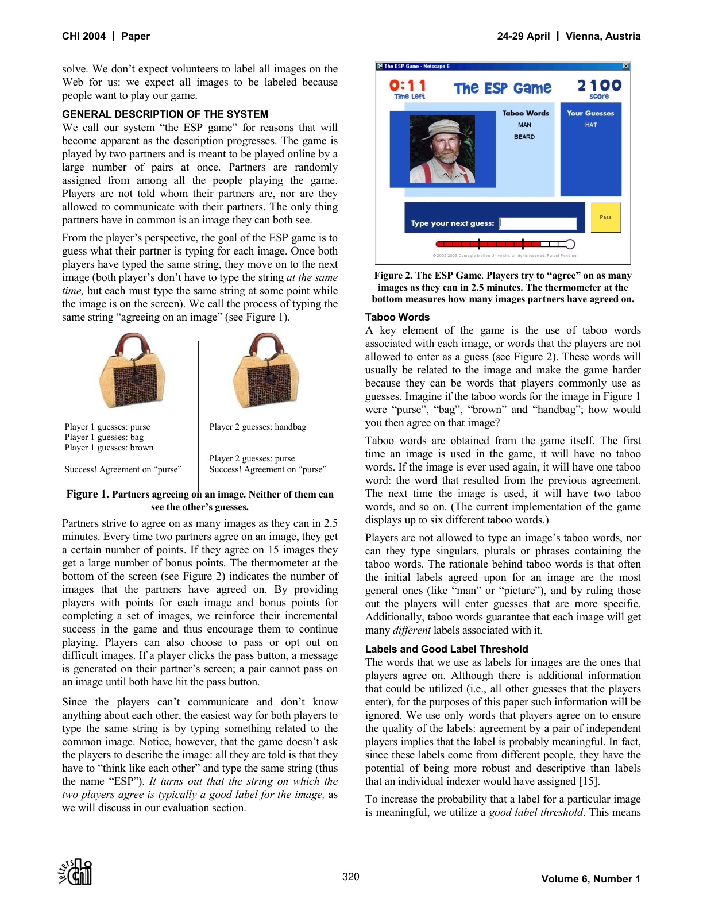

solve. We don’t expect volunteers to label all images on the Web for us: we expect all images to be labeled because people want to play our game.

**GENERAL DESCRIPTION OF THE SYSTEM** We call our system “the ESP game” for reasons that will become apparent as the description progresses. The game is played by two partners and is meant to be played online by a large number of pairs at once. Partners are randomly assigned from among all the people playing the game. Players are not told whom their partners are, nor are they allowed to communicate with their partners. The only thing partners have in common is an image they can both see.

From the player’s perspective, the goal of the ESP game is to guess what their partner is typing for each image. Once both players have typed the same string, they move on to the next image (both player’s don’t have to type the string _at the same_ _time,_ but each must type the same string at some point while the image is on the screen). We call the process of typing the same string “agreeing on an image” (see Figure 1).

Player 1 guesses: purse Player 1 guesses: bag Player 1 guesses: brown

Success! Agreement on “purse”

Player 2 guesses: handbag

Player 2 guesses: purse Success! Agreement on “purse”

**Figure 1.** **Partners agreeing on an image. Neither of them can**

**see the other’s guesses.** Partners strive to agree on as many images as they can in 2.5 minutes. Every time two partners agree on an image, they get a certain number of points. If they agree on 15 images they get a large number of bonus points. The thermometer at the bottom of the screen (see Figure 2) indicates the number of images that the partners have agreed on. By providing players with points for each image and bonus points for completing a set of images, we reinforce their incremental success in the game and thus encourage them to continue playing. Players can also choose to pass or opt out on difficult images. If a player clicks the pass button, a message is generated on their partner’s screen; a pair cannot pass on an image until both have hit the pass button.

Since the players can’t communicate and don’t know anything about each other, the easiest way for both players to type the same string is by typing something related to the common image. Notice, however, that the game doesn’t ask the players to describe the image: all they are told is that they have to “think like each other” and type the same string (thus the name “ESP”). _It turns out that the string on which the_ _two players agree is typically a good label for the image,_ as we will discuss in our evaluation section.

**Figure 2. The ESP Game** . **Players try to “agree” on as many**

**images as they can in 2.5 minutes. The thermometer at the** **bottom measures how many images partners have agreed on.**

**Taboo Words** A key element of the game is the use of taboo words associated with each image, or words that the players are not allowed to enter as a guess (see Figure 2). These words will usually be related to the image and make the game harder because they can be words that players commonly use as guesses. Imagine if the taboo words for the image in Figure 1 were “purse”, “bag”, “brown” and “handbag”; how would you then agree on that image?

Taboo words are obtained from the game itself. The first time an image is used in the game, it will have no taboo words. If the image is ever used again, it will have one taboo word: the word that resulted from the previous agreement. The next time the image is used, it will have two taboo words, and so on. (The current implementation of the game displays up to six different taboo words.)

Players are not allowed to type an image’s taboo words, nor can they type singulars, plurals or phrases containing the taboo words. The rationale behind taboo words is that often the initial labels agreed upon for an image are the most general ones (like “man” or “picture”), and by ruling those out the players will enter guesses that are more specific. Additionally, taboo words guarantee that each image will get many _different_ labels associated with it.

**Labels and Good Label Threshold** The words that we use as labels for images are the ones that players agree on. Although there is additional information that could be utilized (i.e., all other guesses that the players enter), for the purposes of this paper such information will be ignored. We use only words that players agree on to ensure the quality of the labels: agreement by a pair of independent players implies that the label is probably meaningful. In fact, since these labels come from different people, they have the potential of being more robust and descriptive than labels that an individual indexer would have assigned [15].

To increase the probability that a label for a particular image is meaningful, we utilize a _good label threshold_ . This means

#### Source page 3

[Open original PDF page 3](mod_02_readings/Labeling%20Images%20with%20a%20Computer%20Game%20-%20985692.985733.pdf#page=3)

View original page 3, including its figures, tables, and equations

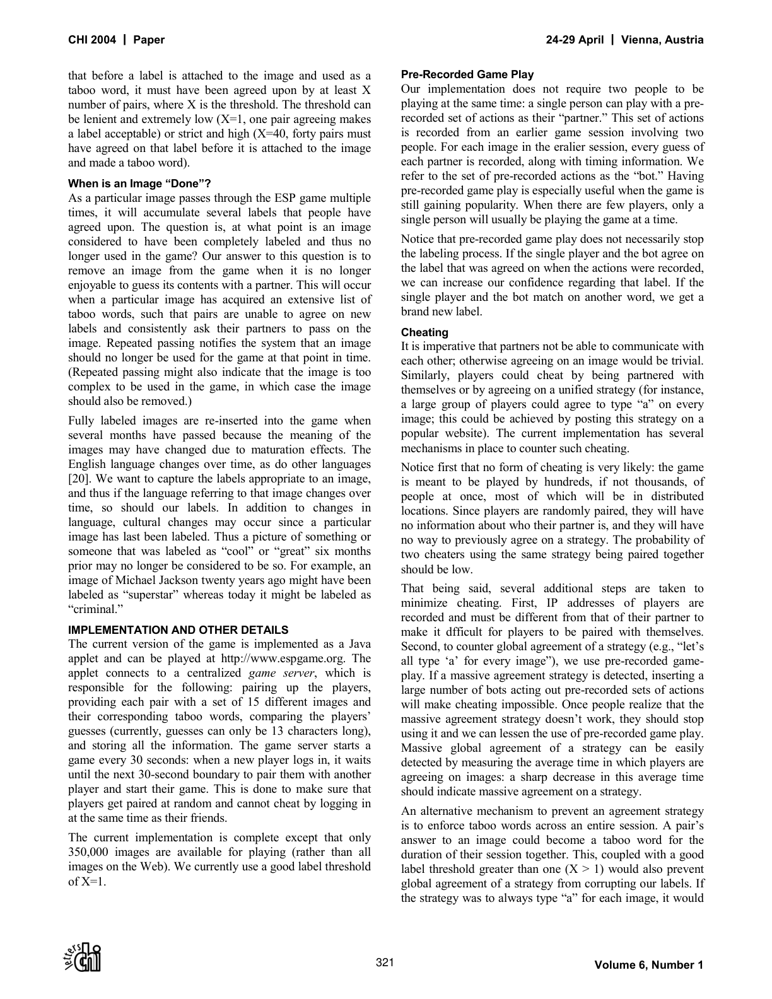

that before a label is attached to the image and used as a taboo word, it must have been agreed upon by at least X number of pairs, where X is the threshold. The threshold can be lenient and extremely low (X=1, one pair agreeing makes a label acceptable) or strict and high (X=40, forty pairs must have agreed on that label before it is attached to the image and made a taboo word).

**When is an Image “Done”?** As a particular image passes through the ESP game multiple times, it will accumulate several labels that people have agreed upon. The question is, at what point is an image considered to have been completely labeled and thus no longer used in the game? Our answer to this question is to remove an image from the game when it is no longer enjoyable to guess its contents with a partner. This will occur when a particular image has acquired an extensive list of taboo words, such that pairs are unable to agree on new labels and consistently ask their partners to pass on the image. Repeated passing notifies the system that an image should no longer be used for the game at that point in time. (Repeated passing might also indicate that the image is too complex to be used in the game, in which case the image should also be removed.)

Fully labeled images are re-inserted into the game when several months have passed because the meaning of the images may have changed due to maturation effects. The English language changes over time, as do other languages

[20]. We want to capture the labels appropriate to an image, and thus if the language referring to that image changes over time, so should our labels. In addition to changes in language, cultural changes may occur since a particular image has last been labeled. Thus a picture of something or someone that was labeled as “cool” or “great” six months prior may no longer be considered to be so. For example, an image of Michael Jackson twenty years ago might have been labeled as “superstar” whereas today it might be labeled as “criminal.”

**IMPLEMENTATION AND OTHER DETAILS** The current version of the game is implemented as a Java applet and can be played at http://www.espgame.org. The applet connects to a centralized _game server_, which is responsible for the following: pairing up the players, providing each pair with a set of 15 different images and their corresponding taboo words, comparing the players’ guesses (currently, guesses can only be 13 characters long), and storing all the information. The game server starts a game every 30 seconds: when a new player logs in, it waits until the next 30-second boundary to pair them with another player and start their game. This is done to make sure that players get paired at random and cannot cheat by logging in at the same time as their friends.

The current implementation is complete except that only 350,000 images are available for playing (rather than all images on the Web). We currently use a good label threshold of X=1.

**Pre-Recorded Game Play** Our implementation does not require two people to be playing at the same time: a single person can play with a prerecorded set of actions as their “partner.” This set of actions is recorded from an earlier game session involving two people. For each image in the eralier session, every guess of each partner is recorded, along with timing information. We refer to the set of pre-recorded actions as the “bot.” Having pre-recorded game play is especially useful when the game is still gaining popularity. When there are few players, only a single person will usually be playing the game at a time.

Notice that pre-recorded game play does not necessarily stop the labeling process. If the single player and the bot agree on the label that was agreed on when the actions were recorded, we can increase our confidence regarding that label. If the single player and the bot match on another word, we get a brand new label.

**Cheating** It is imperative that partners not be able to communicate with each other; otherwise agreeing on an image would be trivial. Similarly, players could cheat by being partnered with themselves or by agreeing on a unified strategy (for instance, a large group of players could agree to type “a” on every image; this could be achieved by posting this strategy on a popular website). The current implementation has several mechanisms in place to counter such cheating.

Notice first that no form of cheating is very likely: the game is meant to be played by hundreds, if not thousands, of people at once, most of which will be in distributed locations. Since players are randomly paired, they will have no information about who their partner is, and they will have no way to previously agree on a strategy. The probability of two cheaters using the same strategy being paired together should be low.

That being said, several additional steps are taken to minimize cheating. First, IP addresses of players are recorded and must be different from that of their partner to make it dfficult for players to be paired with themselves. Second, to counter global agreement of a strategy (e.g., “let’s all type ‘a’ for every image”), we use pre-recorded gameplay. If a massive agreement strategy is detected, inserting a large number of bots acting out pre-recorded sets of actions will make cheating impossible. Once people realize that the massive agreement strategy doesn’t work, they should stop using it and we can lessen the use of pre-recorded game play. Massive global agreement of a strategy can be easily detected by measuring the average time in which players are agreeing on images: a sharp decrease in this average time should indicate massive agreement on a strategy.

An alternative mechanism to prevent an agreement strategy is to enforce taboo words across an entire session. A pair’s answer to an image could become a taboo word for the duration of their session together. This, coupled with a good label threshold greater than one (X > 1) would also prevent global agreement of a strategy from corrupting our labels. If the strategy was to always type “a” for each image, it would

#### Source page 4

[Open original PDF page 4](mod_02_readings/Labeling%20Images%20with%20a%20Computer%20Game%20-%20985692.985733.pdf#page=4)

View original page 4, including its figures, tables, and equations

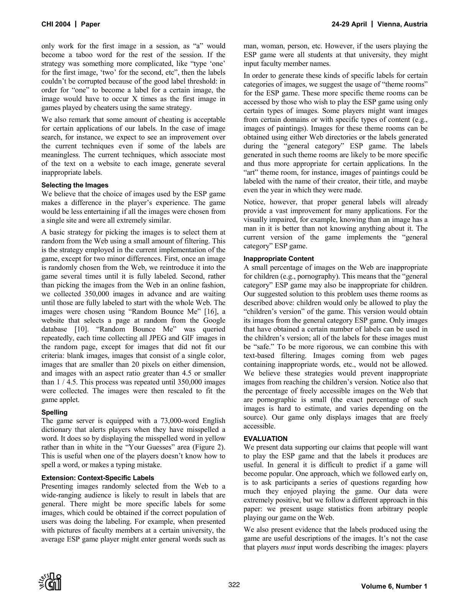

only work for the first image in a session, as “a” would become a taboo word for the rest of the session. If the strategy was something more complicated, like “type ‘one’ for the first image, ‘two’ for the second, etc”, then the labels couldn’t be corrupted because of the good label threshold: in order for “one” to become a label for a certain image, the image would have to occur X times as the first image in games played by cheaters using the same strategy.

We also remark that some amount of cheating is acceptable for certain applications of our labels. In the case of image search, for instance, we expect to see an improvement over the current techniques even if some of the labels are meaningless. The current techniques, which associate most of the text on a website to each image, generate several inappropriate labels.

**Selecting the Images** We believe that the choice of images used by the ESP game makes a difference in the player’s experience. The game would be less entertaining if all the images were chosen from a single site and were all extremely similar.

A basic strategy for picking the images is to select them at random from the Web using a small amount of filtering. This is the strategy employed in the current implementation of the game, except for two minor differences. First, once an image is randomly chosen from the Web, we reintroduce it into the game several times until it is fully labeled. Second, rather than picking the images from the Web in an online fashion, we collected 350,000 images in advance and are waiting until those are fully labeled to start with the whole Web. The images were chosen using “Random Bounce Me” [16], a website that selects a page at random from the Google database [10]. “Random Bounce Me” was queried repeatedly, each time collecting all JPEG and GIF images in the random page, except for images that did not fit our criteria: blank images, images that consist of a single color, images that are smaller than 20 pixels on either dimension, and images with an aspect ratio greater than 4.5 or smaller than 1 / 4.5. This process was repeated until 350,000 images were collected. The images were then rescaled to fit the game applet.

**Spelling** The game server is equipped with a 73,000-word English dictionary that alerts players when they have misspelled a word. It does so by displaying the misspelled word in yellow rather than in white in the “Your Guesses” area (Figure 2). This is useful when one of the players doesn’t know how to spell a word, or makes a typing mistake.

**Extension: Context-Specific Labels** Presenting images randomly selected from the Web to a wide-ranging audience is likely to result in labels that are general. There might be more specific labels for some images, which could be obtained if the correct population of users was doing the labeling. For example, when presented with pictures of faculty members at a certain university, the average ESP game player might enter general words such as

man, woman, person, etc. However, if the users playing the ESP game were all students at that university, they might input faculty member names.

In order to generate these kinds of specific labels for certain categories of images, we suggest the usage of “theme rooms” for the ESP game. These more specific theme rooms can be accessed by those who wish to play the ESP game using only certain types of images. Some players might want images from certain domains or with specific types of content (e.g., images of paintings). Images for these theme rooms can be obtained using either Web directories or the labels generated during the “general category” ESP game. The labels generated in such theme rooms are likely to be more specific and thus more appropriate for certain applications. In the “art” theme room, for instance, images of paintings could be labeled with the name of their creator, their title, and maybe even the year in which they were made.

Notice, however, that proper general labels will already provide a vast improvement for many applications. For the visually impaired, for example, knowing than an image has a man in it is better than not knowing anything about it. The current version of the game implements the “general category” ESP game.

**Inappropriate Content** A small percentage of images on the Web are inappropriate for children (e.g., pornography). This means that the “general category” ESP game may also be inappropriate for children. Our suggested solution to this problem uses theme rooms as described above: children would only be allowed to play the “children’s version” of the game. This version would obtain its images from the general category ESP game. Only images that have obtained a certain number of labels can be used in the children’s version; all of the labels for these images must be “safe.” To be more rigorous, we can combine this with text-based filtering. Images coming from web pages containing inappropriate words, etc., would not be allowed. We believe these strategies would prevent inappropriate images from reaching the children’s version. Notice also that the percentage of freely accessible images on the Web that are pornographic is small (the exact percentage of such images is hard to estimate, and varies depending on the source). Our game only displays images that are freely accessible.

**EVALUATION** We present data supporting our claims that people will want to play the ESP game and that the labels it produces are useful. In general it is difficult to predict if a game will become popular. One approach, which we followed early on, is to ask participants a series of questions regarding how much they enjoyed playing the game. Our data were extremely positive, but we follow a different approach in this paper: we present usage statistics from arbitrary people playing our game on the Web.

We also present evidence that the labels produced using the game are useful descriptions of the images. It’s not the case that players _must_ input words describing the images: players

#### Source page 5

[Open original PDF page 5](mod_02_readings/Labeling%20Images%20with%20a%20Computer%20Game%20-%20985692.985733.pdf#page=5)

View original page 5, including its figures, tables, and equations

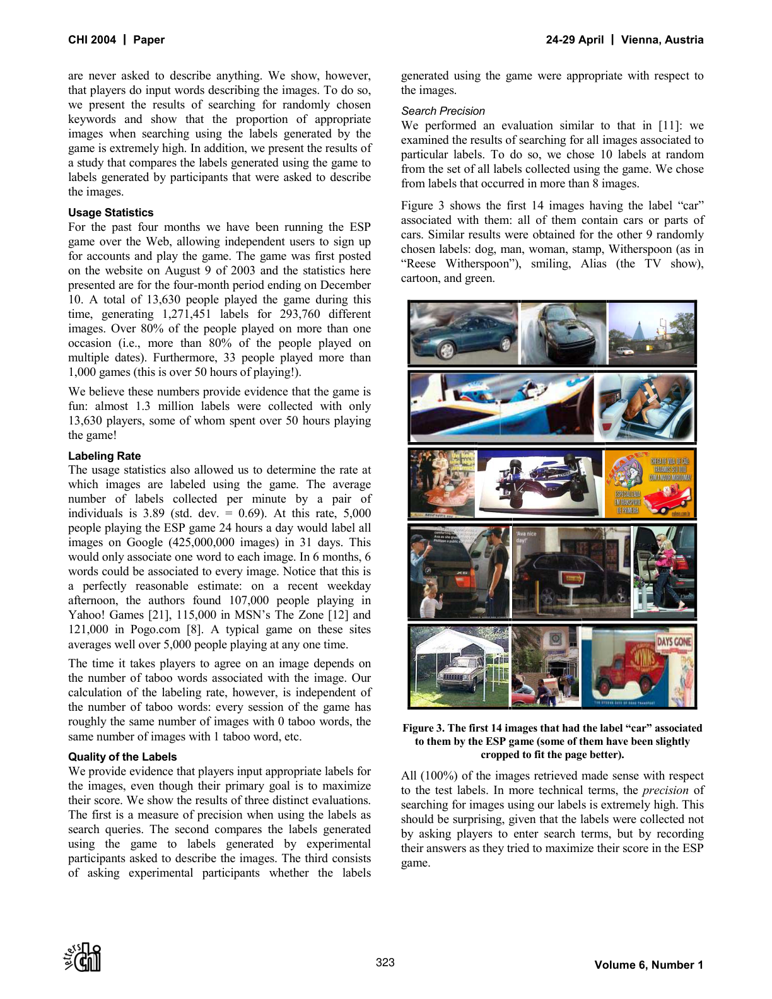

are never asked to describe anything. We show, however, that players do input words describing the images. To do so, we present the results of searching for randomly chosen keywords and show that the proportion of appropriate images when searching using the labels generated by the game is extremely high. In addition, we present the results of a study that compares the labels generated using the game to labels generated by participants that were asked to describe the images.

**Usage Statistics** For the past four months we have been running the ESP game over the Web, allowing independent users to sign up for accounts and play the game. The game was first posted on the website on August 9 of 2003 and the statistics here presented are for the four-month period ending on December 10. A total of 13,630 people played the game during this time, generating 1,271,451 labels for 293,760 different images. Over 80% of the people played on more than one occasion (i.e., more than 80% of the people played on multiple dates). Furthermore, 33 people played more than 1,000 games (this is over 50 hours of playing!).

We believe these numbers provide evidence that the game is fun: almost 1.3 million labels were collected with only 13,630 players, some of whom spent over 50 hours playing the game!

**Labeling Rate** The usage statistics also allowed us to determine the rate at which images are labeled using the game. The average number of labels collected per minute by a pair of individuals is 3.89 (std. dev. = 0.69). At this rate, 5,000 people playing the ESP game 24 hours a day would label all images on Google (425,000,000 images) in 31 days. This would only associate one word to each image. In 6 months, 6 words could be associated to every image. Notice that this is a perfectly reasonable estimate: on a recent weekday afternoon, the authors found 107,000 people playing in Yahoo! Games [21], 115,000 in MSN’s The Zone [12] and 121,000 in Pogo.com [8]. A typical game on these sites averages well over 5,000 people playing at any one time.

The time it takes players to agree on an image depends on the number of taboo words associated with the image. Our calculation of the labeling rate, however, is independent of the number of taboo words: every session of the game has roughly the same number of images with 0 taboo words, the same number of images with 1 taboo word, etc.

**Quality of the Labels** We provide evidence that players input appropriate labels for the images, even though their primary goal is to maximize their score. We show the results of three distinct evaluations. The first is a measure of precision when using the labels as search queries. The second compares the labels generated using the game to labels generated by experimental participants asked to describe the images. The third consists of asking experimental participants whether the labels

generated using the game were appropriate with respect to the images.

_Search Precision_ We performed an evaluation similar to that in [11]: we examined the results of searching for all images associated to particular labels. To do so, we chose 10 labels at random from the set of all labels collected using the game. We chose from labels that occurred in more than 8 images.

Figure 3 shows the first 14 images having the label “car” associated with them: all of them contain cars or parts of cars. Similar results were obtained for the other 9 randomly chosen labels: dog, man, woman, stamp, Witherspoon (as in “Reese Witherspoon”), smiling, Alias (the TV show), cartoon, and green.

**Figure 3. The first 14 images that had the label “car” associated**

**to them by the ESP game (some of them have been slightly**

**cropped to fit the page better).**

All (100%) of the images retrieved made sense with respect to the test labels. In more technical terms, the _precision_ of searching for images using our labels is extremely high. This should be surprising, given that the labels were collected not by asking players to enter search terms, but by recording their answers as they tried to maximize their score in the ESP game.

#### Source page 6

[Open original PDF page 6](mod_02_readings/Labeling%20Images%20with%20a%20Computer%20Game%20-%20985692.985733.pdf#page=6)

View original page 6, including its figures, tables, and equations

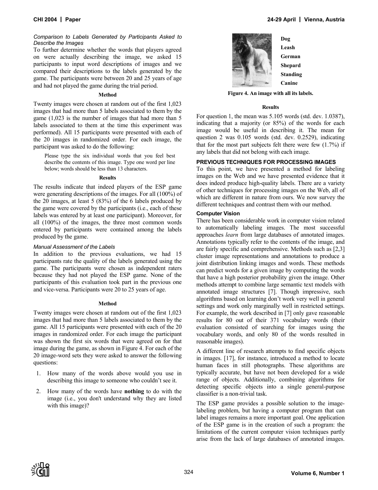

_Comparison to Labels Generated by Participants Asked to_ _Describe the Images_ To further determine whether the words that players agreed on were actually describing the image, we asked 15 participants to input word descriptions of images and we compared their descriptions to the labels generated by the game. The participants were between 20 and 25 years of age and had not played the game during the trial period.

**Method** Twenty images were chosen at random out of the first 1,023 images that had more than 5 labels associated to them by the game (1,023 is the number of images that had more than 5 labels associated to them at the time this experiment was performed). All 15 participants were presented with each of the 20 images in randomized order. For each image, the participant was asked to do the following:

Please type the six individual words that you feel best describe the contents of this image. Type one word per line below; words should be less than 13 characters.

**Results** The results indicate that indeed players of the ESP game were generating descriptions of the images. For all (100%) of the 20 images, at least 5 (83%) of the 6 labels produced by the game were covered by the participants (i.e., each of these labels was entered by at least one participant). Moreover, for all (100%) of the images, the three most common words entered by participants were contained among the labels produced by the game.

_Manual Assessment of the Labels_ In addition to the previous evaluations, we had 15 participants rate the quality of the labels generated using the game. The participants were chosen as independent raters because they had not played the ESP game. None of the participants of this evaluation took part in the previous one and vice-versa. Participants were 20 to 25 years of age.

**Method** Twenty images were chosen at random out of the first 1,023 images that had more than 5 labels associated to them by the game. All 15 participants were presented with each of the 20 images in randomized order. For each image the participant was shown the first six words that were agreed on for that image during the game, as shown in Figure 4. For each of the 20 image-word sets they were asked to answer the following questions:

1. How many of the words above would you use in describing this image to someone who couldn’t see it.

2. How many of the words have **nothing** to do with the image (i.e., you don't understand why they are listed with this image)?

**Dog**

**Leash**

**German**

**Shepard**

**Standing**

**Canine**

**Figure 4. An image with all its labels.**

**Results**

For question 1, the mean was 5.105 words (std. dev. 1.0387), indicating that a majority (or 85%) of the words for each image would be useful in describing it. The mean for question 2 was 0.105 words (std. dev. 0.2529), indicating that for the most part subjects felt there were few (1.7%) if any labels that did not belong with each image.

**PREVIOUS TECHNIQUES FOR PROCESSING IMAGES** To this point, we have presented a method for labeling images on the Web and we have presented evidence that it does indeed produce high-quality labels. There are a variety of other techniques for processing images on the Web, all of which are different in nature from ours. We now survey the different techniques and contrast them with our method.

**Computer Vision** There has been considerable work in computer vision related to automatically labeling images. The most successful approaches _learn_ from large databases of annotated images. Annotations typically refer to the contents of the image, and are fairly specific and comprehensive. Methods such as [2,3] cluster image representations and annotations to produce a joint distribution linking images and words. These methods can predict words for a given image by computing the words that have a high posterior probability given the image. Other methods attempt to combine large semantic text models with annotated image structures [7]. Though impressive, such algorithms based on learning don’t work very well in general settings and work only marginally well in restricted settings. For example, the work described in [7] only gave reasonable results for 80 out of their 371 vocabulary words (their evaluation consisted of searching for images using the vocabulary words, and only 80 of the words resulted in reasonable images).

A different line of research attempts to find specific objects in images. [17], for instance, introduced a method to locate human faces in still photographs. These algorithms are typically accurate, but have not been developed for a wide range of objects. Additionally, combining algorithms for detecting specific objects into a single general-purpose classifier is a non-trivial task.

The ESP game provides a possible solution to the imagelabeling problem, but having a computer program that can label images remains a more important goal. One application of the ESP game is in the creation of such a program: the limitations of the current computer vision techniques partly arise from the lack of large databases of annotated images.

#### Source page 7

[Open original PDF page 7](mod_02_readings/Labeling%20Images%20with%20a%20Computer%20Game%20-%20985692.985733.pdf#page=7)

View original page 7, including its figures, tables, and equations

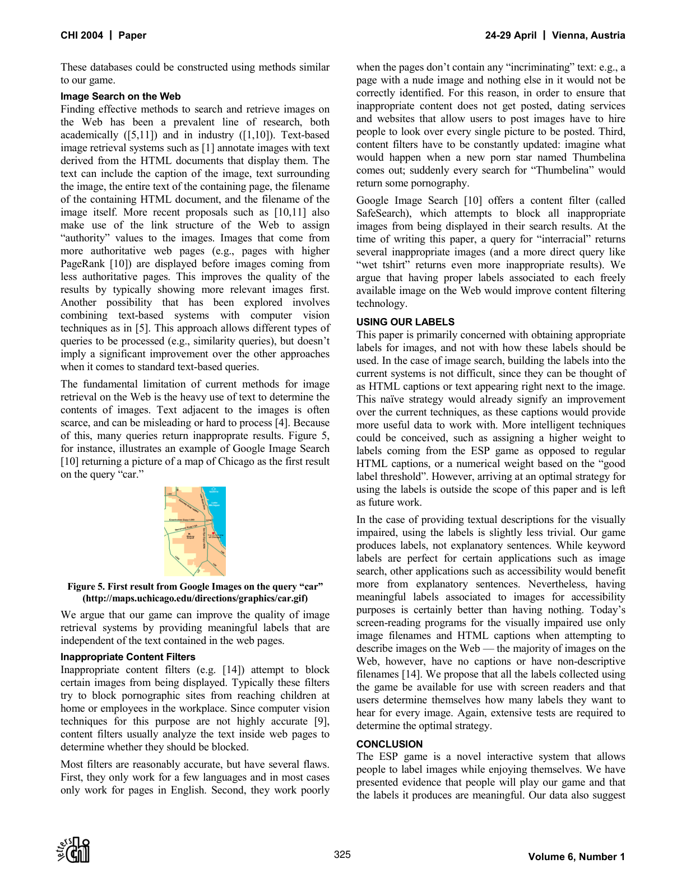

These databases could be constructed using methods similar to our game.

**Image Search on the Web** Finding effective methods to search and retrieve images on the Web has been a prevalent line of research, both academically ([5,11]) and in industry ([1,10]). Text-based image retrieval systems such as [1] annotate images with text derived from the HTML documents that display them. The text can include the caption of the image, text surrounding the image, the entire text of the containing page, the filename of the containing HTML document, and the filename of the image itself. More recent proposals such as [10,11] also make use of the link structure of the Web to assign “authority” values to the images. Images that come from more authoritative web pages (e.g., pages with higher PageRank [10]) are displayed before images coming from less authoritative pages. This improves the quality of the results by typically showing more relevant images first. Another possibility that has been explored involves combining text-based systems with computer vision techniques as in [5]. This approach allows different types of queries to be processed (e.g., similarity queries), but doesn’t imply a significant improvement over the other approaches when it comes to standard text-based queries.

The fundamental limitation of current methods for image retrieval on the Web is the heavy use of text to determine the contents of images. Text adjacent to the images is often scarce, and can be misleading or hard to process [4]. Because of this, many queries return inapproprate results. Figure 5, for instance, illustrates an example of Google Image Search

[10] returning a picture of a map of Chicago as the first result on the query “car.”

**Figure 5. First result from Google Images on the query “car”**

**(http://maps.uchicago.edu/directions/graphics/car.gif)** We argue that our game can improve the quality of image retrieval systems by providing meaningful labels that are independent of the text contained in the web pages.

**Inappropriate Content Filters** Inappropriate content filters (e.g. [14]) attempt to block certain images from being displayed. Typically these filters try to block pornographic sites from reaching children at home or employees in the workplace. Since computer vision techniques for this purpose are not highly accurate [9], content filters usually analyze the text inside web pages to determine whether they should be blocked.

Most filters are reasonably accurate, but have several flaws. First, they only work for a few languages and in most cases only work for pages in English. Second, they work poorly

when the pages don’t contain any “incriminating” text: e.g., a page with a nude image and nothing else in it would not be correctly identified. For this reason, in order to ensure that inappropriate content does not get posted, dating services and websites that allow users to post images have to hire people to look over every single picture to be posted. Third, content filters have to be constantly updated: imagine what would happen when a new porn star named Thumbelina comes out; suddenly every search for “Thumbelina” would return some pornography.

Google Image Search [10] offers a content filter (called SafeSearch), which attempts to block all inappropriate images from being displayed in their search results. At the time of writing this paper, a query for “interracial” returns several inappropriate images (and a more direct query like “wet tshirt” returns even more inappropriate results). We argue that having proper labels associated to each freely available image on the Web would improve content filtering technology.

**USING OUR LABELS** This paper is primarily concerned with obtaining appropriate labels for images, and not with how these labels should be used. In the case of image search, building the labels into the current systems is not difficult, since they can be thought of as HTML captions or text appearing right next to the image. This naïve strategy would already signify an improvement over the current techniques, as these captions would provide more useful data to work with. More intelligent techniques could be conceived, such as assigning a higher weight to labels coming from the ESP game as opposed to regular HTML captions, or a numerical weight based on the “good label threshold”. However, arriving at an optimal strategy for using the labels is outside the scope of this paper and is left as future work.

In the case of providing textual descriptions for the visually impaired, using the labels is slightly less trivial. Our game produces labels, not explanatory sentences. While keyword labels are perfect for certain applications such as image search, other applications such as accessibility would benefit more from explanatory sentences. Nevertheless, having meaningful labels associated to images for accessibility purposes is certainly better than having nothing. Today’s screen-reading programs for the visually impaired use only image filenames and HTML captions when attempting to describe images on the Web  -  the majority of images on the Web, however, have no captions or have non-descriptive filenames [14]. We propose that all the labels collected using the game be available for use with screen readers and that users determine themselves how many labels they want to hear for every image. Again, extensive tests are required to determine the optimal strategy.

**CONCLUSION** The ESP game is a novel interactive system that allows people to label images while enjoying themselves. We have presented evidence that people will play our game and that the labels it produces are meaningful. Our data also suggest

#### Source page 8

[Open original PDF page 8](mod_02_readings/Labeling%20Images%20with%20a%20Computer%20Game%20-%20985692.985733.pdf#page=8)

View original page 8, including its figures, tables, and equations

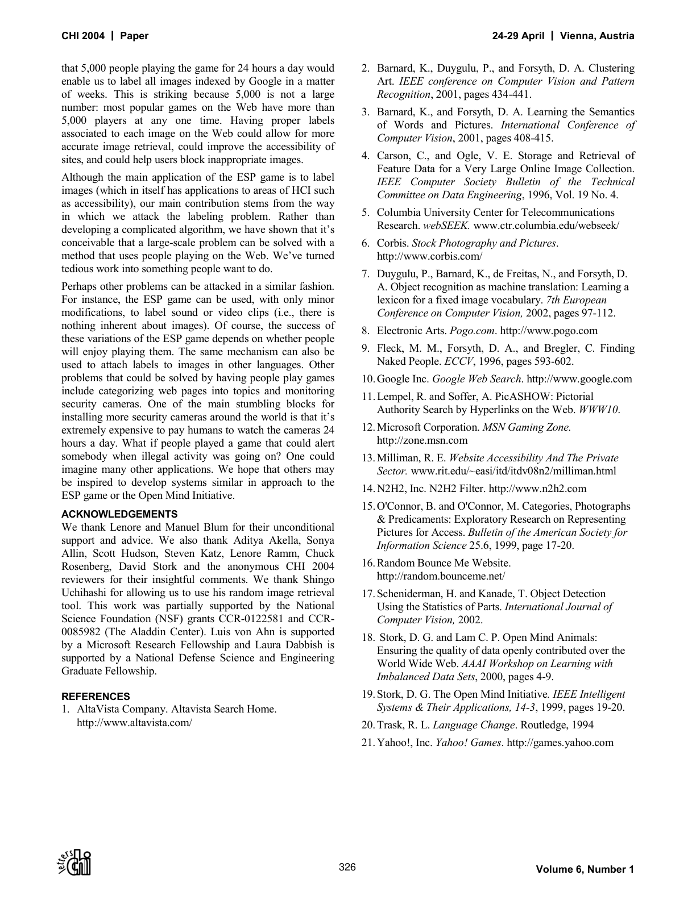

that 5,000 people playing the game for 24 hours a day would enable us to label all images indexed by Google in a matter of weeks. This is striking because 5,000 is not a large number: most popular games on the Web have more than 5,000 players at any one time. Having proper labels associated to each image on the Web could allow for more accurate image retrieval, could improve the accessibility of sites, and could help users block inappropriate images.

Although the main application of the ESP game is to label images (which in itself has applications to areas of HCI such as accessibility), our main contribution stems from the way in which we attack the labeling problem. Rather than developing a complicated algorithm, we have shown that it’s conceivable that a large-scale problem can be solved with a method that uses people playing on the Web. We’ve turned tedious work into something people want to do.

Perhaps other problems can be attacked in a similar fashion. For instance, the ESP game can be used, with only minor modifications, to label sound or video clips (i.e., there is nothing inherent about images). Of course, the success of these variations of the ESP game depends on whether people will enjoy playing them. The same mechanism can also be used to attach labels to images in other languages. Other problems that could be solved by having people play games include categorizing web pages into topics and monitoring security cameras. One of the main stumbling blocks for installing more security cameras around the world is that it’s extremely expensive to pay humans to watch the cameras 24 hours a day. What if people played a game that could alert somebody when illegal activity was going on? One could imagine many other applications. We hope that others may be inspired to develop systems similar in approach to the ESP game or the Open Mind Initiative.

**ACKNOWLEDGEMENTS** We thank Lenore and Manuel Blum for their unconditional support and advice. We also thank Aditya Akella, Sonya Allin, Scott Hudson, Steven Katz, Lenore Ramm, Chuck Rosenberg, David Stork and the anonymous CHI 2004 reviewers for their insightful comments. We thank Shingo Uchihashi for allowing us to use his random image retrieval tool. This work was partially supported by the National Science Foundation (NSF) grants CCR-0122581 and CCR0085982 (The Aladdin Center). Luis von Ahn is supported by a Microsoft Research Fellowship and Laura Dabbish is supported by a National Defense Science and Engineering Graduate Fellowship.

**REFERENCES** 1. AltaVista Company. Altavista Search Home. http://www.altavista.com/

2. Barnard, K., Duygulu, P., and Forsyth, D. A. Clustering Art. _IEEE conference on Computer Vision and Pattern_ _Recognition_, 2001, pages 434-441.

3. Barnard, K., and Forsyth, D. A. Learning the Semantics of Words and Pictures. _International Conference of_ _Computer Vision_, 2001, pages 408-415.

4. Carson, C., and Ogle, V. E. Storage and Retrieval of Feature Data for a Very Large Online Image Collection. _IEEE Computer Society Bulletin of the Technical_ _Committee on Data Engineering_, 1996, Vol. 19 No. 4.

5. Columbia University Center for Telecommunications Research. _webSEEK._ www.ctr.columbia.edu/webseek/

6. Corbis. _Stock Photography and Pictures_ . http://www.corbis.com/

7. Duygulu, P., Barnard, K., de Freitas, N., and Forsyth, D. A. Object recognition as machine translation: Learning a lexicon for a fixed image vocabulary. _7th European_ _Conference on Computer Vision,_ 2002, pages 97-112.

8. Electronic Arts. _Pogo.com_ . http://www.pogo.com

9. Fleck, M. M., Forsyth, D. A., and Bregler, C. Finding Naked People. _ECCV_, 1996, pages 593-602.

10. Google Inc. _Google Web Search_ . http://www.google.com

11. Lempel, R. and Soffer, A. PicASHOW: Pictorial Authority Search by Hyperlinks on the Web. _WWW10_ .

12. Microsoft Corporation. _MSN Gaming Zone._ http://zone.msn.com

13. Milliman, R. E. _Website Accessibility And The Private_ _Sector._ www.rit.edu/~easi/itd/itdv08n2/milliman.html

14. N2H2, Inc. N2H2 Filter. http://www.n2h2.com

15. O'Connor, B. and O'Connor, M. Categories, Photographs & Predicaments: Exploratory Research on Representing Pictures for Access. _Bulletin of the American Society for_ _Information Science_ 25.6, 1999, page 17-20.

16. Random Bounce Me Website. http://random.bounceme.net/

17. Scheniderman, H. and Kanade, T. Object Detection Using the Statistics of Parts. _International Journal of_ _Computer Vision,_ 2002.

18. Stork, D. G. and Lam C. P. Open Mind Animals: Ensuring the quality of data openly contributed over the World Wide Web. _AAAI Workshop on Learning with_ _Imbalanced Data Sets_, 2000, pages 4-9.

19. Stork, D. G. The Open Mind Initiative _. IEEE Intelligent_ _Systems & Their Applications, 14-3_, 1999, pages 19-20.

20. Trask, R. L. _Language Change_ . Routledge, 1994

21. Yahoo!, Inc. _Yahoo! Games_ . http://games.yahoo.com

---

## Original local sources

1. [Harnessing Crowds: Mapping the Genome of Collective Intelligence](mod_02_readings/Mapping%20the%20Genome%20of%20Collective%20Intelligence%20-%20ssrn-1381502.pdf)
2. [Harnessing the Hybrid Intelligence of Crowd and Artificial Intelligence in Group Decision Making for Uncertain Disaster Response](mod_02_readings/Risk%20Analysis%20-%202026%20-%20Tang%20-%20Harnessing%20the%20Hybrid%20Intelligence%20of%20Crowd%20and%20Artificial%20Intelligence%20in%20Group%20Decision.pdf)
3. [Labeling Images with a Computer Game](mod_02_readings/Labeling%20Images%20with%20a%20Computer%20Game%20-%20985692.985733.pdf)
